# MobilePay V10

## How to set up MobilePay
* Let's find "**EFT Setup**" as the initial configuration place for MobilePay.  

  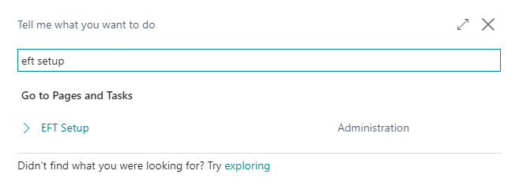

* Now we have to link a selected **POS Unit** with **EFT configurations** for MobilePay.

  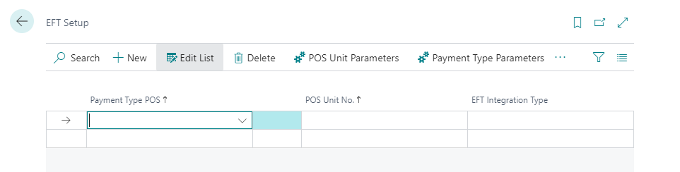

  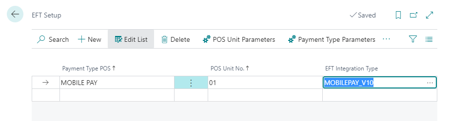

  * Important is to select correct "**POS Unit No.**" and "**EFT Integration Type**" ("**MOBILEPAY_V10**" which will *enable* MobilePay V10 for the selected **POS Unit**).

* Now we should set up "**Payment Type Parameters**" which are common for the selected **Payment Type** (value in "**Payment Type POS**" field). Let's click on the button "**Payment Type Parameters**".

  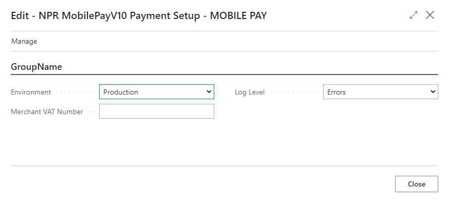

  * "**Environment**" should be "**Production**" for all customers and it's default value for a new setup. "**Sandbox**" is for the internal purposes of NaviPartner only, for development and test purposes.
  
  * "**Merchant VAT Number**" is important as it works as a key to establish communication context with MobilePay backend (during authentication phase). For the sandbox environment we use "**DK90000046**" as this one was assigned to us by MobilePay.
  
  * "**Log Level**" should be set to "**Errors**" by default in production environments to avoid extreme logging of all possible details.

  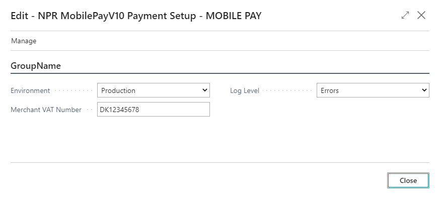

* Now we can close the previous page ("**Payment Type Parameters**") and let's continue with "**POS Unit Parameters**" which has to be configured for each **POS Unit**. Select the **POS Unit** and click on "**POS Unit Parameters**" button.

  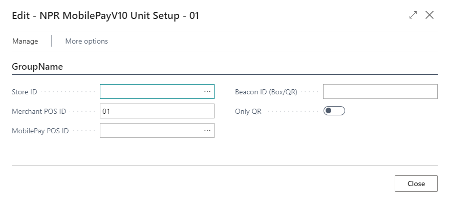

  * "**Store ID**" - you have to click on *assist edit* button (three dots) and select the store from the list. This list is populated dynamically based on the real data existing in MobilePay database (backend).
  
    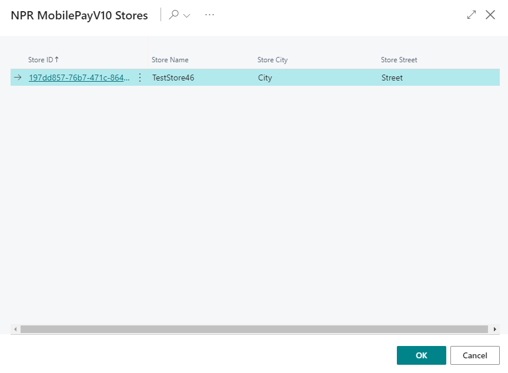

  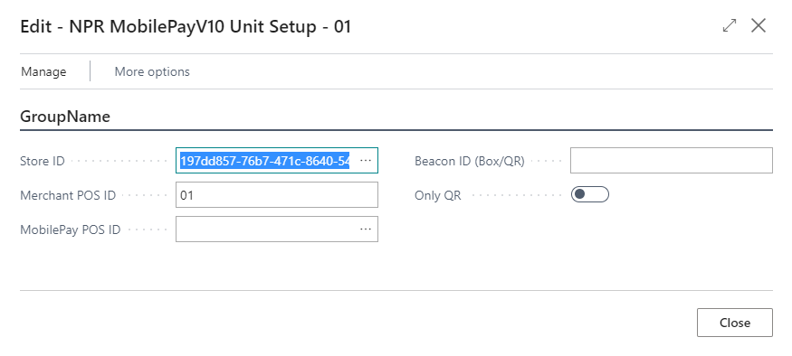

    * Once you have "**Store ID**" assigned you can proceed to the registration of the **POS Unit** in the MobilePay backend. But first of all you need to know if you setup is using some already existing identifier (either a **Bluetooth** device or an existing **QR code**).
  
      * And if yes, you have to fill-in the ID to "**Beacon ID (Box/QR)**" field.   
  
      * If you use an **MPOS** device or any other setup able to render dynamically any QR code, you can keep the field blank and it will be generated for you.   

      * In the same way you can leave it blank if you don't have any QR sticker yet (and you don't use a physical device - white box) and you can print it once it's being set in MobilePay.   

    * You should also select "**Only QR**" as "**TRUE**" only if you are sure you are using only QR code (no physical device). We believe you can also keep this flag "**FALSE**" even if you are using QR codes only. These should be still supported even if "**Only QR**" is set to "**FALSE**".
       * **Warning**: There is current a bug on our side that requires to set "Only QR" to "FALSE" anyway in order to be able to inform an existing value to "Beacon ID (Box/QR)". This bug is address in *#469870* and will be solved very soon.   
  
    * So once you decided what is your scenario with QR or boxes and you have configured properly the values, you can proceed with the registration of the POS unit in MobilePay backend. Please, click on **Actions**->**Create in Mobilepay** and that's all. The success should be confirmed with a confirmation dialog otherwise you will see an error message with some details that should be used to identify the problem.

      

      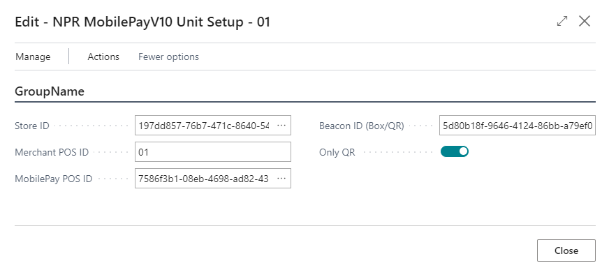

    * If you decide to unregister **POS Unit** in MobilePay backend you have to do that using action called **Actions**->**Delete in Mobilepay**. The **POS Unit** will be deleted in MobilePay, "**MobilePay POS ID**" will be blanked but "**Beacon ID (Box/QR)**" will be preserved locally in order to be able reuse easily QR/Box code if needed.

      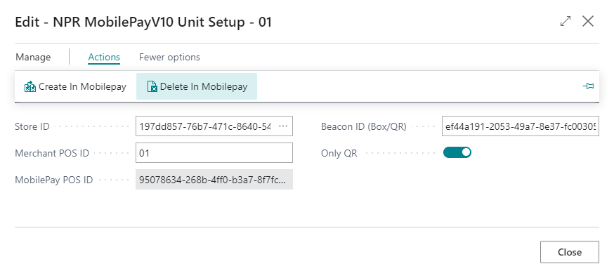

      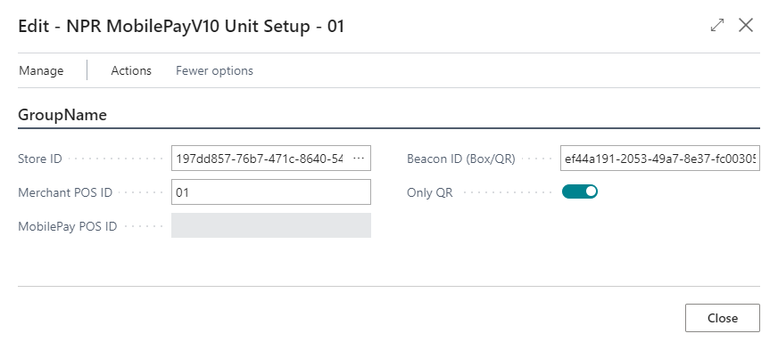
