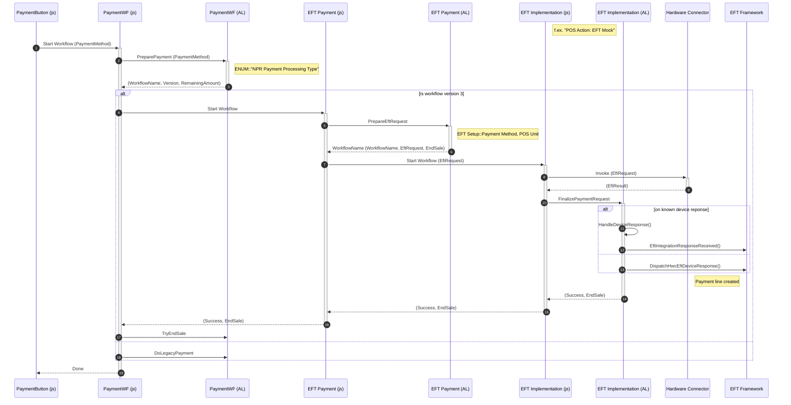

## EFT Payment flow (workflow version 3)

Clicking a front-end payment button triggers the following sequence of workflows and first level AL code to resolve.

```mermaid
sequenceDiagram
    autonumber
    participant PaymentButton (js)
    participant PaymentWF (js)
    participant PaymentWF (AL)
    participant EFT Payment (js)
    participant EFT Payment (AL)
    participant EFT Implementation (js)
    participant EFT Implementation (AL)
    participant Hardware Connector
    Note right of EFT Implementation (js): f.ex. "POS Action: EFT Mock"

    PaymentButton (js)->>+PaymentWF (js): Start Workflow (PaymentMethod)
    PaymentWF (js)->>+PaymentWF (AL): PreparePayment (PaymentMethod)
    Note right of PaymentWF (AL): ENUM::"NPR Payment Processing Type"
    PaymentWF (AL)-->>-PaymentWF (js): (WorkflowName, Version, RemainingAmount)
    alt is workflow version 3
        PaymentWF (js)->>+EFT Payment (js): Start Workflow
            EFT Payment (js)->>+EFT Payment (AL): PrepareEftRequest
            Note right of EFT Payment (AL): EFT Setup::Payment Method, POS Unit
            EFT Payment (AL)-->>-EFT Payment (js): WorkflowName (WorkflowName, EftRequest, EndSale)
            EFT Payment (js)->>+EFT Implementation (js): Start Workflow (EftRequest)
                EFT Implementation (js)->>+Hardware Connector: Invoke (EftRequest)
                Hardware Connector-->>-EFT Implementation (js): (EftResult)
                EFT Implementation (js)->>+EFT Implementation (AL): FinalizePaymentRequest
                    alt on known device reponse
                        EFT Implementation (AL)->>EFT Implementation (AL): HandleDeviceResponse()
                        EFT Implementation (AL)->>EFT Framework: EftIntegrationResponseReceived()
                    else
                        EFT Implementation (AL)->>EFT Framework: DispatchHwcEftDeviceResponse()
                    end
                    note left of EFT Framework: Payment line created
                EFT Implementation (AL)-->>-EFT Implementation (js): (Success, EndSale)
            EFT Implementation (js)-->>-EFT Payment (js): (Success, EndSale)
            EFT Payment (js)-->>-PaymentWF (js): (Success, EndSale)
        PaymentWF (js)->>PaymentWF (AL): TryEndSale
    else 
        PaymentWF (js)->>PaymentWF (AL): DoLegacyPayment 
    end
    PaymentWF (js)-->>-PaymentButton (js): Done
```