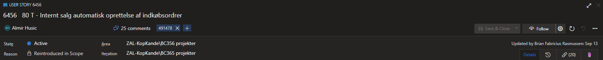

# Assignment structure

Regardless of which assignment type is created, the page structure is largely the same, and it consists of the following common elements:

## Header

The header contains the ID of the work item generated by DevOps Azure as soon as the item is added, followed by the assignment title. Additionally, if there is a defined estimate, it can be placed in front of the title. This number should correspond to the number provided in the **Full Original Estimate** field.

The headline is followed by the assignee's name (which corresponds to **Person Responsible** in the case system ), the number of comments, and the tags. The main purpose of tags is for linking assignments to the relevant cases in the case system. 

You can also see the current **State** of the assignment, the **Reason** why it is being tackled, the **Area** it belongs to, as well as the **Iteration**. Iterations are stages that the project is divided into, and they correspond to specific time frames stated in the cases. 

**NOTE:** 
Providing the correct information in the assignment is crucial for the successful integration between the case system and DevOps Azure. Always make sure that the information provided in the assignment corresponds to the information in the relevant case.

## Description

This area contains important information regarding the case and the DevOps assignment. If you click anywhere in the **Description** area, the text editor will be triggered, and you will be able to edit the description. 

## Planning

The **Planning** area is used for providing the **Full Original Estimate** for the assignment's completion expressed in the number of manhours it will require, followed by the **Priority** (expressed with numbers 1 thru 4 - 1 being the highest in the priority list), and any potential **Risk**.

**NOTE**:
As the integration between DevOps Azure and the case system is still in progress, the **Full Original Estimate** value needs to be provided manually. Once the integration is complete, this field will automatically be populated with the value provided in the case system. 

## Discussion

This segment contains comments regarding the assignment. You can tag colleagues if you need feedback, and they will instantly be notified. 

## Related Work

The **Related Work** section consists of any tasks, subtasks, and stories linked to the currently opened assignment.

You can create them either from the [board](kanban.md) or from the assignment's **Related Work** section. The related assignments can have various relationships with the assignment they are created from, but the most common ones are **Parent**, **Child**, and **Related**.

## Release Notes

Optionally, you can add some final notes about the assignment in this section.

## Effort (Hours)

In addition to all listed common assignment sections, tasks also contain the **Effort (Hours)** section.

In the **Original Estimate**, you can provide the estimate for the task's completion. This number will not be automatically updated in the linked story. However, providing the correct estimate on each task helps make the story estimate as accurate as possible.

### Related links

- [Kanban boards in DevOps Azure](kanban.md)