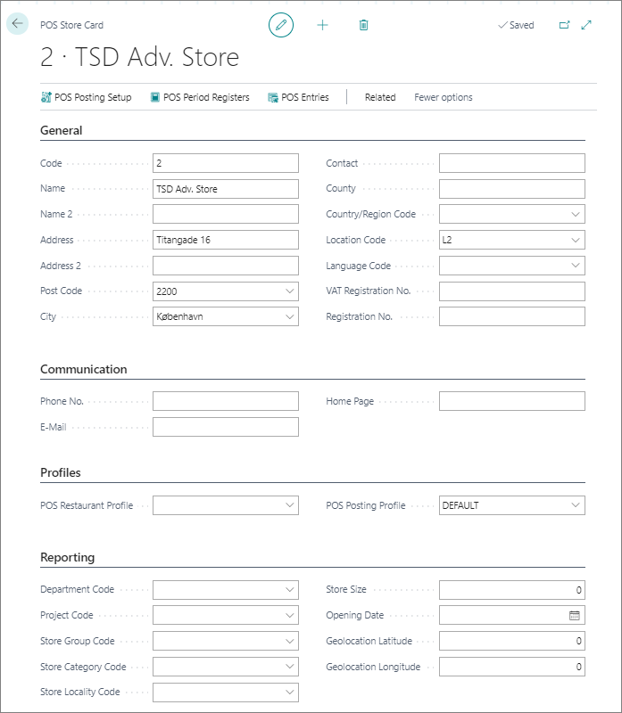

Float is money within banking system that is briefly counted twice due to time gaps in registering a deposit or withdrawal. These time gaps are usually due to the delay in processing paper checks. A bank credits a customer's account as soon as a check is deposited. However, it takes some time to receive a check from the payer's bank and record it.

Until the check clears the account it is drawn on, the amount it is written for "exists" in two different places, appearing in the accounts of both the recipient’s and payer’s banks.

It is possible to insert the initial float on a new POS unit. It doesn't generate any accounting entries as it covers different situations.

When an external retail client is converted into our solution, the cash float is already accounted in the accounts associated with the original register. If a new transaction is generated for it, the entry will be duplicated.

The total value of written or received checks which haven't yet come out or been credited to a designated bank account. There are several types of cash float - disbursement float and collection float.   
 

# Set up the initial cash float on a POS unit

A cash float is (usually) a small amount of cash reserved for customers if they don't have the exact amount ready to make a payment.

The following procedure explains how to insert the initial cash float on a new POS unit for the first time. 

In certain scenarios, it doesn't generate any accounting entries:
- If an external retail client is converted into the NP Retail solution - the cash float is already accounted for in the accounts associated with the original register. Therefore, a new transaction doesn't need to be generated for it (the entry will simply be duplicated).
- If NP Retail is already in use, and a new POS unit is created - the accountant needs to create a journal entry for transferring the cash float from the source 

### Prerequisites

- (Optional) Create a new POS store.
- Create a cash register.
- Use the cash register ID to create a POS unit.
4. Create a POS payment bin which is used for that POS unit.
5. Insert the initial cash float in the POS payment bin.

# Create a new POS store

POS stores are on the highest hierarchy level when it comes to POS-based retail management. The physical representation of a POS store is a shop. The main distinguishing criterion for POS stores in NP retail is the store's location. 

Various information about POS stores are contained within the POS store cards. This information is available for any Business Intelligence that needs to be performed for the shop.

1. Use the search functionality to navigate to the **POS Store List**.   
   The list of all POS stores created in the system is displayed.
2. Click **New**.  
   The **POS Store Card** window is displayed.
3. Fill in the necessary fields for creation of a POS store.    
   Use the provided screenshot as a reference, if needed.
     
4. (Optional) Edit the **POS Posting Setup**, **POS Period Registers**, and **POS Entries** options, for additional setup options.  
   The values you've entered are automatically saved.

# Create a new cash register

Cash registers are used for logging transactions that occur in a POS store. They create a record of the money that comes in and goes out.

The minimal requirement for creating a functional cash register is indicated in the following screenshots:

# Create a new POS unit

A POS unit can be created by using the existing ones as a reference, or they can be created from the beginning, once there is a POS store they can be associated with.

# Create a new payment bin
Once you have a POS unit and a cash register set up, you can create a new payment bin and link it to them.

# Create the initial cash float in the POS payment bin

Once all previous segments are correctly set up, you can create the initial cash float.

1. Navigate to the **POS Payment Bin** list and select a POS payment bin you've specifically created to use it for the purpose of setting up the cash float.
2. 