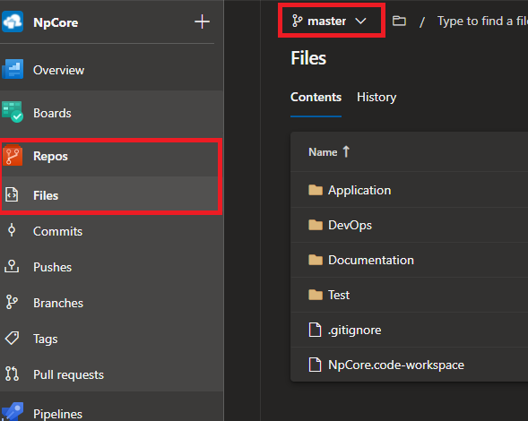
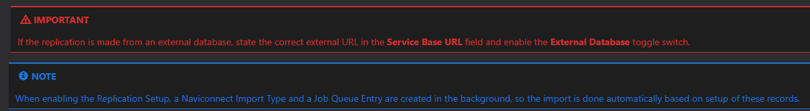
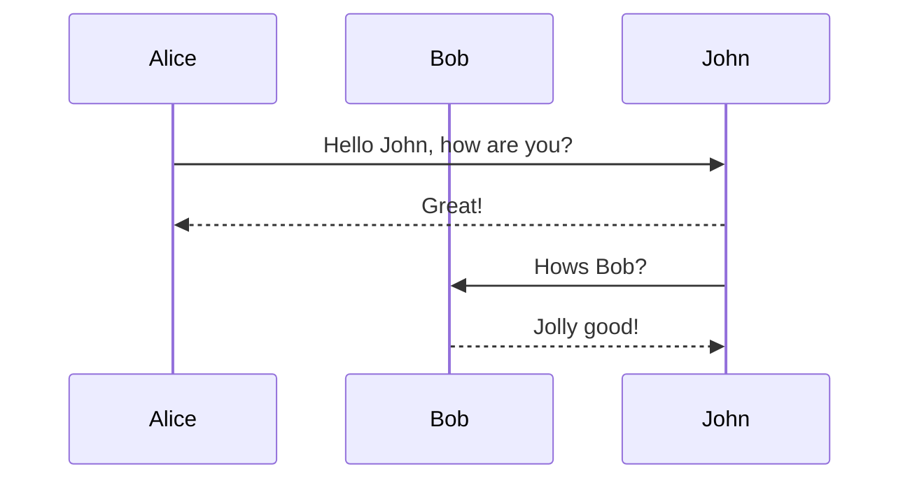
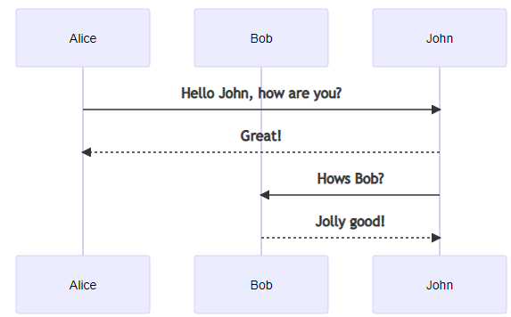
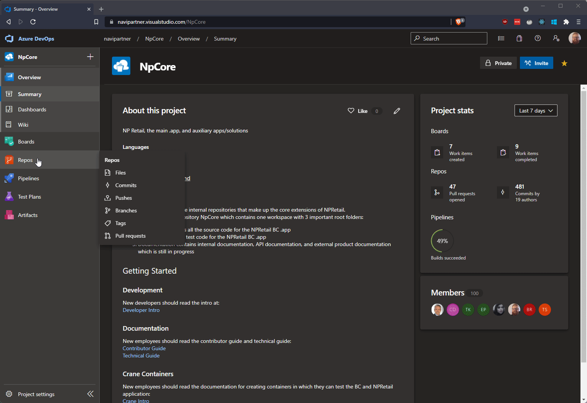
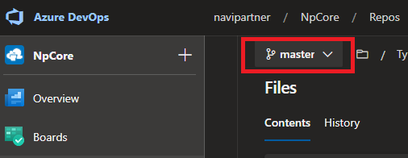
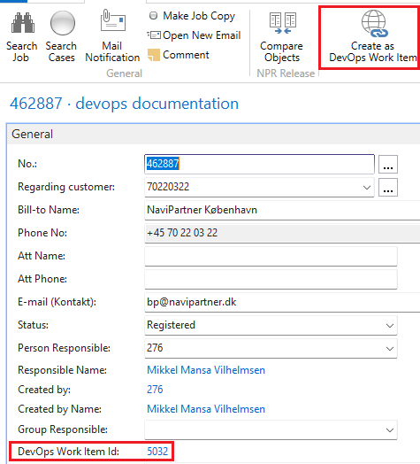

# Intro

This article is intended for non-developers that are not already familiar with visual studio code, git and the markdown format.
It covers the minimum technical requirements necessary for contributing to our product documentation. Both the quick-edit of the existing articles on the server, and the full documentation editing workflow on local machine are explained in detail.

## Azure DevOps

Azure Devops is the platform you are reading this article on. It is a Microsoft tool to develop software with everything that comes along with that: Tracking and planning work, making code changes, documentation changes, wiki changes, creating releases, changelogs, running automatic tests, approving QA flows and deploying releases and more.
Under the **Repos** tab (orange icon on the left) you will see **Files**.



**Make sure the master branch is selected up top**, otherwise you are not seeing the latest version of the files.
The Application, DevOps and Test folders contain code for NPRetail.
The Documentation folder is what we are focused on here.
Inside it, we have the following:


* the /.tools/ folder contains the scripts used to build the website automatically.
* The /internal/ folder contains this guide and anything else not published on the documentation website. These articles can be previewed inside azure devops by NP employees. Subfolders are created as needed for structure.
* the /public/ folder is the main focus - it contains the documentation that is publicly available to the customers.
* the /public/openapi/ folder contains technical webservice reference documentation that is maintained solely by developers.

You are encouraged to open up the public folder and look around it, while comparing the structure to the menu structure you see on docs.navipartner.com.
What you should notice is that the .md files ([markdown](#markdown-files) files) are structured in a folder hierarchy that matches the website structure and that the toc.yml files ([table of contents](#table-of-contents-files)) files) declare the menu structure for the website.

You are also encouraged to explore on the Azure Devops portal to get more familiar with it - a couple of highlights:
* Under **Repos** -> **Commit** you will see all changes done to both code & documentation
* Under **Repos** -> **Pull requests** you will see pending changes to both code & documentation, not yet approved for various reasons.

## Why are we doing this? Word, sharepoint, confluence or notepad is easier to use!

There is a trend in the software industry, most relevant examples being docs.microsoft.com and docs.continia.com, to treat documentation-as-code by writing in a format called markdown and then generating the HTML for a website automatically, based on the markdown files.
Don't worry, this does not mean you have to learn to code before you can contribute to the documentation but it is an acknowledgment of the fact that most software is living, meaning it changes constantly, and so any documentation of that software has to be living as well.
The easiest way to keep that documentation up to date and as relevant as possible is to re-use many of the procedures invented to track text changes for software development, instead of keeping documentation stored in a 3rd party tool where it can slowly rot away, out of sight and out of mind.  

The upside to this is that you will get more familiar with the vocabulary of the software developers in NaviPartner, since you will be using some of the same tools such as "Pull requests" here on Azure Devops, along with "Visual Studio Code" and "Git".  
Another upside is that it means that collaboration with developers on documentation changes is easier, as any documentation change is treated the same way as code changes, inside one shared tool. That also means there is less of an excuse for a developer to not write or update documentation and ping-pong with non-developer employees about it as the code changes :)
All of this come at the cost of a learning curve at the start compared to using word and notepad etc. - we hope that the benefits detailed above, along with the fact that we are guiding you towards habits of modern software documentation, helps ease that burden.
We are many people involved in this documentation project and that means there are many people that can help if you hit an edge case.

## Markdown files

Markdown is a language used for formatting plain text, that is stored in .md files. We will be using this language to write all of our articles, such as this one.
It is a bare minimum syntax required to get just-enough structure onto text, without opening up the door to picking between fonts, sizes, colors etc.
Those things are irrelevant when focus is on the content and they can be added automatically later when generating the HTML for the documentation website.

Since markdown is a commonly used format, there are many online ressources that cover the syntax, i.e. how to create headlines, bold, numbered lines etc.
One of the best examples that you should check out is:   
https://www.markdownguide.org/cheat-sheet/

The precise version of markdown we use is known as DocFx flavored markdown with additional support for graphs added on top.
It is fully detailed here: https://dotnet.github.io/docfx/spec/docfx_flavored_markdown.html   
The special features worth highlighting are:

* Being able to highlights notes, tips, warnings, important messages and caution messages in colored boxes via the following syntax:
```
> [!NOTE]
> note content

> [!TIP]
> tip content

> [!WARNING]
> warning content

> [!IMPORTANT]
> important content

> [!CAUTION]
> caution content
```
It looks like this when used on the docs website:  


* Being able to render graphs via mermaid syntax. Mermaid is fully detailed here: https://mermaid-js.github.io/mermaid/#/ and an example of how to use it:

~~~

~~~

It looks like this when used:  


## Table Of Contents files

if you take a look in the /public folder structure you will see a toc.yml config file is placed a at various folder levels.
These reference each other and tell the website generator how to structure the menus.
Note: The top-level toc.yml outside the /product folder is special - it only controls the top blue navigation bar.
All the other toc.yml files are connected and structure the documentation articles.

The file format is called yaml (.yml). It is intended as a simpler version of json & xml, for human readability/editability.
It consists of key/value pairs with the option of children for nested elements.
To manage our tables of contents, we only need 3 keys: 
* name: The caption displayed on the website menu.
* href: The relative "link" to a subfolder.
* items: (optional) if there are any nested article sections, this key can be used to group them.

Instead of jumping into reading the technical reference documentation of the toc.yml file (https://dotnet.github.io/docfx/tutorial/intro_toc.html) you are instead encouraged to copy/paste from existing toc.yml files and adjust as needed, if creating new module folders or adding new articles.

## Pull Requests

Whenever you are doing any changes to files you will be doing it on your own branch.
A branch is git terminology for having "your own copy" of the files, that you can work on without disturbing anyone else.
Pull request is another git term for making a change request from your branch to the master branch, when you feel that your changes are ready to be distributed to everyone else looking at the master branch.
The meaning of the term comes from the fact that you are requesting the target to "pull your changes" into his/her branch.

In the NpCore project, where we maintain documentation, we have only 2 rules that are important to know (but don't worry, both are enforced automatically):
1. All branches where people work should be named topic/* at the start. So for example, when adding documentation for configuring POS menus, you would create a branch based on the master branch (since this is the most recent version of our files based on everyones work) into your own temporary branch and name it:
   
    topic/initials/pos_menus_docs 

    Note, everything after topic/ is optional. By using your own initials you make sure you never hit a colleagues branch name.

2. All merges to master requires a pull request. This means, you cannot bypass the approval process of a pull request when merging to master.

All your file changes will be done on your topic branches and when you are done with each, you would make sure your changes are committed and pushed, and then finally create a pull request from your topic branch to the master branch.

At this point, your colleagues has a chance to approve your changes, make sure you didn't make a mistake, ping-pong with you if improvements are needed before approval, and finally approve it, at which point your documentation will be merged to the master branch (so everyone else starting new work by branching from master in the future will see your changes).

You can create as many branches as you want, and creating a new one every time you need to do isolated work is encouraged to keep things from overlapping unnecessarily.

See [git](#git) for more details.

### Creating a pull request
You can create a pull request at any time from your topic branches to master.
This is the final step of your changes, when you feel like it is ready for review and publishing to website. See [full edit example](#full-edit-example) and [quick edit example](#quick-edit-example) for two different ways to create a PR.


### Using a pull request
The core essence of a pull request is the reviewing of changes, visible under the **Files** tab and the comments written below for feedback.  
Individual comments can be marked as resolved when feedback has been addressed by committing and pushing changes.


### Updating files after receiving feedback on review
To make more changes after your PR (Pull Request) has been created, you commit and push more changes to the branch the PR is created from. (Your topic branch)
Azure Devops will automatically pick up these changes, reset any reviewer votes and show the latest changes in the files tab in the devops web client.

Do not create a new branch with changes on the same files before your first PR is in the Accepted/Complete status, to avoid merge conflicts. You can reuse your PR branch all the way up until the point that is has been approved and has merged into the master branch.
At that point you will need to pull latest master branches onto your local machine and create a new branch from it. (See [Git](#git) later for more details)).
  
### Resolving a merge conflict
Merge conflict is the term used when git cannot automatically merge changes and needs human input to resolve the conflict.  
It happens if the same sections of the same files are touched in different branches.

You can use the **Conflicts** tab on a PR to select the appropriate changes (left or right side) or hand merge the content if it needs to be a combination of both.


## Images

All images can be placed into a /images folder on the same level as the articles they are referenced by.
In the articles, you can indicate a place where the image are placed by using this tag:

```

```

Notice that the filepath must use forward slashes, not backwards slashes!

# Quick edits 

If you are not making big changes to many files, then you can use the browser-based azure devops webclient to create, upload and modify files. 
The downside to this is that each of the files will be tracked in a separate pull request so this "quick" flow is mainly intended for single-face changes. Otherwise the Visual Studio Code tool is a better match.

This is done by using the "Edit", "New", and "Upload Files" buttons in the top right when navigating files in azure devops webclient.  

Notice: Just like when making changes from visual studio code, you cannot commit directly to the master branch - so when you are asked in webclient for a branch name, you need to specify a branch name that starts with "topic/", as always, and check the "Create a pull request" checkmark to instantly create a pull request from your branch with your changes.

## Quick edit example
The following gif shows all the steps involved in editing an existing markdown file using strictly the browser:

1. Locate the file you wish to edit on the master branch using the file explorer.
2. Click **Edit** in the top right corner.
3. Make any file changes.
4. Click **Commit** in the top right corner.
5. Replace the default **master** branch name with a custom topic branch name appropriate for your change.
6. Click Commit and click create on the auto-filled pull request creation wizard.
7. On the new PR, specify a workitem ID, which is linked to a case in the case system. See [work items](#work-items) for details on creating one.



## Addressing feedback
 If you get any feedback that needs to be addressed during review and you want to stick to the browser-based workflow, you'll need to use dropdown up top in the azure devops file section to make additional changes:



# Setting up the local machine
There are a couple of tools you will need to install locally.

Git is used for version control, to track file changes:  
https://git-scm.com/download/win
Note: There are a lot of prompts when installing git - default settings are all fine, and there are no hidden toolbar prompts :)


Visual Studio Code is used as the editor for making changes:  
https://code.visualstudio.com/docs/?dv=win

## Git
Git is version control software. It is decentralized, meaning that the entire concept of git is built upon downloading a full copy from the server onto your local machine and working against this local copy.
Whenever changes are committed and ready to share with colleagues via a pull request, we can "push" to the server (usually on a topic branch). Whenever we want to see changes our colleagues have made since we last checked, we can "pull" from the server (usually on the master branch)

### Operations
The most important git operations for contributing to docs are:
* **Clone**: Git Clone is used to download the entire project down onto your local machine, the very first time you need to contribute anything. 
* **Branch**: Git Branch is used to create a branch from master into your own custom named topic branch on your local machine, for every isolated change you need to make. 
* **Commit**: Git Commit is used onto your topic branch locally, when you are done with your changes.
* **Push**: Git Push is used to push commits from your local machine to the server, usually done as part of daily backup or when everything is ready, just before creating a PR in the webclient.
* **Pull**: Git Pull is used to download latest changes from the server to your local machine, usually used on the master branch locally, just before creating a new topic branch to ensure that it will have the latest changes from colleagues.

Visual Studio Code has a Git menu that can both visualize changes done to files on your local branch and allow you to fire all the commands detailed above.  

Notice: To commit file changes you must first stage them.

See [full edit example](#full-edit-example) which uses the git menu, stages file changes, commits them and pushes the commit to server.


## Visual Studio Code
Visual studio code is an editor that can be used to make changes to all the filetypes involved here.
It can also be used to preview markdown and to use git via built-in git UI.

Notice:  
Git should be installed before visual studio code.  
After installing both you will have to configure git once, using the visual studio code terminal:

1. Click **Terminal** -> **New Terminal**
2. Paste the following line, replace with your name and click enter:   
   git config --global user.name "Firstname Lastname"
3. Paste the following line, replace with your e-mail and click enter:  
   git config --global user.email "name@example.com"

The above is also shown in the [full edit example](#full-edit-example).

### Extensions
There are some helper extensions in visual studio code that can help when writing markdown:  
https://marketplace.visualstudio.com/items?itemName=ban.spellright  
https://marketplace.visualstudio.com/items?itemName=docsmsft.docs-preview

These will also be recommended automatically by visual studio code when you clone NPCore as they are specified in our project configuration file. 

## Full edit example
The following gif shows all the steps involved in creating a new article with images and table of content update, with the full local setup from scratch:

1. Setup git name and e-mail (Only needed once on fresh installations)
2. Clone NpCore project to a folder on the local machine using vscode. Folder location is completely up to you. (Only needed once on fresh installations)
3. Open the project workspace by waiting for vscode to prompt automatically about it when cloning is done.
4. Perform "Git Pull" on the master branch (!) using vscode. This is needed at the start of every new change, just before you create a new topic branch to make sure all files are up-to-date locally on the master branch and the upcoming topic branch.
5. Perform Git branch from the master branch into a new topic branch dedicated for the documentation changes we want to make.
6. Create a markdown file for a new article.
7. Create an image file inside a folder called images, with the folder located on the same level as the markdown file.
8. Update the markdown file to use the new image.
9. Update the toc.yml file to reference the new article. 
10. Commit the changes via the git tab in vscode.
11. Push the local commits to the topic branch on the server by performing "Git Push" in vscode. (up until now the topic branch was only on your local machine)
12. In the azure devops webclient, create a pull request from the topic branch to the master branch.
13. On the new PR, specify a workitem ID, which is linked to a case in the case system. See [work items](#work-items) for details on creating one.


Notice that steps 1) and 2) are only required the first time you prepare your environment locally.  
For additional new additions to docs, you can start on step 4) by pulling changes to your master branch locally to make sure you get all changes done by your colleagues downloaded to your machine.

# Work Items

All pull requests must have a work item linked to them.  
We have made it easy to create a work item in azure devops from a case in our case system.  
You can click the following action on any case assigned to 70220322 (internal NP case):



if you confirm the dialog, it'll create a work item with same description as the case and fill out the "DevOps Work Item Id" field on the case card so you can easily find any existing work items linked to cases later.