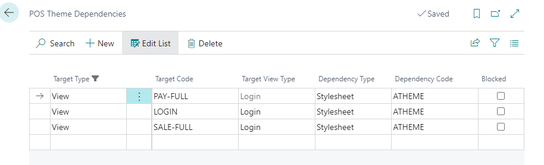
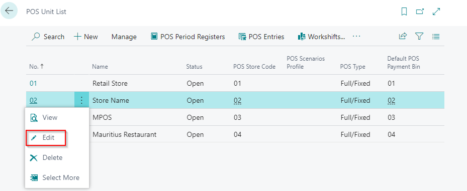
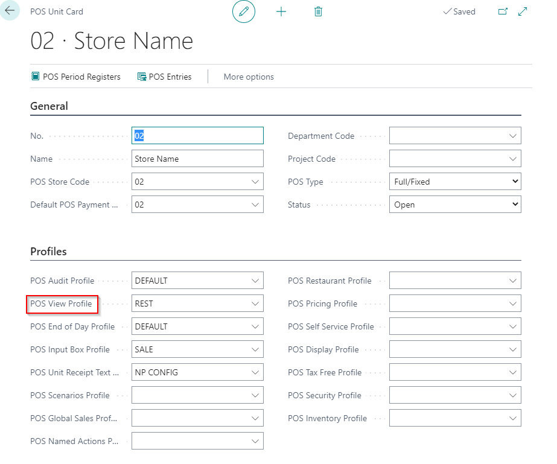
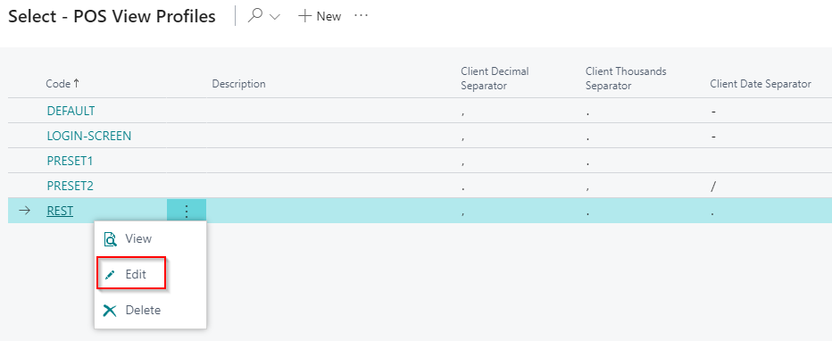

# Create a POS theme

1. Navigate to the **POS Themes** page.
2. Click **New**.
3. Edit the **Theme Dependencies**.

There are two scenarios:

First scenario:

1. In the column **Target type** (of **Theme Dependencies**) choose which view you want to customize.    
   If you choose **View**, you can select only one POS view profile that will be customized.
2. Select the POS view profile from the **Target Code** dropdown.    
   The default target codes are **PAY-FULL**, **LOGIN**, **SALE-FULL**
3. Make sure that the **Target View Type** is set to **Login**.
4. In the column **Dependency Type** choose what will be affected with this change - **Logo**, **Background** or **Stylesheet**.
5. In the **Dependency Code** choose which customization will be applied.

Second scenario:

1. If you choose the **Client** target type, the changes will be applied to everything.

2. Make sure that the column **Target View Type** is set to **Login**.

3. In column **Dependency Type** choose what will be affected with this change - **Logo**, **Background** or **Stylesheet**.

## Customize color of POS bottoms

The first step when customizing POS bottoms is preparing a CSS file. Each bottom can have its own customized color. Pictures are also imported as CSS files.

## Web client dependencies

When a CSS file is prepared, the next step is uploading all changes that are made in CSS file.

1. Navigate to the **Web Client Dependencies** administrative section. 
2. Add a new line. 
3. In the column **Type** choose CSS. 
4. Populate the **Code** field with the name of your CSS file.  
5. Add a description.
6. Import the prepared CSS file.

## Setting POS theme on POS unit

1. Navigate to the **POS Unit List**.
2. Select the POS unit that needs to have new customized theme.

3. Navigate to the **POS View Profile**. 

4. Choose a **POS View Profile** that needs to have this customization.
5. CLick **Edit**.

6. In the filed **POS Theme Code** choose the Web client dependencies file that contains all necessary customizations.

## POS bottom size

Number of POS bottoms and size of bottoms can be customized as well.

1. Go to the **POS View List**. 
2. The most common **POS Views** that are used are **LOGIN**, **PAY FULL** and **SALE FULL**.
3. Click **Edit**.

4. Set how many bottoms should be visible, the size of the bottoms and the size of the base. 

