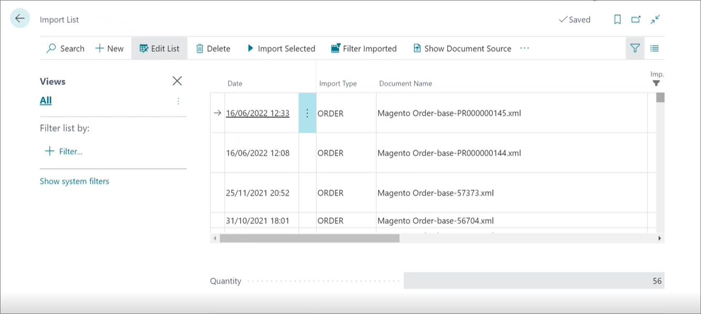
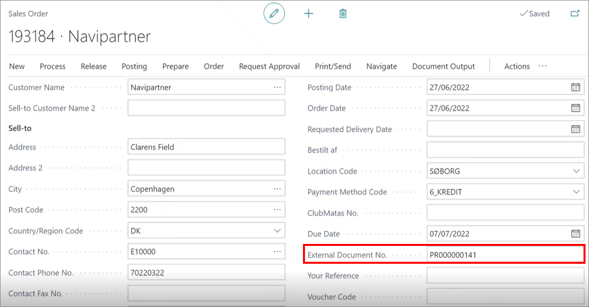

# Automatic sales order creation - Import list

Web sales orders are automatically created in Business Central upon arrival from the web stores. This integration is achieved with the Naviconnect module of NP Retail. It is configured to accept sales orders arriving from the web stores in XML files. If you navigate to the **Import List** administrative section, you can see the list of all documents that were sent from the web store. It is indicated which entries were successfully processed in Business Central, and which ones have errors. 

The **External Document No.** field in the **Sales Order** card is used for storing the web reference numbers.

### Related links

- [Create a new sales order](../howto/create_sales_order.md)