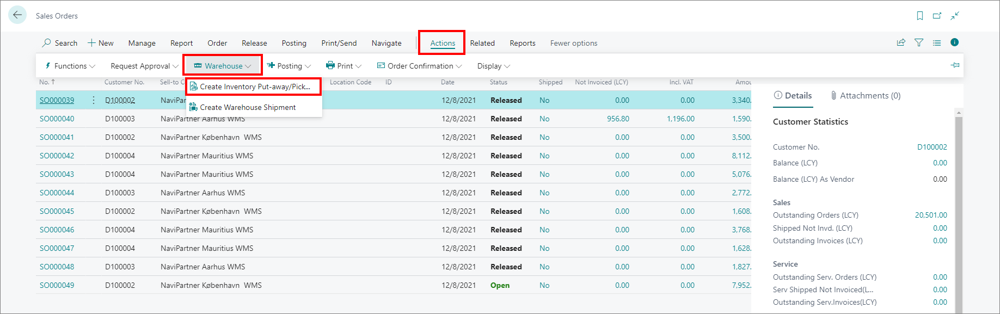

# Create inventory pick from Sales Orders

To create inventory picks from sales orders, follow the provided steps:

1. Click the  button, enter **Sales Orders** and choose the related link. 
2. Click **Actions** in the ribbon, followed by **Warehouse**, and finally **Create Inventory Put-Away/Pick**.         
   
   

3. Ensure that the **Create Invt. Pick** toggle switch is enabled.
4. Click **OK**.      
   The inventory pick is now created.

> [!Note]
> Each sales order can be associated with only one inventory pick.

