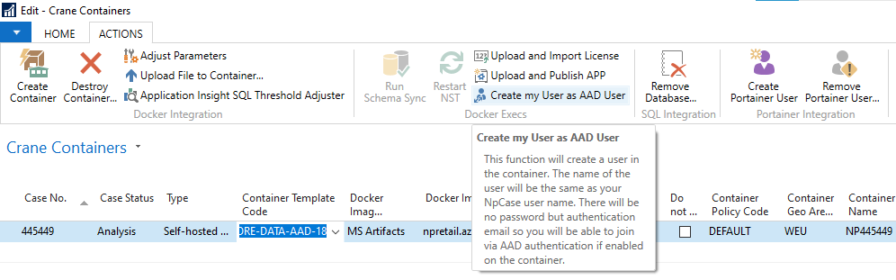
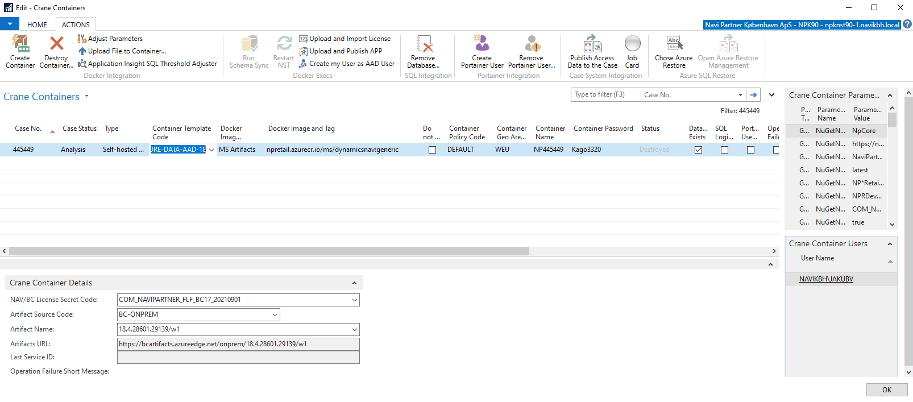
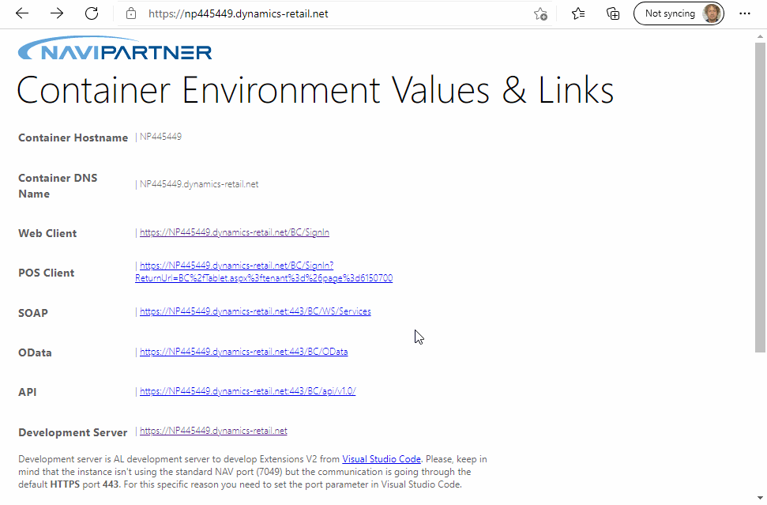

# AAD Integration

### For all topics requiring **AAD Integration** we are enabling this option also for Crane Containers.

---

WARNING: Please, this feature is experimental as today, there are still problematic parts:
- [X] SOAP authentication issues.
- [ ] Generic user we would like to offer you via **npknav@navipartner.dk** (we need to update its password to be in match with **NPKNAV** managed through **Triskelion 2018**).
- [X] Maybe we will need two web server instances to allow both, **AAD** and **NavUserPassword** authentication at the same time. This might be necessary to let the external users (partners, customers) access the containers.
- [ ] Multi-Tenant containers should be covered as well.

---

If you want to create a container offering **AAD** integration with **SSO** (Single Sign-On) you can use **CORE-DATA-AAD-18** Crane Template Code. Or, as the activation through configuration is very easy, you can use any container template (the BC has to support **AAD**, of course) and add the following parameter(s): 
- ```Generic env``` = ```AddAADInstance``` = ```true```. This one is mandatory if you want to active AAD.
- ```Generic env``` = ```AuthenticationEMail```. The value can be basically whatever, any valid email address, we use by default **npknav@navipartner.dk**. This parameter is optional.

This parametrization will activate all necessary configurations on NST and it will associate the default container user with this email. Then you can use this email to authenticate (as the default user). So by default, **npknav@navipartner.dk** will be associated with the default container user.

Logically, you want to use your account (email) to access the container. This is perfectly possible. You can do this easily from the case system. There is a new action called **Create my User as AAD User** and it's accessible directly from **Crane Container** page.



Once you click on the button, your user will be created in the target database and associated with your authentication email available in the case system. Also in the case system, you will be able to see the registered accounts for each container (on the right side, there is a new sub-page **Crane Container Users**).



Now, you can proceed with the log-in.




