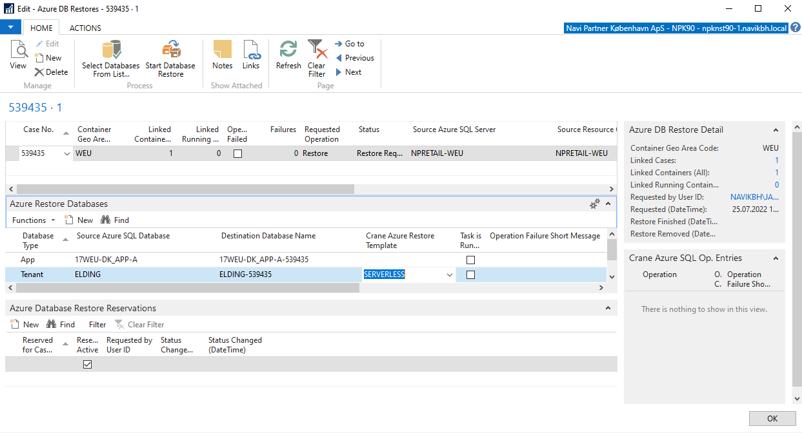
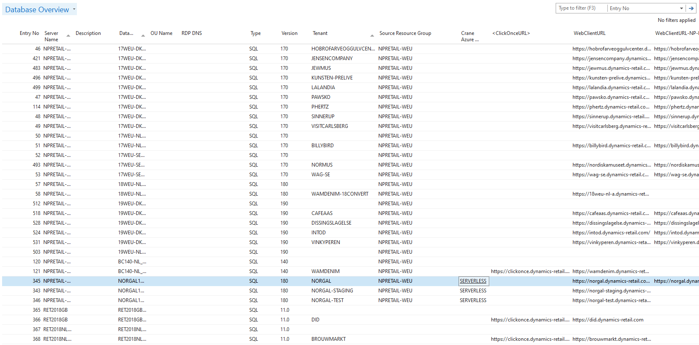
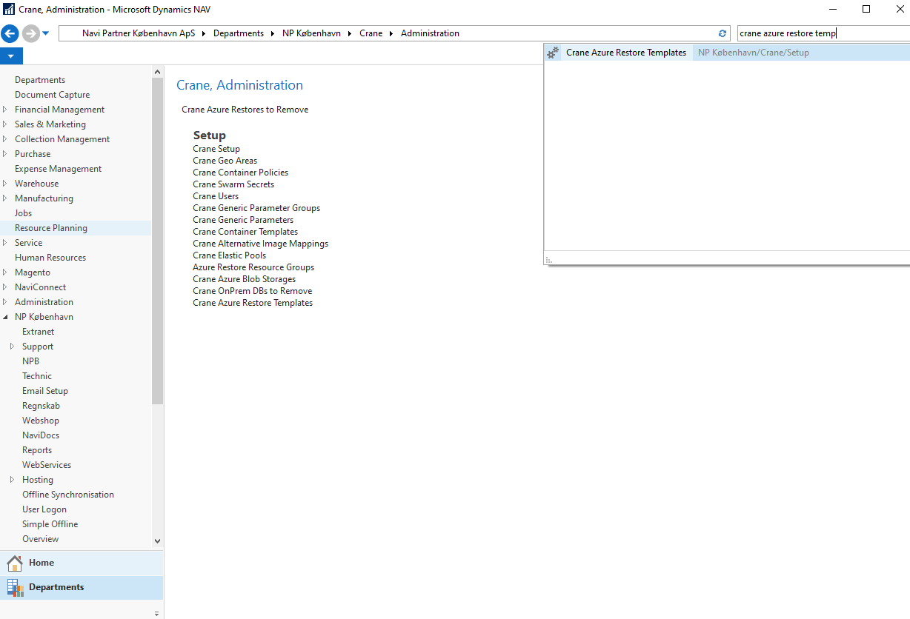
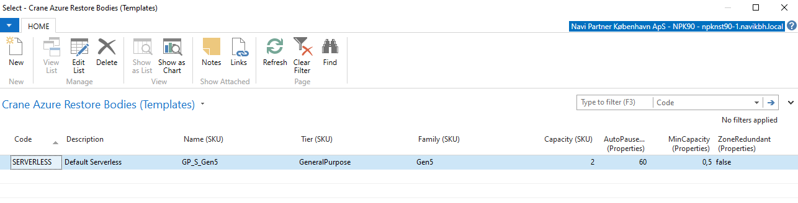

# Azure Database Restore Templates (for SERVELESS pricing model/tier).

### In order to be able to deploy selected tenant databases not to elastic pool but separately and with `serverless` pricing tier model, we introduce functionality `Azure Restore Templates`.

**Azure Restore Templates** functionality is activated when you start the process Azure Database restoration. It will be activated only if you configure one of the existing templates. If the value isn't provided, the common procedure will be used instead and the tenant database will be restored to the preconfigured elastic pool.

We told that we need to configure one of the templates. In order to do that, please, go to `Azure Restore Management` from the selected `Crane Container`. There, go to the lines and for tenant database (**and this is very important, APP database shouldn't have any value here as we don't want to be restored as serverless!!!**) and configure one of the provided templates:

To make everything easier, there is the same field also on `Database` level. So **Hosting** can preconfigure all relevant databases in advance and then the information will be automatically transferred to the `Azure Restore Management`, to the proper place (tenant database):

**Hosting** can also create/update/delete templates. Please, search the `Crane Azure Restore Templates` agenda and there you can proceed with required configurations:

You can configure several things for each template. In order to make it correctly, it's necessary to know relevant values. Also some combination of values are not possible. As far as I know, there is no nice guide providing you list of proper values and valid combinations. I recommend to change values manually on `Azure Database` level in the **Azure Portal** and then see `JSON definition` and take values from there to the new or existing template.

