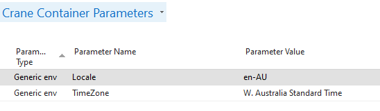

# Container Culture and Time Zone settings

### If you need for any reason change the default culture (1033 - en-US) and/or the default Time Zone (UTC) you have now an option of doing that through **Crane Container Parameters**.

The configurations happen through **Parameter Type** = ```Generic env``` . You can set one of the following parameters up to achieve the goal you need:
 - ```Locale``` to set the culture up. There are several pre-configured values for the most frequent locales (those corresponding with the localizations of BC). Supported locales can be found [here](https://docs.microsoft.com/en-us/bingmaps/rest-services/common-parameters-and-types/supported-culture-codes).
 - ```TimeZone``` to set the Time Zone. There were only a few of them added as examples. You can find more Time Zones [here](https://docs.microsoft.com/en-us/windows-hardware/manufacture/desktop/default-time-zones).

