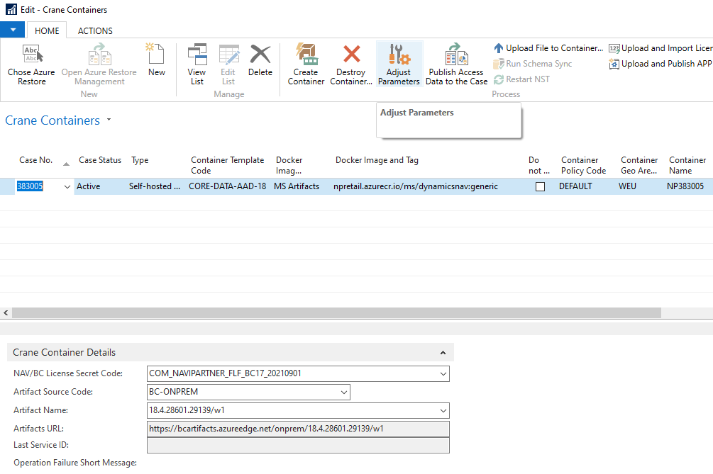
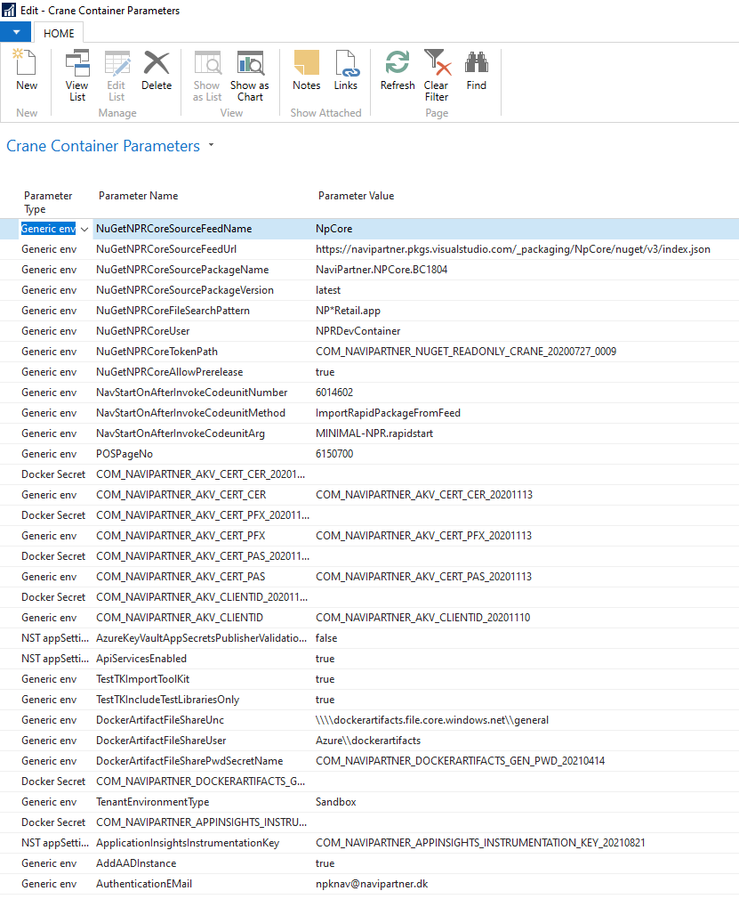
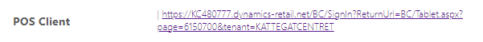

# **Crane Container Parameters** let you change the behavior of the containers.

### **Crane Container Parameters** is very tightly related to [the parameters you can find on Crane Templates](./Crane-Templates). The main difference here is you change the parametrization of a specific container only, it won't affect the rest of the containers at all.

In order to adjust the parameters, go to **Crane Containers** page and click on **Adjust Parameters**.

Now you can adjust required parameters (you can change the existing ones, add new ones or eventually remove those you don't want to be there). Just keep in mind that some of them are not standalone parameters but we use them together with others.

**It's also necessary to restart the container once you are done with the changes!**

---

## The list of the parameters (will be extended over time to cover most of them relevant to be changed by you):

| **Parameter Type** | **Parameter Name** | **Parameter Description** |
|--|--|--|
| Generic env | POSPageNo | POS Page number being rendered on the landing page in the URL(s).      |

