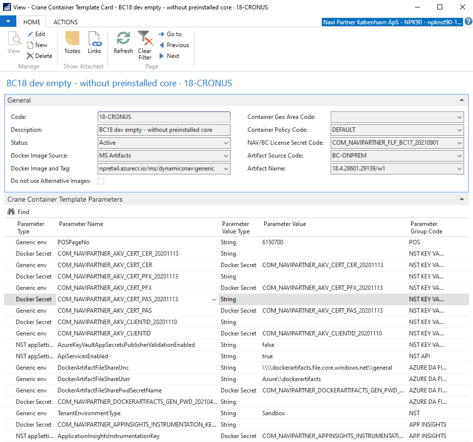
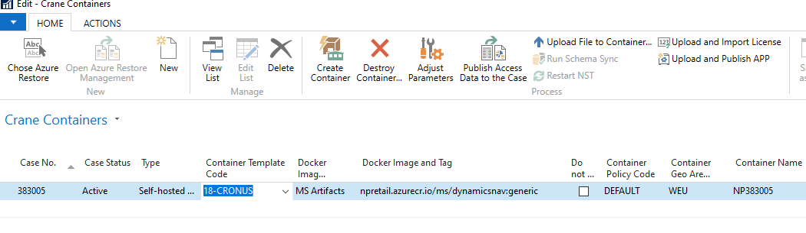
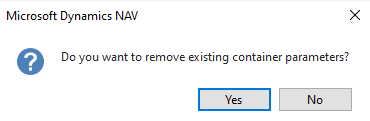

# **Crane Container Templates** - an easy way to define all container parameters

### **Crane Container Templates** speeds up the container definition. They help us to specify all required parameters for specific use cases. And for you, it's a great help in the way of selecting a proper parameter set (template) for your container. This makes the container definition quite an easy and quick task while helping us to cover many different scenarios and BC/NAV version.   

Templates consist of several common and widely used parameters across all containers. They also contain other additional parameters that can vary significantly based on use cases (templates).

The common parameters are stored in ```Crane Template Header``` table while the additional parameters are located in ```Crane Container Template Param``` table. Both are projected and accessible via ```Crane Container Template Card```.



Additional parameters sometimes include a short description and several possible values (true/false for booleans, enums or examples values - e.g. NuGet package names).

The maintenance of the templates is in the hands of the administrators (Crane administrators). These shouldn't be altered by the common users!

---

```Crane Container Template``` can be assigned to your container, directly from ```Crane Container``` page. 

 

Again, it's a very easy task but you should keep several details in mind:
 - You can assign/change the template code whenever you want and it won't affect the state of the physical container itself unless you (re)start it.
 - When you assign/change the template code in your container definition, the change will result in the update of the parameters. Basically, we copy all parameters from the template (both, header and lines) to the [container level](./Crane-Container-Parameters). We update the common fields (directly on the Crane Container level) and the additional parameters are overwritten but with a prompt (confirm dialog).
   
 - In regards to the previous lines, be careful if you use a special custom configuration of the parameters and you are going to change the template. If you confirm the dialog you will lose your customer parameters in favor of the standard ones coming with the new temmplate.
 - As you can probably understand, you can adjust any of these parameters once you have them assigned to the container. [You can change values, remove parameters or add new ones.](./Crane-Container-Parameters) Whatever is allowed but we can't guarantee your container will start up properly ;) Several examples:
   - You shouldn't use parameters (templates using these) publishing **NpCore** or importing the data (initial demo data) if you use an Azure restore. It doesn't make too much sense and can cause issues (or will do probably).
   - You shouldn't change runtime (artifact version) if you don't delete an existing database.
   - ...
 - Once you have configurations ready, you have to (re)start the container to bypass the parameters to the new containers. This will effectuate all changes.

---

Currently, we have these templates (I will omit BC version number to make the list version-independent because most of the templates repeat for different BC versions):
 - **CRONUS** - This is a Cronus container. It has nothing else but the standard Cronus database inside. There are no additional apps being installed or any custom data. Use cases:
   - Testing of the standard provided by MS.
   - **Perfect fit for Azure restores!!!!!**
   - If you need to deploy your app to the blank (Cronus) database and you don't want to be messed up with anything coming with **NpCore**, **WMS** etc.
 - **CORE**, **WMS** - This container will contain a preinstalled version of **NpCore**/**WMS**. Today, the template says it's the **latest prerelease** version. Of course, these are ones of the parameters users from time to time change if they need e.g. a specifcic version (```NuGetNPRCoreSourcePackageVersion```) or the latest official release (```NuGetNPRCoreAllowPrerelease```). Use cases:
   - You need to test **NpCore**/**WMS** but you still need to import custom data or for some reason, you need a blank database (without the template/demo data).
 - **CORE-DATA** - This container will container everything **CORE** container would have but also we import the data from a *Rapid Start* template. As a result, you will have a fully functional environment, with POS enabled and some demo data inside. Currently, we don't have the data for **WMS** so the template is valid only for **NpCore**. Use cases:
   - You need to test or present fully functional **NpCore** with **POS**.
   - You need to develop and test (and you need the data). Of course, you will upload your changes via *VS Code* but thanks to the initial **NpCore** installation and the data import you will have a functional environment ready for testing of your changes even before you will deploy your own modifications.
 - **CORE-DATA-AAD** - Everything mentioned above but also with (currently experimental feature) **AAD integration**.
 - **INSIDER** - BC insider program. This will contain an empty container as we can't probably preinstall **NpCore** or **WMS** due to possible incompatibilities. Use cases:
   - The preparations of the products for the next official release of BC.
 - **PUBPREV** - Public (Microsoft) preview of the next release. There is no custom NP product being pre-installed. We can expect these will appear approx. 1 month before official releases. Use case:
   - Testing and learning of the upcoming BC version. 
   - Confirmation of the features being announced.
 - **LEGACY** - This template is aiming at our legacy customers. Those running on the older *C/AL* code-base. Some of them are using newer versions with customizations made via *Extensions*. Use cases:
   - Ideal for the development of the extensions for legacy customers. In this case, is very good to have also Azure restore to get the entire application pack from the customer database. Otherwise, you will get only *C/AL* code from the app database with the standard (MS) apps preinstalled.
