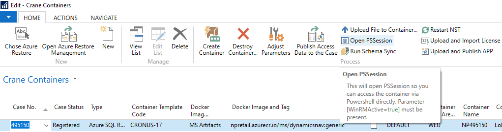
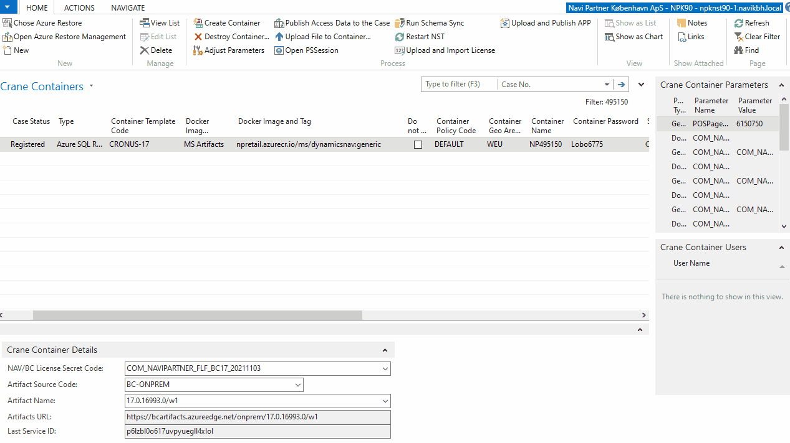

# **Open PSSession** feature lets you access the PowerShell of the container.

### Every time you need to access a PowerShell session of the container, you do this from Portainer. Since now, you can use **Open PSSession** feature that will let you access the PowerShell session directly from your machine.

To activate this feature and access the session, everything you have to do is the following:
 - Add or make sure the following parameter is present: `Generic env` - `WinRMActive` = `true`. I have activated the parameter on all templates. That means every new `Crane Container` record you create since now will include the parameter out of the box.
 - Start the container.
 - Click on `Open PSSession` action:

    

 - The action will open PowerShell on your machine, authenticate against the container and open `PSSession`.

    

There are some restriction on the amount of requests per time unit (rate limits) to avoid abusment. Usually, these limits shouldn't limit you in the normal work.

The communications happens via PSSession which is internally using WinRM which is configured to use HTTPS and Baisc Authentication. And there are currently no IP filters being set.