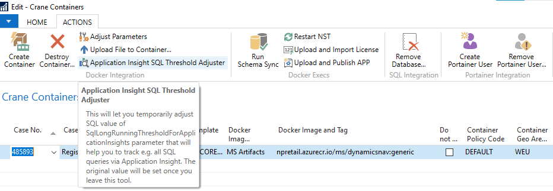
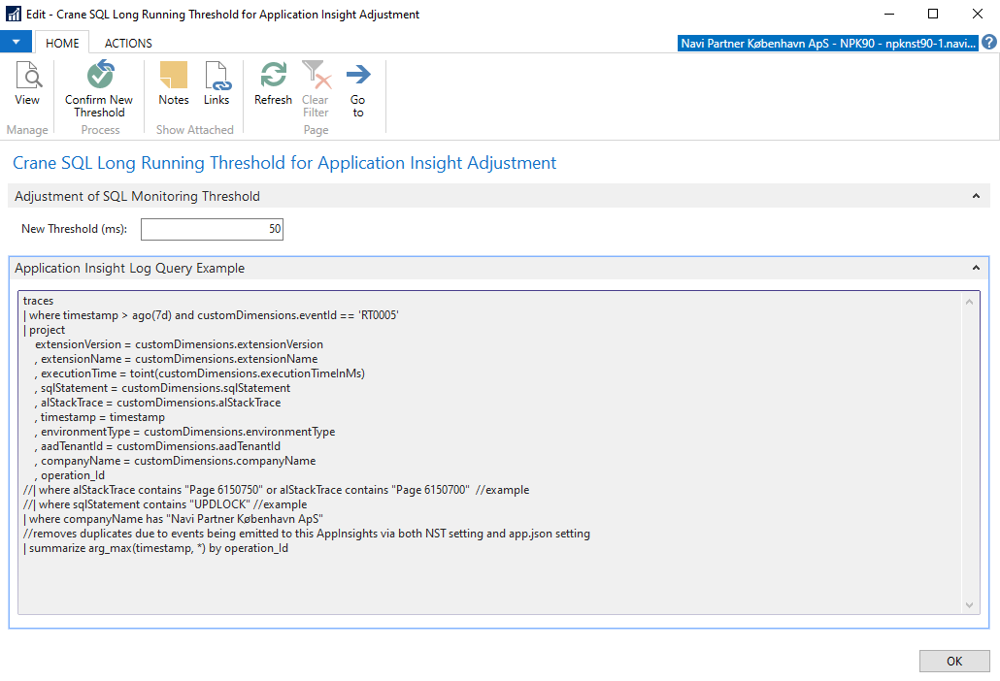

# SQL Long Running Query Threshold Adjustment for Application Insight

### If you need to work on a performance tuning against containers, this will provide a quick option how to adjust *query threshold* and send more or all queries to Application Insight.

You can use the following page to adjust `SqlLongRunningThresholdForApplicationInsights` parameter and in this way, you can basically start sending practically all SQL queries to *Applictation Insigh* (if you set **New Threshold (ms)** to value 1.

Be careful, this will produce a significant amount of data so the feature should be used only during the time that is required!!!

The feature usage:
 - Open **Crane Container** page and go to **ACTIONS** tab.
 - Click on **Application Insight SQL Threshold Adjuster**   

   

- The following page will open. There you can adjust the query threshold via **New Threshold (ms)** parameter.   

   

   - Set **1 ms** if you need to send all SQL queries to **Application Insight**. This might partially work as an alternative to **SQL Profiler**.
   - Set higher values to capture only relevant long-running queries.

- You have to change the value and then confirm with the button **Confirm New Threshold** (this is necessary to avoid unwanted values being sent directly to the container NST).
- Once this action is confirmed, the new threshold is valid (immediately).
- You can use the KQL query below to gather the data. Please, keep in mind, this is a sample query and you can/should elaborate according to your needs directly in the [query editor](https://portal.azure.com/#@navipartner.dk/resource/subscriptions/69d253f1-b9ce-4d76-b16d-7db24c8c48ad/resourceGroups/NPRetail-Application-Insights/providers/microsoft.insights/components/NPRetail/logs).
- Once you are done, close the page. When closing the page the original threshold (the default one is usually **750 ms**) will be set. The original value is taken from the persisten NST settings. We basically adjust only **in-memory** value which makes the changes temporary and immediately available.
- In the case of NST crash or some unexpected disconnection the original value will be re-set during the next login to the case system (there are some entries in a table we use to control this).