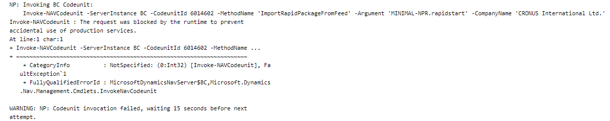
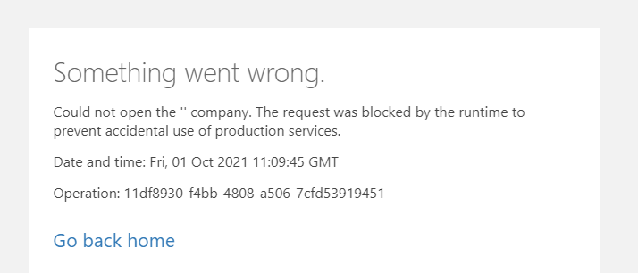
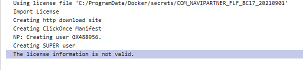
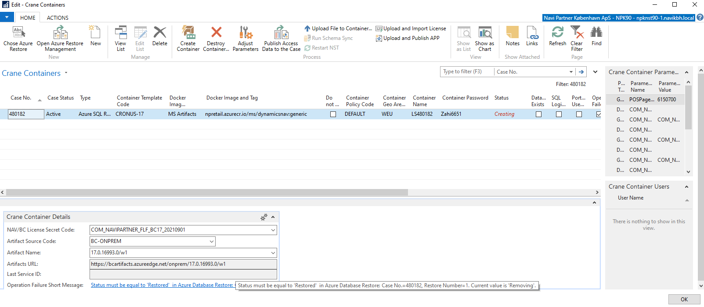
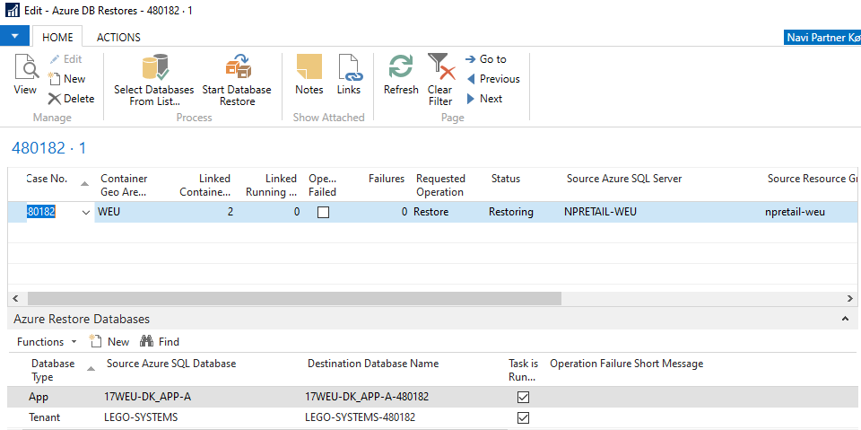

# Troubleshooting of Crane Issues

### This section will cover different scenarios that repeat and we are getting cases to help you with. Many of them can be resolved directly by you so I will try to cover these here.

---

**Issues:**
- You run a signle-tenant (no Azure restore) **NpCore** container and it fails on the data import.
  - Details:

      ```Invoke-NAVCodeunit : The request was blocked by the runtime to prevent accidental use of production services```

      

  - Possible reasons:
    - Check if ```TenantEnvironmentType=Sandbox``` and you use don't use ```NuGetNPRCoreSourcePackageVersion=latest```.
      - Resolution: It 's important to use ```Sandbox``` for NpCore higher than **1700.10.0.92** / **1804.10.0.44**. If you need to use a lower version, please, switch to ```TenantEnvironmentType=Production``` instead.

---

 - When running a multi-tenant container against an Azure restore, probably with **NpCore** and using **Sandbox** environment, the services are up but you **can't login**.
   - Details:
     - You might see one of the following screenshots:

       

   - Possible reasons:
     - Check if ```TenantEnvironmentType=Sandbox``` and you use don't use ```NuGetNPRCoreSourcePackageVersion=latest```.
       - Resolution: It 's important to use ```Sandbox``` for NpCore higher than **1700.10.0.92** / **1804.10.0.44**. If you need to use a lower version, please, switch to ```TenantEnvironmentType=Production``` instead. [You can read how to change parameters on containers right here.](./Crane-Features/Crane-Container-Parameters)

         Also, you have to blank ```dbo.$ndo$tenants``` table in the associated **app database** to make the changes efficient as the situation for multi-tenant is slightly different.

         ```sql
         truncate table [dbo].[$ndo$tenants]
         ```

         Now you can restart the container.
      
---

- Container is **Created** in Portainer you can see it's ending up with the license import.
  - Details:   

    The error says:
    ```
    The license information is not valid
    ```

    

   - Possible reasons:
     - The license isn't probably not aiming the correct NAV/BC version.
       - Resolution: Please, change the license. Keep in mind that the latest BC version don't use the same license you are supposed to use with NAV 2018 and lower (at least). 

         If you run NAV 2018 and lower, try to remove the license code as the global setup is configured (at least today) with the license matching the older (legacy) versions (```COM_NAVIPARTNER_LICENSE_DEVFLF```). If you use the empty value, then try to set another value.
  
---

- If you try to start a container and you see ```Status=Creating``` but in **red** color.
  - Details:

    

   - Possible reasons (please, always read the details bellow, the line in the bottom of the page where the details are published):
     - ```Status must be equal to 'Restored'  in Azure Database Restore: Case No.=xxxxxx, Restore Number=1. Current value is 'XXXXX'.```
       - Resolution: This is Azure connected container and the restore has been probably requested (or maybe removed) but not restored yet. It's necessary to proceed with the restore (forward the case to **Hosting** department to proceed with the restore).
         If you want, you can check the restore status by accessing the agenda via **Open Azure Restore Management** button.

         