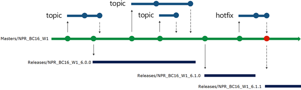
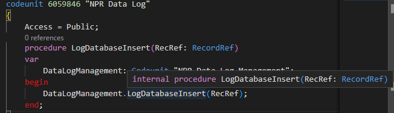

Welcome to NP Core repo. This is our central repo for our flagship product.

[[_TOC_]]

# Introduction
We use Azure DevOps to manage our core development.
The core solution is located in the NpCore repo of this project.
Other core apps, such as country specific apps, are located in other repos of this project.
Customer projects are located in "ZAL-CustomerName" projects instead of this project.

We maintain a single master branch of NpCore and use pull requests, work items and pipelines to coordinate our work.
For differences in future BC version baseapps that impact NpCore, we will use compilation preprocessor flags to keep everything on one branch, this is detailed in another wiki article.

# Branching Strategy
We use ”Release Flow” as our git branching strategy.
It is documented in detail here:
https://devblogs.microsoft.com/devops/release-flow-how-we-do-branching-on-the-vsts-team/ 
This means that we have a master branch that should always be “ready to release” for each major version. If a feature is not ready for master the conflict must be resolved on the ongoing topic branch before merging. Topic branches should be isolated to specific features or bugfixes.
The only difference for us is that every single hotfix triggers a new release.
This is because we need to generate a new .app and these need to be uniquely versioned, even for hotfix versions.

Illustrated in a graph the flow looks like this:



Note that:
- Hotfixes are treated as any other topic branch. These are still merged to master before creating any hotfix release branch to make sure master never accidentally falls behind.
And they must still be placed in a topic/* named branch while developing.
From here hotfixes can be cherry picked to a hotfix release branch if it needs to reach our production nuget feed before next official release. Triskelion can deploy from the production feed to production tenants.
- This approach means that multiple hotfix releases created for the same release will be additive! 
This is different than the C/SIDE world where individual objects were frequently touched in different ways for different databases. 
This additive approach to hotfixes means that the 3rd hotfix release will contain code from the 1st and 2nd hotfix release as well and so on, but it is critical to maintain a linear release flow that we can reason about internally in NaviPartner. Otherwise, our deployed versions list will be a christmas tree of quickly growing size which we will not be able to keep an overview of. (Just like it was in C/SIDE).

# Versioning Strategy
The first number follows the minimum baseapp requirement for example 1700 for BC17.0
The second number is our actual version number, for example release 1 of NpCore is 1700.1.0.0
The third version number increases for hotfix releases, for example release 1 hotfix 1 of NpCore is 1700.1.1.0

The reason we use BC version first is to make it clear from the version list which NpCore version to use for a given BC environment.
For example, to fix breaking changes in BC18 pricing we'll start maintaining NpCore for BC18 versioned as 1800.2.0.0 while 1700.2.0.0 will contain all the same NpCore features and bugfixes since the second number on both releases is 2. 

Note that we ignore the fourth number since there is no logic tied to it, it is our internal revision number always set to 0 for production apps and auto increasing for internal prerelease builds.
When developing against a crane container you can set it to .9999999 so you can easily deploy to containers with pre-installed NpCore versions.
Remember to not commit changes to the app.json when you are done!

# Tips and Best Practices

1. After you clone the project you can do Ctrl+Shift+P -> "Tasks: Run Task" -> "Download Dependencies". This will run the script download_compile_dependencies.ps1 in the .scripts folder on the project which will download all our .net dependencies and place them into the .netpackages folder that the AL compiler looks in. You might need to restart VSCode before it picks up .dll changes.
2. Setup the following path in your AL probing paths in vscode for references to mscorlib:
```
C:/Windows/Microsoft.NET/Framework64 
```
3. Typical development branches must be named as topic/*, otherwise you cannot push to origin.
4. Pull requests, commit messages, descriptions etc. do not all need to have case numbers applied to them. The reason is that a work item is enforced for every pull request and the case number field is enforced for all of these work items.
That means, for navigating through history, you can already search for a case number in the far right corner on the DevOps “board” view of work items, which will find related work items.
From here you can see all linked pull requests. This is more powerful than searching through commit messages since there can be a many-to-many relationship between pull requests and work items, so searching for work items first gives you full overview quickly in case development was split up for a single case.
5. We use squash commit on all pull requests so they are squashed into one commit before merging to master branches. This is what allows us to quickly cherry pick that single commit onto a hotfix release branch if necessary.
6. **Make sure to always set your pull request to auto complete** as soon as you create your PR.
Otherwise your PR might be left in a "ready to merge" state where all checks have been approved. This increases the risk that the pipeline will expire and need to re-run again, because another PR merged in between.
Another reason is that only the topic branch author (you) have permission to delete topic branch. You do this by using Set auto-complete button in top right corner of the pull request page.
7. Get familiar with the git cherry pick command, as it is used for hotfix release branches.
8. Use the access modifier internal heavily in code that should not be exposed to other extensions. This is the first time in NAVs history that you can properly design an API towards other apps, by locking down everything except the intended public functions & tables. Internal should be your default access modifier to simplify future refactoring from potentially becoming a breaking change towards other extensions.
9. Breaking table changes are not allowed, even for on-prem targets. Use Obsolete parameters and appendh new fields & tables instead. We might as well get used to the MS cloud rules even before we get there.
10. You can use the “CRS AL Language extension” in vscode with auto rename setup on save to enforce the prefix and naming style automatically.
The following vscode config for the CRS extension is a recommendation that can be copy pasted:
```json
"CRS.FileNamePattern": "<ObjectNameShort>.<ObjectTypeShortPascalCase>.al",
"CRS.FileNamePatternExtensions": "<ObjectNameShort>.<ObjectTypeShortPascalCase>.al",
"CRS.FileNamePatternPageCustomizations": "<ObjectNameShort>.<ObjectTypeShortPascalCase>.al",
"CRS.RenameWithGit": false,
"CRS.ObjectNamePrefix": "NPR ",
"CRS.RemovePrefixFromFilename": true,
"CRS.DisableCRSSnippets": true,
"CRS.OnSaveAlFileAction": "Rename",
```
11. Do not re-use your topic branch after completing a squash commit via a PR into master. Git will get confused since the squash commit has a different ID than the latest commit on your topic branch. So even though they are functionally the same, the latest commit ID is not, unless you immediately merge master back into your topic branch.
12. For more complex git operations, a dedicated git tool like [GitExtensions](https://gitextensions.github.io/) will be better than the git tab in vscode, for visualizing exactly what is going on.
13. Remember not to close your case before your PR is merged. Your case is not done until the code is in the master branch.

# Object names and ID

Every object must be prefixed with “NPR”. Every page-/tableextension field, group, action must be prefixed with NPR as well. 
For IDs in NpCore we do not maintain module specific areas. Microsoft long term plans are to remove IDs and grouping based on ID is no longer required when using vscode to organize files.
It is recommended to make heavy use of intellisense (ctrl+space when Id in a snippet is selected) to pull next available ID for new object. If someone else used the same ID as you and his pull request is merged before yours, you will get an error that you can quickly fix locally by swapping IDs. Remember that AL code maintain references via name instead of IDs so you can quickly swap IDs without losing test data in your container.

For making sure we don't have conflicts when multiple developers are creating new objects in the same project we are using 
[AL Object ID Ninja](ALObjectIDNinja.md)

# Project Structure

Modules are split into separate folders as much as possible. There are no hard rules about the organization inside of these as the details are module specific.
Files are named according to MS recommendations of Name.Type.al
If you prefer a C/SIDE-like list based overview of objects this is still possible using the 3rd party “AL Object Designer” extension.

There are some special folders in the project, sorted at the top alphabetically:

__Legacy (STILL SUPPORTED): 
Contains every module that is planned to be phased out but must still work. This is meant as a reminder to anyone that they should not invent new features for these modules before asking around.

__Obsolete (NOT SUPPORTED): 
Contains obsoleted tables from dead modules.

_Control Addins: 
Contains all control addins. Since these can overlap multiple modules they are not maintained inside a module folder.

_Page Extensions: 
Contains all page extensions. Since these can overlap multiple modules they are not maintained inside a module folder.

_Table Extensions: 
Contains all table extensions. Since these can overlap multiple modules they are not maintained inside a module folder.

_RoleCenters: 
Contains all rolecenter pages & logic. Since these can overlap multiple modules they are not maintained a module folder.

_Reports: 
Contains some reports. These are fine to have in module folders as well, but a lot of our reports are cross module which fits this folder.

_Misc: 
For anything not deemed to fit a specific module and/or not big enough to warrant its own folder. 
Usually one-object scoped functionality that is independent from other functionality.

# Internal access modifiers and _public folders
Just like Microsoft with their BaseApp, we need to be careful about what AL methods and objects we expose publicly in our ISV modules. 
The reason is that we risk breaking a PTE, both our own and from partners, if we later refactor something public, plus we have to deal with slowly obsoleting objects in multiple steps to comply with appsource cops when we touch public code.

For those reasons, we have defined a structure where public objects must be placed inside a folder with the name _public. 
There can be an infinite number of _public folders, so we recommend that they are placed inside module folders in appropriate areas. 
The reason we did this, is because objects in AL are public by default instead of private by default. So the only way we can be sure that someone truly meant for something to be public, instead of just forgetting to mark it as internal, 
is by doing something like this. 
Our pipelines will fail if you have a public object outside of a _public folder, allowing us to catch these errors early.

Note that you will see a lot of older verbose code marked as public for backward compatibility reasons, however **for all new code you should strive to comply with the approach Microsoft uses for their system apps.** 
This approach entails using small public codeunits that carry tiny functions and event publishers. Those tiny functions can then call into internal objects. This is to have proper contract/API codeunits.
Tip: You should avoid exposing tables as public unless it is very explicitly a part of your API design - the reason is that tables have so many built-in events that if you group together all the field validations, OnBeforeX, OnAfterX, OnDelete events
together, any external .app will be able to depend on a TON of implementation details. Whereas with an explicitly designed codeunit API, everything has to be done and invoked in the designed manner, from the outside.

Look at Microsofts system app for inspiration. For example, this little module shows how they structure this: 
https://github.com/microsoft/ALAppExtensions/tree/main/Modules/System/Azure%20Key%20Vault/src

They also have some additional notes on these ideas on their docs portal here: 
https://docs.microsoft.com/en-us/dynamics365/business-central/dev-itpro/developer/devenv-blueprint#object-accessibility

## Internal procedures to Public
**Internal procedures should not be converted to public ones.** Instead of making existing internal procedures public and exposing more of the code, better would be to create a facade codeunit that will call internal procedure, as standard is doing it.



As you can see in the example above, a new public codeunit is created with a public procedure that is calling the existing internal procedure.
# Code Review
Do not be afraid to write feedback on a colleagues pull request - we all have to learn and improve :)
And try not to take it personal if your pull request is failed in the first go.
The main purpose of code reviews is to passively share knowledge and to trigger self regulation due to the subconscious knowledge that things will be double checked. The second purpose is a 2nd chance at catching problems in the actual code.
Even if it’s “just minor details”, if it is clearly wrong/suboptimal, then fail it and write why.
If it’s a matter of opinion then do not fail it unless you think it will actually lead to a constructive discussion.

# Hotfixes

Procedure is as described:
1. Always merge to master branch first via a topic branch and PR. Same as any other change, so the master cannot fall behind a hotfix release.
2. Create a hotfix release branch inside the releases/ folder with name of the 2nd+3rd digit (our version numbers).
**Hotfix release branches must be branched from the last release, NOT master, so that we don't deploy anything done on master since last release if we are only hotfixing. This way, hotfixes will be additive but at least they won't contain everything, only the bare minimum!**
**Make sure you are not creating a new branch from release branch where work is in progress. Good thing to check is the number of commits behind/ahead, whether the branch is locked and if pipeline has been completed**
3. Create a topic branch from 2). This is the branch where you will prepare the hotfix code, before PRing back onto the release branch created in 2)
4. Cherry pick the commits from the master branch (using commit IDs) onto your topic branch.
5. Manually test the hotfix .app if necessary. Remember that the unique combination of changes might cause a different behaviour than on master branch.
6. Create a PR from your topic branch to your release branch. 
7. When PR is approved, the new hotfix release branch should now contain the changes you wish to release. Any further hotfixes will need to go into another newer hotfix release.
**If you are done with changes, you can now lock the branch**
8. Run the release pipeline on this new release branch. It will output release artifacts to the npcore nuget feed.
These can be deployed to prod tenants via triskelions lookup into the nuget feed.
The release pipeline is found here: https://navipartner.visualstudio.com/NpCore/_build?definitionId=38 (NpCore Release build)
**Note - Since pipeline execution is manual, please pay attention to if the developer before you is done with his hotfix (=pipeline has run, .app is in release feed). Otherwise you might beat him in the "race" with a higher version than his, if creating hotfixes in parallel. Ideally two hotfixes in the same day could instead be one, with changes from two developers.**
**It is a recommended that you announce new release in Teams Channel NAV Developers (sync'ed) - NP Core Releases. If another developer already announced new release you could contact them and join them in release.**

# Restructuring the repo or renaming files - important!

If you are renaming/moving a file and changing the contents at the same time, please verify using staging in vscode that it automatically detects that you have done a **rename** rather than a delete + addition. 
Git has built in mechanism that checks this when you **stage**, but they won't run if you skip staging and just commit all changes immediately.
If you modify more than 50% of a files content or the amount of changes in the entire commit is too high, the auto rename detection will also not work. In that case, you will need to manually handle renames and modifications in two separate commits, please read the following article for more info on that:
[Restructuring, renaming, and keeping our change history in git](https://dev.azure.com/navipartner/_git/NpCore?path=/Documentation/internal/developers/Restructuring-the-repo%2C-renaming%2C-and-content-changes.md&version=GBmaster&_a=preview&anchor=restructuring%2C-renaming%2C-and-keeping-our-change-history-in-git)