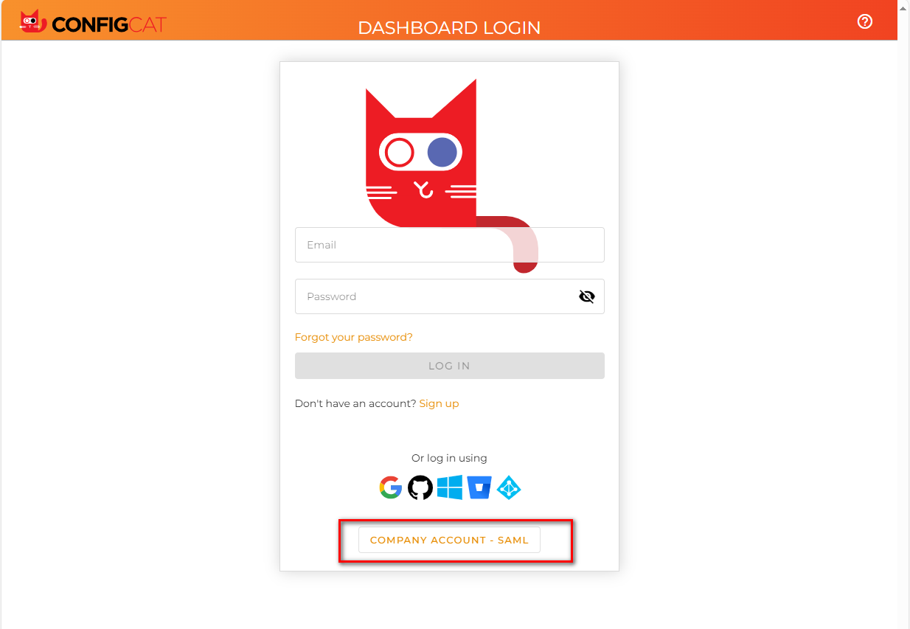
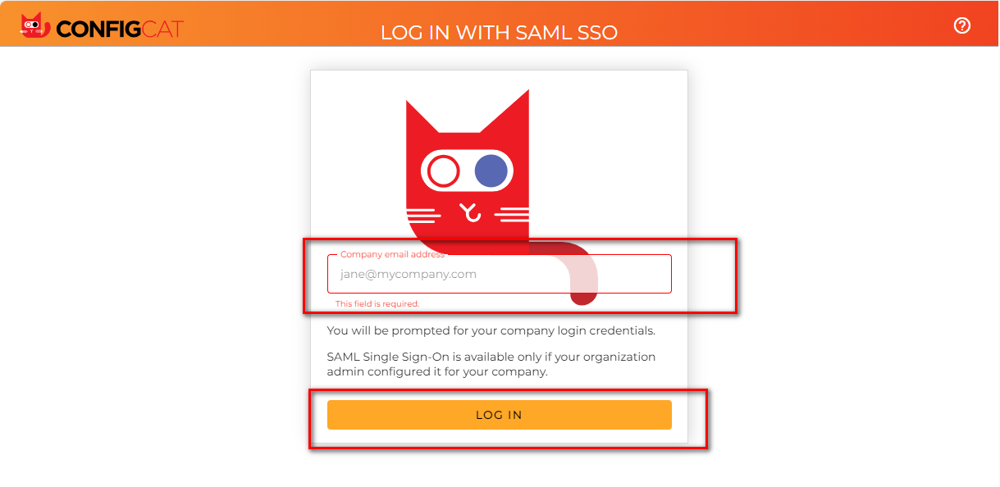
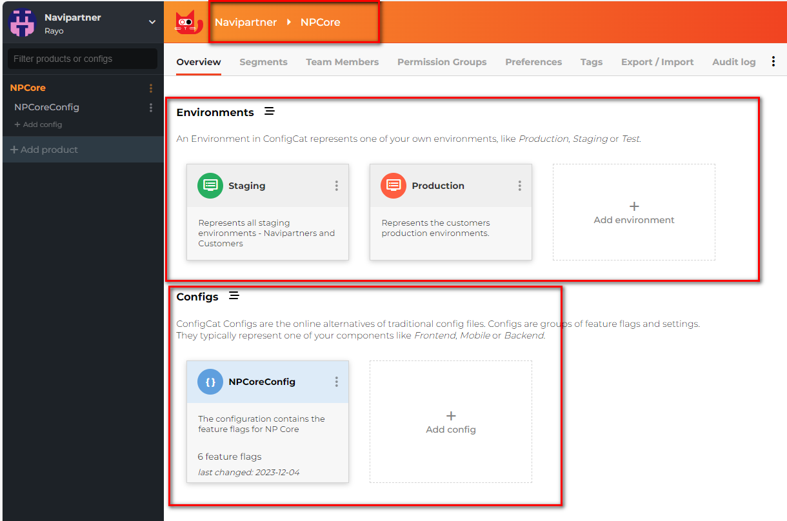
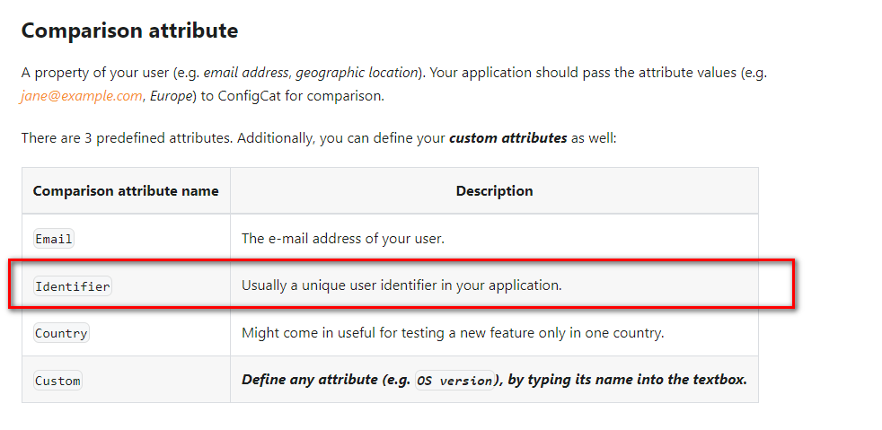
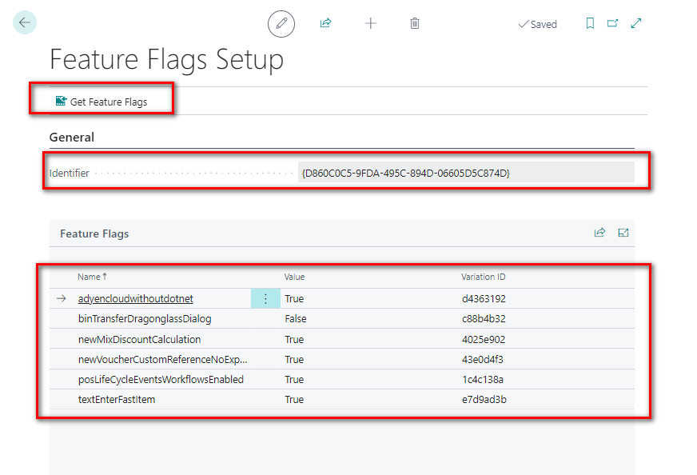
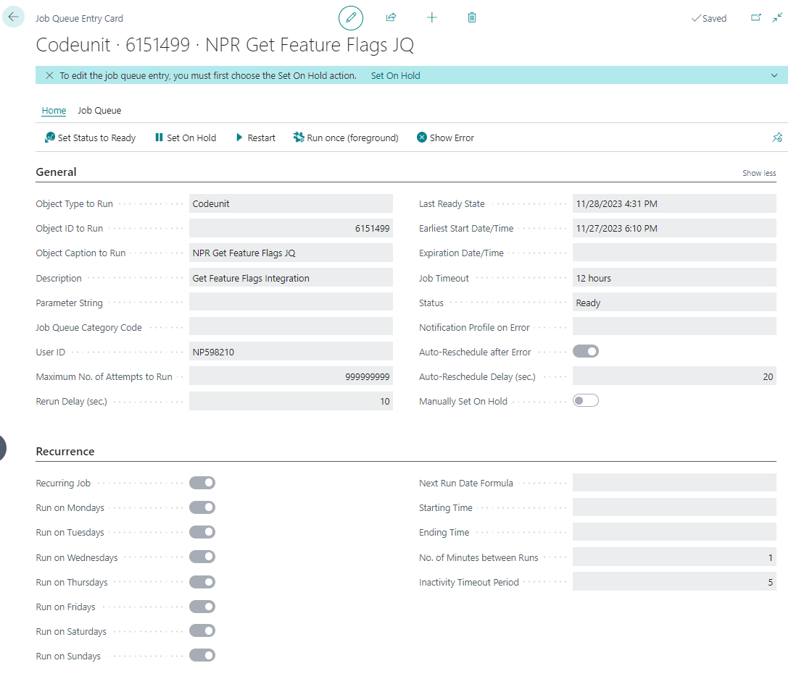
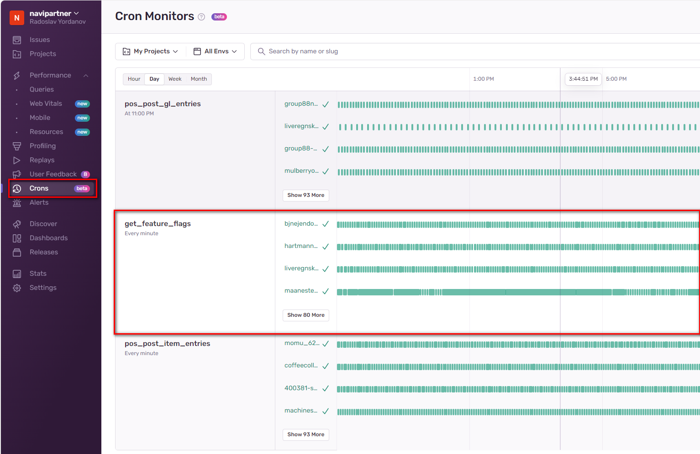
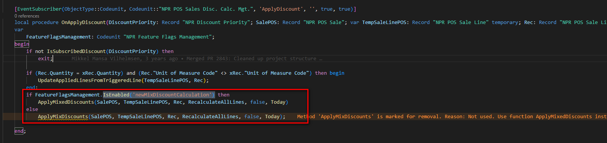
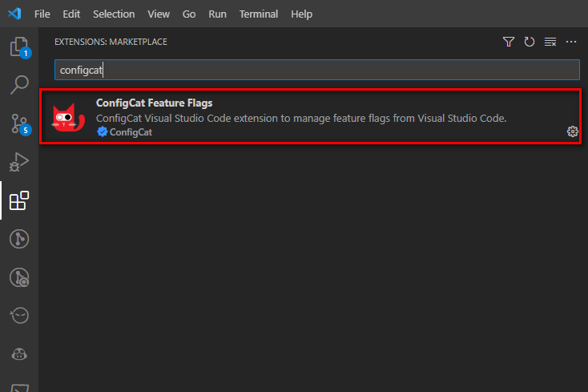
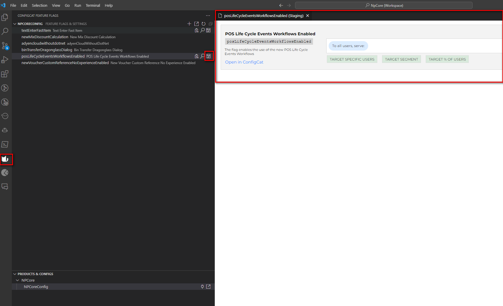

# NaviPartner Feature Flags

## Table of Contents

1. [What are feature flags and what are they used for?](https://navipartner.visualstudio.com/NpCore/_git/NpCore?path=/Documentation/internal/developers/Feature-Flags/FeatureFlags.md&_a=preview&anchor=what-are-feature-flags-and-what-are-they-used-for?)
2. [ConfigCat](https://navipartner.visualstudio.com/NpCore/_git/NpCore?path=/Documentation/internal/developers/Feature-Flags/FeatureFlags.md&_a=preview&anchor=configcat)
3. [Getting started with ConfigCat](https://navipartner.visualstudio.com/NpCore/_git/NpCore?path=/Documentation/internal/developers/Feature-Flags/FeatureFlags.md&_a=preview&anchor=getting-started-with-configcat)  
3.1. [Log in to ConfigCat](https://navipartner.visualstudio.com/NpCore/_git/NpCore?path=/Documentation/internal/developers/Feature-Flags/FeatureFlags.md&_a=preview&anchor=1%29-log-in-to-configcat)  
3.2. [Get familiar with the basic concepts used by ConfigCat](https://navipartner.visualstudio.com/NpCore/_git/NpCore?path=/Documentation/internal/developers/Feature-Flags/FeatureFlags.md&_a=preview&anchor=2%29-get-familiar-with-the-basic-concepts-used-by-configcat)  
3.3. [Navipartner project structure](https://navipartner.visualstudio.com/NpCore/_git/NpCore?path=/Documentation/internal/developers/Feature-Flags/FeatureFlags.md&_a=preview&anchor=3%29-navipartner-project-structure)  
3.4. [Create a feature flag](https://navipartner.visualstudio.com/NpCore/_git/NpCore?path=/Documentation/internal/developers/Feature-Flags/FeatureFlags.md&_a=preview&anchor=4%29-create-a-feature-flag)  
3.5. [Targeting](https://navipartner.visualstudio.com/NpCore/_git/NpCore?path=/Documentation/internal/developers/Feature-Flags/FeatureFlags.md&_a=preview&anchor=5%29-targeting)
4. [Business Central Integration](https://navipartner.visualstudio.com/NpCore/_git/NpCore?path=/Documentation/internal/developers/Feature-Flags/FeatureFlags.md&_a=preview&anchor=business-central-integration)  
4.1 [Feature Flags Setup](https://navipartner.visualstudio.com/NpCore/_git/NpCore?path=/Documentation/internal/developers/Feature-Flags/FeatureFlags.md&_a=preview&anchor=1%29-feature-flags-setup)  
4.2 [Retrieving the Feature Flags](https://navipartner.visualstudio.com/NpCore/_git/NpCore?path=/Documentation/internal/developers/Feature-Flags/FeatureFlags.md&_a=preview&anchor=2%29-retrieving-the-feature-flags)  
4.3 [How to use the feature flags in your code](https://navipartner.visualstudio.com/NpCore/_git/NpCore?path=/Documentation/internal/developers/Feature-Flags/FeatureFlags.md&_a=preview&anchor=3%29-how-to-use-the-feature-flags-in-your-code) 
5. [Feature Flags Armageddon](https://navipartner.visualstudio.com/NpCore/_git/NpCore?path=/Documentation/internal/developers/Feature-Flags/FeatureFlags.md&_a=preview&anchor=feature-flags-armageddon)

## What are feature flags and what are they used for?

We all have been in a situation where we need to release big and complex changes that affect many areas of the system. The problem with changes like that is that even after rigorous testing there is always a possibility of an unhandled scenario or a bug that can critically affect the daily activities of our customers. When this happens it causes a lot of stress for both parties - the users using the system and the technical team responsible for the change. The users are often blocked and cannot use the system properly and the technical team needs to quickly release new hotfixes or even revert the change in total to handle the issue. In order to mitigate the stress and damage caused by situations like that we have decided to adopt feature flags in our development practices. Feature flags are simple boolean fields that are used to enable or disable features on runtime. This can help the technical team to disable the feature that is causing the problem without the need of a new release and in this way allow the users to continue using the system until the problem is resolved. On the other hand it gives more control over the release of the changes and in this way the opportunity to deal with unforeseeable situations in a less stressful way. For more information about feature flags and how they are used in software development you can read [here](https://launchdarkly.com/blog/what-are-feature-flags/).

## ConfigCat
We have decided to use [ConfigCat](https://configcat.com/#product) as our main feature flag service provider. It's a cross platform feature flag service where we're going to be hosting and managing our feature flags. We have developed an integration between it and Business Central which is going to download the feature flags to our environments. The integration works in **one direction from ConfigCat to Business Central** which means that ConfigCat is going to be our **single source of truth**. All feature flags are going to be created and managed there. You can read more about how ConfigCat works [here](https://configcat.com/architecture/).

## Getting started with ConfigCat

### 1) Log in to ConfigCat

The first thing that you need to do to start with ConfigCat is to log in and open the dashboard from [here](https://app.configcat.com/auth/login).

You need to choose **COMPANY ACCOUNT - SAML** and enter your email. The first time you log in an admin will need to approve the request and after that you will be able to use the dashboard freely.

### 2) Get familiar with the basic concepts used by ConfigCat

After you have logged in it's good to read through the [basic concepts](https://configcat.com/docs/main-concepts/) that ConfigCat uses. 

### 3) Navipartner project structure

The ConfigCat project will have the following structure:

  - **Company** - we will have only one company - Navipartner
  - **Product** - we will have only one product - NPCore
  - **Config** - we will have only one config where we will create our feature flags
  - **Environments** - we will have 2 environments:
    - **Staging** - the staging environment will contain the feature flags setup that is going to be used in **all Crane containers and customers sandboxes.**
    - **Production** - the production environment will contain the feature flags setup which is going to be used in **all production environments**.

### 4) Create a feature flag

You can read about how to create a feature flag [here.](https://configcat.com/docs/getting-started/);

### 5) Targeting

ConfigCat provides a lot of different ways in which you can target an environment. You can read more about the different targeting options and how to use them [here](https://configcat.com/docs/advanced/targeting/).

For all of the targeting options we're going to be using the **Identifier attribute**. In our case it is going to represent the **azure tenant id** for the **cloud environments** and for the **onprem environments** we're going to generate a **unique GUID**.

Our preferred targeting option is going to be [targeting a percentage of users](https://configcat.com/docs/advanced/targeting/#targeting-a-percentage-of-users). It is [sticky](https://configcat.com/docs/advanced/targeting/#stickiness--consistency) by design, which means that an environment is going to be always part of the same percentage group no matter how many times you target it.

Sometimes you will need to target environments which are grouped by different characteristics rather than grouped by a percentage. For example you may want to give an early access to a new feature in some environments. For that you can use the [segmentation functionality](https://configcat.com/docs/advanced/segments/) that is available in ConfigCat.

## Business Central Integration

### 1) Feature Flags Setup
The heart of the integration is the Feature Flags Setup page. It contains all of the feature flags that have been downloaded from ConfigCat and the unique identifier of the environment. The data in the page is **per database** which means it's **not unique for the company**.

You can use the Get Feature Flags button to retrieve the feature flags from ConfigCat on demand.

### 2) Retrieving the Feature Flags

When NP Core is installed it will create a job queue entry which runs codeunit 6151499 "NPR Get Feature Flags JQ" and downloads the feature flags from ConfigCat every 1 minute. It will be created only in the most used company, because the data in the Feature Flags Setup is not unique per company and there is no need for the job queue to run in each company. 

- Test Environments - the Task Scheduler is not enabled when you create a crane container. This is a safety measure to prevent accidental runs of jobs when using Azure Restores. Because of that we have added a code that retrieves the feature flags when you log in only in test environments.

- Production Environments - in production environments we have a functionality that resets on log in our most important jobs once per day. We have added the Get Feature Flags job queue entry to that functionality.

- Cron monitor in Sentry - the integration automatically creates a cron monitor in Sentry that tracks if the Get Feature Flag job queue is running in our saas production environments.

### 3) How to use the feature flags in your code

**Codeunit 6151495 "NPR Feature Flags Management"** contains a function **IsEnabled** that accepts as a parameter the feature flag name and returns the boolean value of the feature flag. If the feature flag doesn't exist it will return **false**. You can use the function to check in your code if the feature flag is enabled.

It's good to mention that ConfigCat has a vscode extension that can be used to show all the places in the code where the feature flag has been used. You can use it as well to manage the feature flags in ConfigCat remotely from vscode without the need to open the ConfigCat dashboard.

## Feature Flags Armageddon
Feature flags can be very helpful in dealing with the release of big and complex functionalities but at the same time they can be very dangerous if not handled properly. The most common problem that occurs when
feature flags are not managed well is to have many feature flags that depend on each other. When this happens the code becomes very dirty, difficult to understand and maintain. Because of that our main goal should be to make the life of a feature flag **as short as possible**. 

