# NaviPartner Feature Flags Architecture

## Table of Contents
1. [Architecture](https://navipartner.visualstudio.com/NpCore/_git/NpCore?path=/Documentation/internal/developers/Feature-Flags/FeatureFlagsArchitecture.md&_a=preview&anchor=architecture)  
2. [ConfigCat](https://navipartner.visualstudio.com/NpCore/_git/NpCore?path=/Documentation/internal/developers/Feature-Flags/FeatureFlagsArchitecture.md&_a=preview&anchor=configcat)  
3. [ConfigCat Proxy Service](https://navipartner.visualstudio.com/NpCore/_git/NpCore?path=/Documentation/internal/developers/Feature-Flags/FeatureFlagsArchitecture.md&_a=preview&anchor=configcat-proxy-service)  
3.1 [Docker Compose File](https://navipartner.visualstudio.com/NpCore/_git/NpCore?path=/Documentation/internal/developers/Feature-Flags/FeatureFlagsArchitecture.md&_a=preview&anchor=1%29-docker-compose-file)  
3.2 [Create ConfigCat Proxy as a web app in Azure App service](https://navipartner.visualstudio.com/NpCore/_git/NpCore?path=/Documentation/internal/developers/Feature-Flags/FeatureFlagsArchitecture.md&_a=preview&anchor=2%29-create-configcat-proxy-as-a-web-app-in-azure-app-service)
4. [Call the ConfigCat Proxy Service](https://navipartner.visualstudio.com/NpCore/_git/NpCore?path=/Documentation/internal/developers/Feature-Flags/FeatureFlagsArchitecture.md&_a=preview&anchor=call-the-configcat-proxy-service)  
## Achitecture

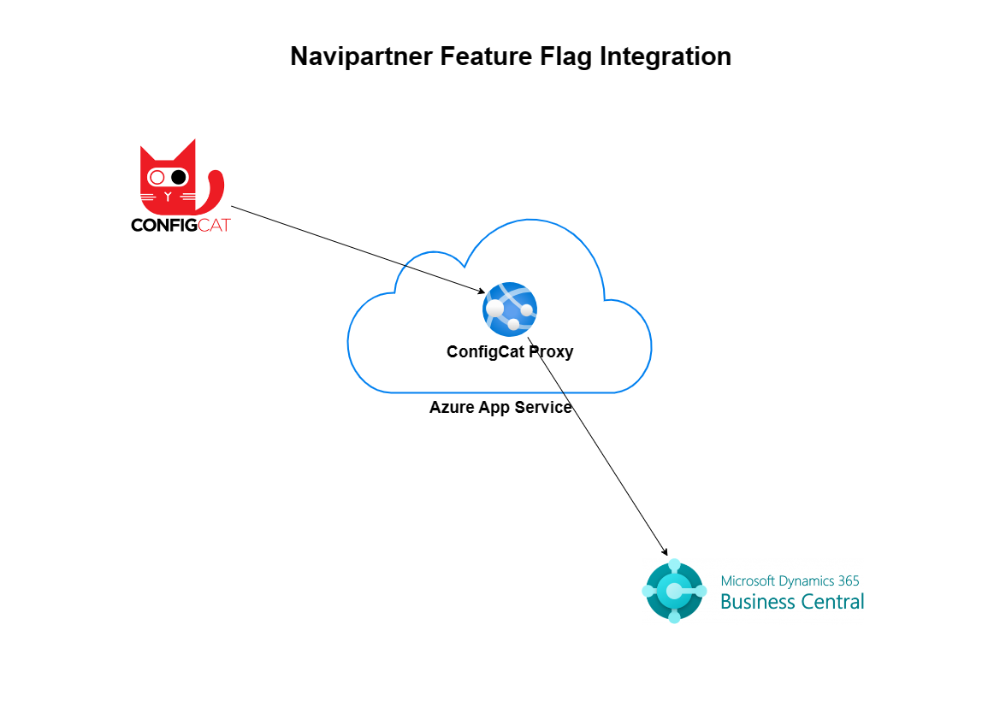

## ConfigCat
We use [ConfigCat](https://configcat.com/#product) as our main feature flag service provider. It's a cross platform feature flag service where we're going to be hosting and managing our feature flags. We have developed an integration between it and Business Central which is going to download the feature flags to our environments. The integration works in **one direction from ConfigCat to Business Central** which means that ConfigCat is going to be our **single source of truth**. All feature flags are going to be created and managed there. You can read more about how ConfigCat works [here](https://configcat.com/architecture/).

## ConfigCat Proxy Service
We're using the ConfigCat Proxy service to communicate between ConfigCat and Business Central. **It is hosted in Azure app service as a web app**.

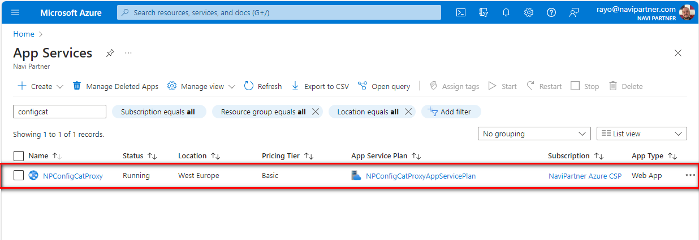

It exposes a simple **read-only** API that returns the feature flags from ConfigCat. We call the API from Business Central to get the feature flags. You can read more about it and how to set it up [here](https://configcat.com/docs/advanced/proxy/proxy-overview/)

### 1) Docker Compose File
We use a docker compose file to create the web app in azure app service. You can read about the structure of the docker compose file [here](https://configcat.com/docs/advanced/proxy/proxy-overview/#installation).

The different variables that are available in the docker compose are described [here](https://configcat.com/docs/advanced/proxy/proxy-overview/#sdk-identifier--sdk-key).

From all of the variables the most important one is the **CONFIGCAT_SDKS**. It is a simple json object that contains pairs of \<sdk-identifier\> and \<your-sdk-key\>. These pairs are used to communicate with the different environments in ConfigCat.

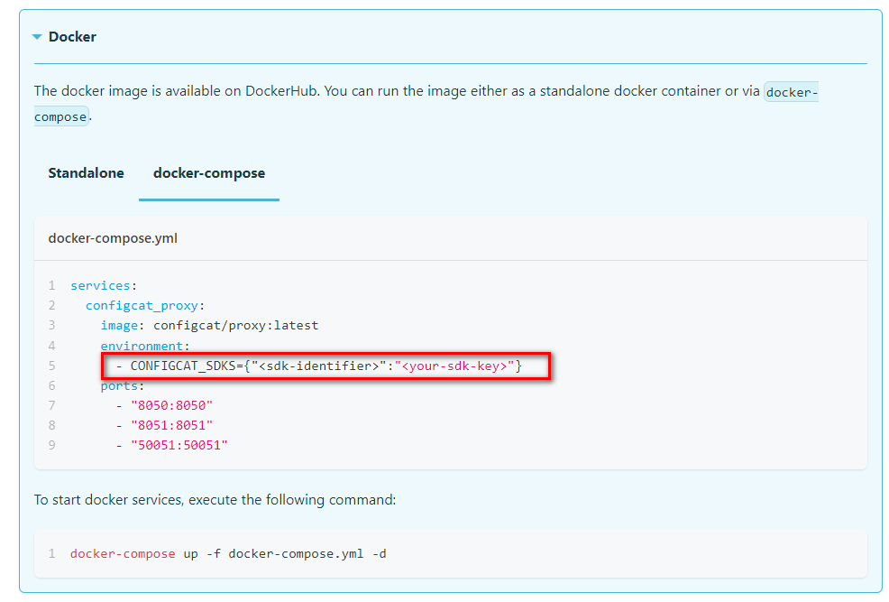
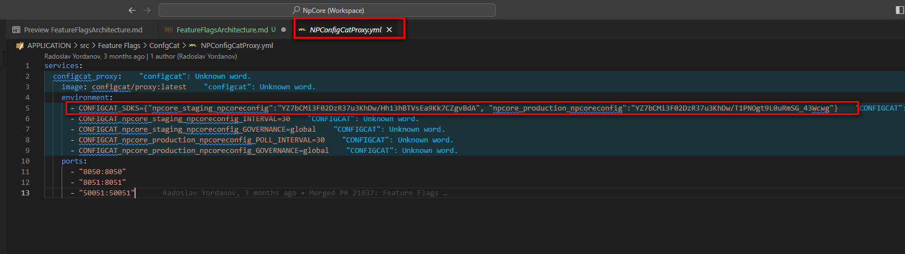

 - **sdk-identifier** - it is given manually by the person creating the docker-compose file. It is going to be used as a name to reference one of the environments in config cat. When calling the ConfigCat proxy
 to get the feature flags the sdk-identifier is used instead of the sdk-key. 
 - **your-sdk-key** - contains the sdk key for a specific environment. It is acquired from ConfigCat.

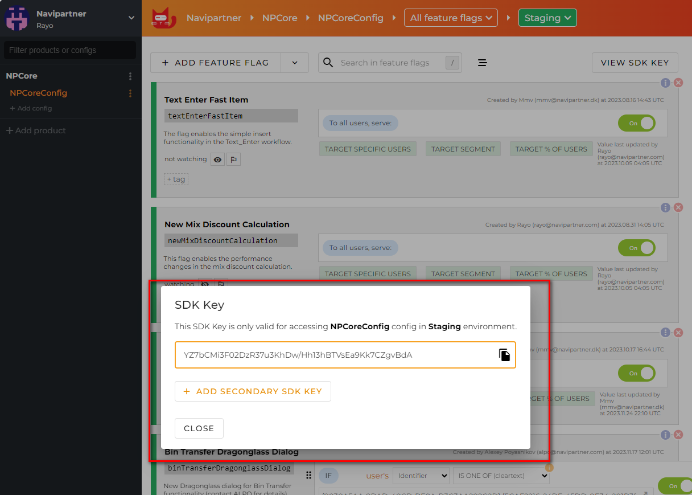

The docker-compose file that is used to create and deploy the ConfigCat proxy as a web app in Azure App service can be found here - **src\Feature Flags\ConfgCat\NPConfigCatProxy.yml**

### 2) Create ConfigCat Proxy as a web app in Azure App service
 
To host the ConfigCat Proxy service as a web app in Azure App service follow the steps below:  
1) Go to **App Services** and press **Create** -> **Web App**

2) In the **Basics** tab select:
  - **Subscription** - NaviPartner Azure CSP
  - **Resource Group** - NPConfigCatProxy-RG
  - **Name** - NPConfigCatProxy
  - **Publish** - Docker Container
  - **Operating System** - Linux
  - **Region** - West Europe
  - **Linux Plan (West Europe)** - NPConfigCatProxyAppServicePlan
  - **Pricing Plan** - Basic B1

3) Don't change anything in the **Database** tab:

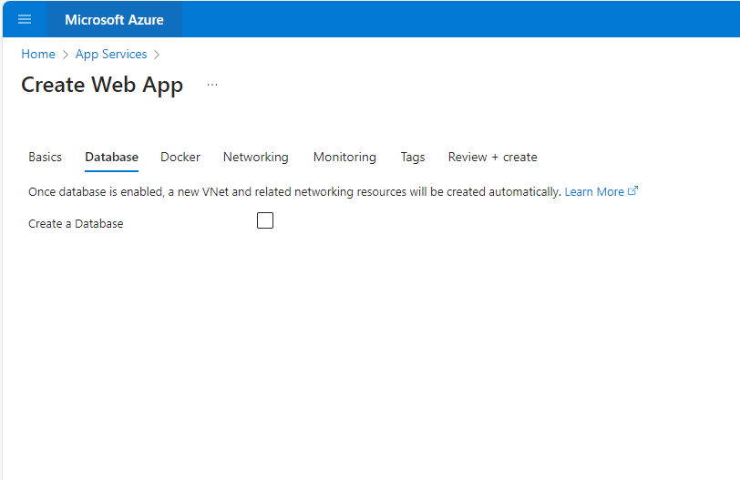

4) In the **Docker** tab select: 
  - **Options** - Docker Compose
  - **Image Source** - Docker Hub
  - **Access Type** - Public
  - **Configuration File** - select the docker compose file from - src\Feature Flags\ConfgCat\NPConfigCatProxy.yml

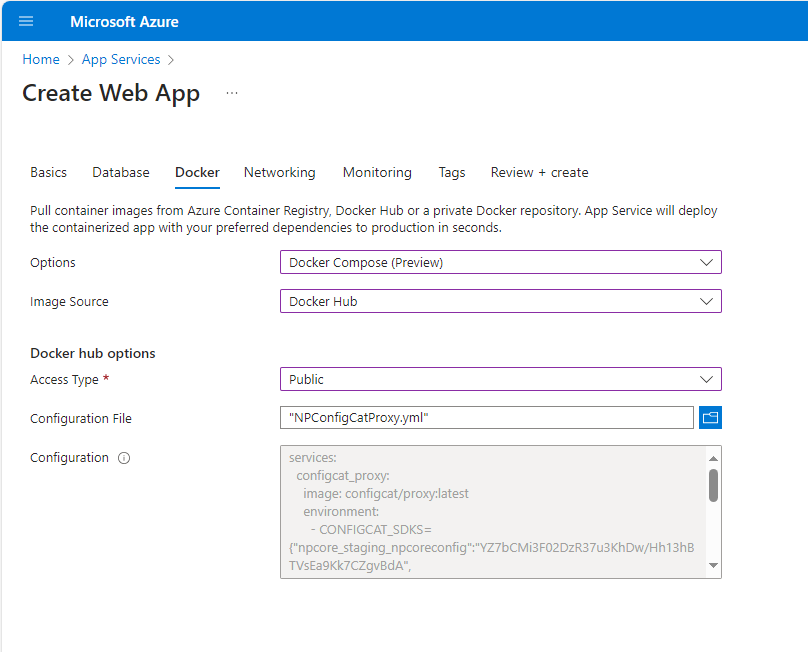

5) Don't change anything in the **Networking** tab: 

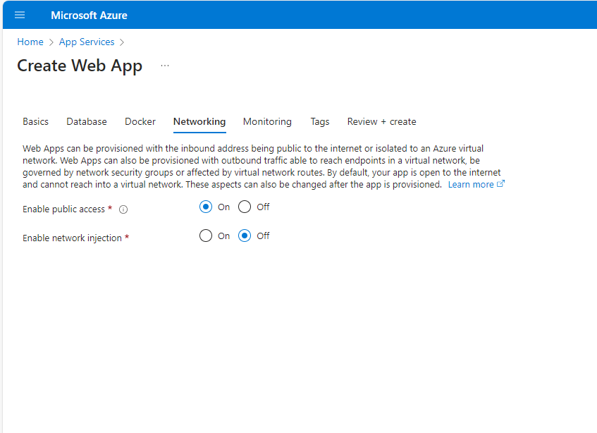

6) Don't change anything in the **Monitoring** tab: 

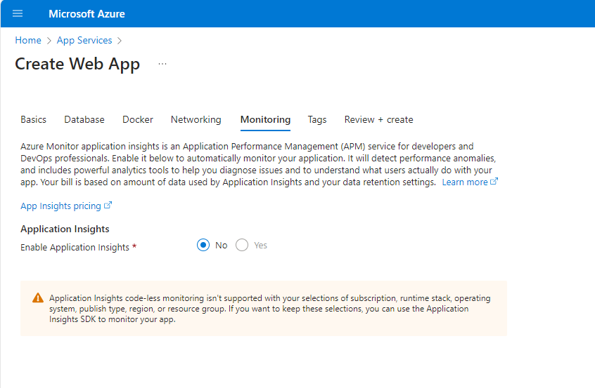

7) In the **Tags** tab add the following tags:
 - **Name** - NPConfigCatProxy
 - **Value** - WebApp

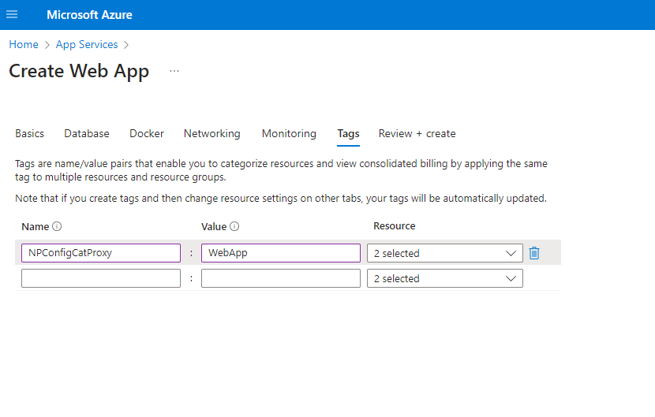

8) Press create

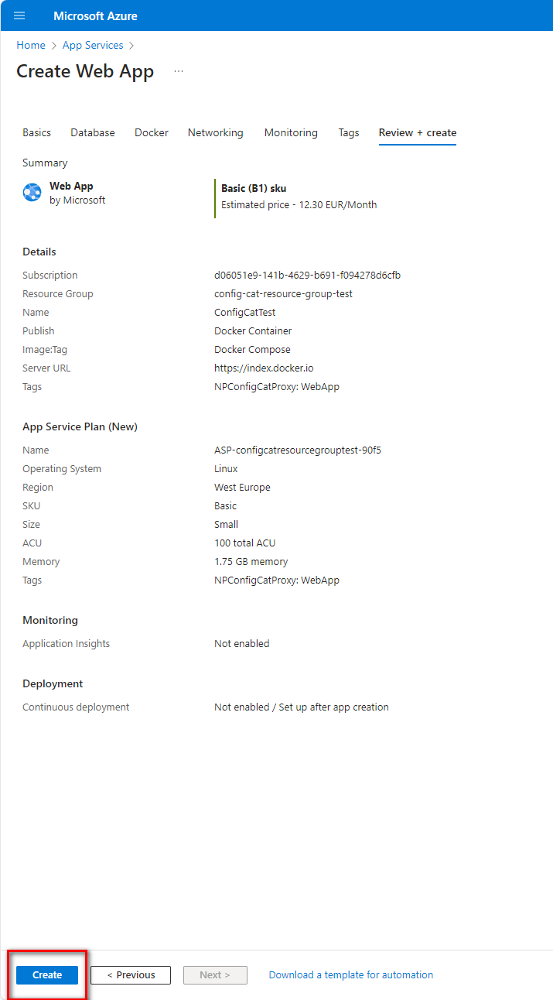

## Call the ConfigCat Proxy Service

You can read about all of the APIs that are available in the ConfigCat Proxy [here](https://configcat.com/docs/advanced/proxy/endpoints/#api).
We're using the **eval-all** endpoint to retrieve the feature flags. 

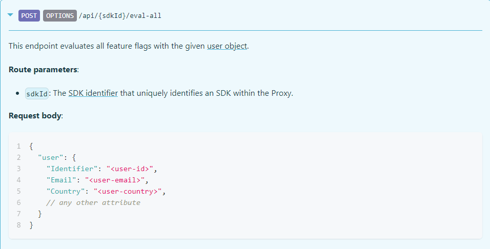

It's good to mention that we use the [Identifier attribute](https://navipartner.visualstudio.com/NpCore/_git/NpCore?path=/Documentation/internal/developers/Feature-Flags/FeatureFlags.md&_a=preview&anchor=4%29-create-a-feature-flag) for the integration. 

The edpoint is a combination of the **default domain** of the web app + the [**sdk-identifier**](https://navipartner.visualstudio.com/NpCore/_git/NpCore?path=/Documentation/internal/developers/Feature-Flags/FeatureFlagsArchitecture.md&_a=preview&anchor=1%29-docker-compose-file) + **eval-all** -> https://npconfigcatproxy.azurewebsites.net/api/npcore_staging_npcoreconfig/eval-all

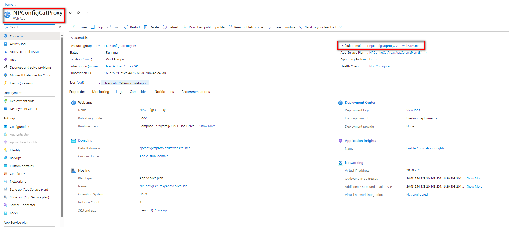

A postman collection exists which can be used to test the api. It can be found here - **src\Feature Flags\ConfgCat\ConfigCat.postman_collection.json**.  

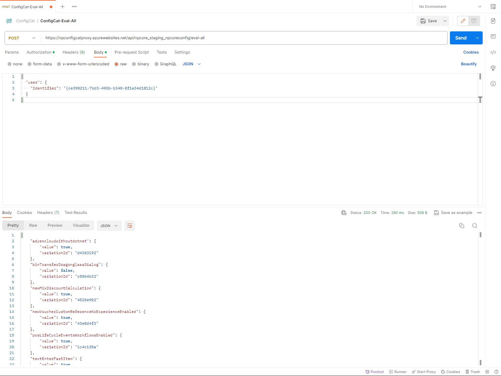

For more information about how the integration works you can read [here](https://navipartner.visualstudio.com/NpCore/_git/NpCore?path=/Documentation/internal/developers/Feature-Flags/FeatureFlags.md).

