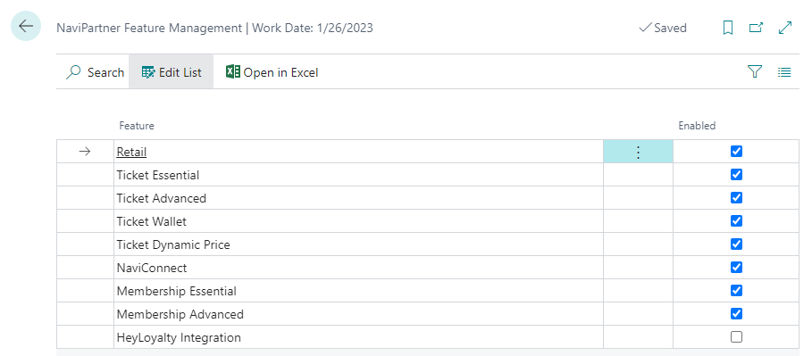

# NaviPartner Feature Management

## Table of Contents

1. [Purpose of NaviPartner Feature Management](https://navipartner.visualstudio.com/NpCore/_git/NpCore?path=/Documentation/internal/developers/FeatureManagement.md&_a=preview&anchor=purpose-of-navipartner-feature-management)
2. [NaviPartner Feature Management Page](https://navipartner.visualstudio.com/NpCore/_git/NpCore?path=/Documentation/internal/developers/FeatureManagement.md&_a=preview&anchor=navipartner-feature-management-page)
3. [Module Specific Table for Application Area](https://navipartner.visualstudio.com/NpCore/_git/NpCore?path=/Documentation/internal/developers/FeatureManagement.md&_a=preview&anchor=module-specific-table-for-application-area)

## Purpose of NaviPartner Feature Management

The purpose of NaviPartner Feature Management is twofold. On one hand, it replaces the old approach of having multiple module-specific Application Area Setup pages, whose growing number over time has made their usage and maintenance more difficult. On other hand, it helps avoid potential problems stemming from the use of this approach. The following statement from MS emphasizes this: "This event is important because it is called every single time an experience tier is reset, which can happen because of many reasons." One of the known issues with having module-specific Application Area Setup pages is that when you close the Company Information page, it may be refreshed without your knowledge.

To solve this, we've decided to introduce the NaviPartner Feature Management table. This table should be used in all cases except those in which there are some specific tables which define whether a certain module is enabled (as is the case for some localizations and fiscalizations).

**NOTE:** We should still add a specific field to the table extension of the Application Area table. However, in the subscribers for event publishers _OnGetEssentialExperienceAppAreas_ and _OnGetPremiumExperienceAppAreas_ we should be using the table NaviPartner Feature Management or a module-specific table in order to determine whether that application area can be enabled.

## NaviPartner Feature Management Page



As of this moment these are the features that are being added to this page when someone installs or updates to at least 25.03 release of NP Retail app. We decided that HeyLoyalty Integration should not be enabled by default. 

### Add New Feature

Only a developer can add a new feature related to some application area by adding its specific implementation of the NPR Feature Management interface.

When adding a new feature, it's necessary to add a call to the procedure _RefreshExperienceTierCurrentCompany_ in the Feature Management Install codeunit in order to trigger the _OnGetEssentialExperienceAppAreas_ publisher which populates the related application area accordingly.

## Module Specific Table for Application Area

If someone adds a module-specific table for a new application area in the _OnClosePage_ trigger on its related page, the code such as the one provided below should be added:

```
trigger OnClosePage()
var
    ApplicationAreaMgmtFacade: Codeunit "Application Area Mgmt. Facade";
begin
    if EnabledValueChanged then
        ApplicationAreaMgmtFacade.RefreshExperienceTierCurrentCompany(); 
end;
```

This is necessary in order to trigger _OnGetEssentialExperienceAppAreas_ publisher which populates related application area accordingly.