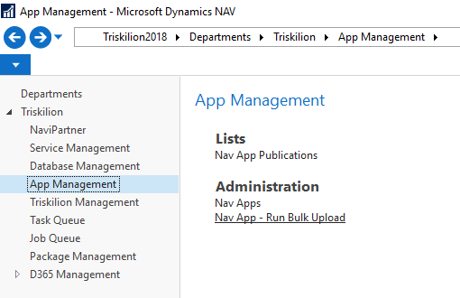
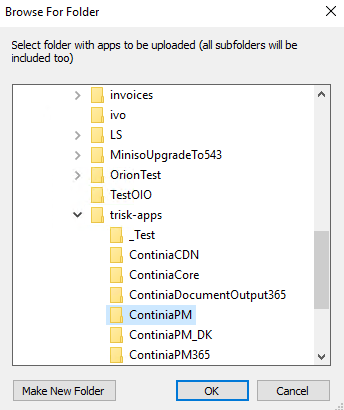
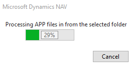
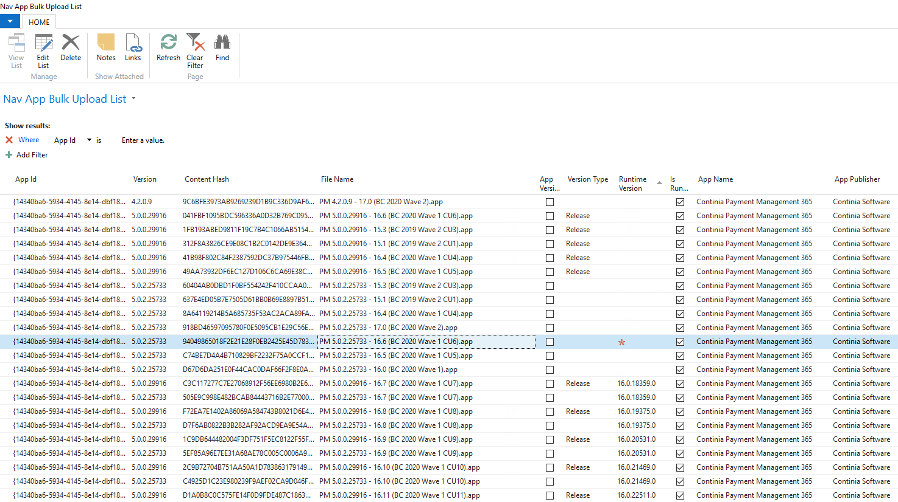

# Bulk Upload of Apps to Triskilion

[[_TOC_]]

There are certain situations in which [NuGet Integration](NuGetToTriskelionArchitecture.md) is not possible, and the existing single App file upload can be very cumbersome to use. This feature is very useful for scenarios in which someone is supposed to upload a bunch of third-party apps we get from one of our partners, like **Continia**. 

## How to use Bulk Upload Feature

* In **Triskelion** you have to navigate to `Triskilion`->`App Management`->`Administration`->**`Nav Apps - Run Bulk Upload`**

    

* Select a folder including apps you need to be uploaded. The folder you select will be considered to be a top-level folder, and the process will search through all app files in that folder, as well as in all sub-folders.

    

> [!IMPORTANT]
> Please, consider that a big volume of apps in the folder (and sub-folders) might result in long processing times. But even worse, it might significantly increase the database size (consider, if all the apps are really needed). And also, as this pre-processing stores all data in temporary tables, the client and eventually NST might crash (Out of Memory errors). It's better to **split those folders containing hundreds of MBs or even GBs into smaller groups and process them one-by-one**.

* Wait until the pre-processing of the apps is done. This part may be very slow, which mainly depends on the volume of the data in the selected folder.

    

* Once the apps are pre-processed, they will appear in the page where you will need to provide some information when missing. You have to classify the following fields:

  * `Version Type` which identifies if the app version is a **PreReleases** or a **Release**. This field can be pre-populated if the version was already stored in Triskelion (in this case the value will be inherited).
  * `Runtime Version` is mandatory for all apps classified as **Runtime Packages** (`Is Runtime Package` = `true`).

    

> [!NOTE]
> The page will show only those records that are not present yet in the Triskelion database.

* Once you classified all apps you want to upload (you can filter the data of the page and import only those records you really want to be uploaded), confirm the page (**LookupOK**), and the import will be finished (transfer the data from the temporary tables to the real data structures). This step should be already way faster.

> [!NOTE]
> You are allowed to confirm **LookupOK** button only when the selected record set contains data in all mandatory fields (mentioned above, `Version Type` and `Runtime Version` for runtime packages).