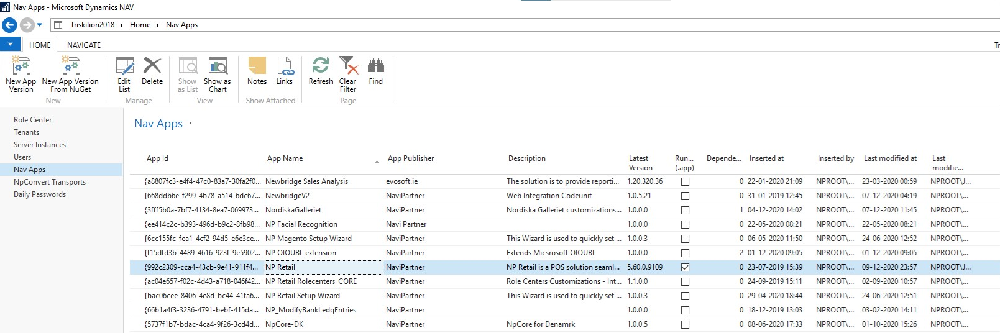
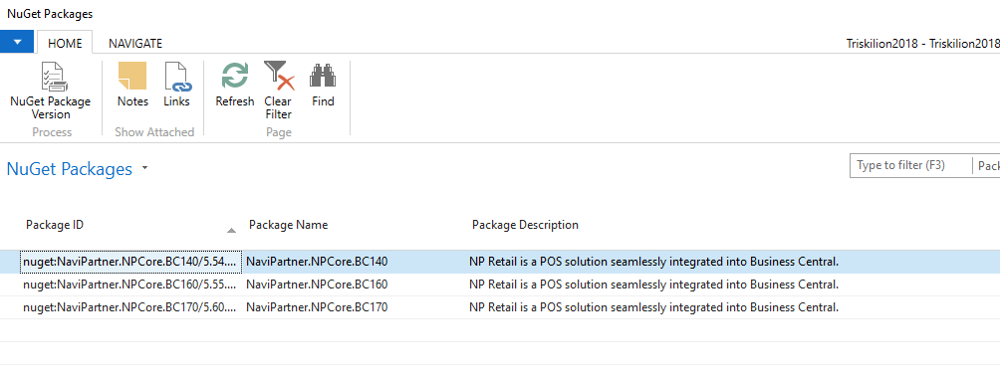
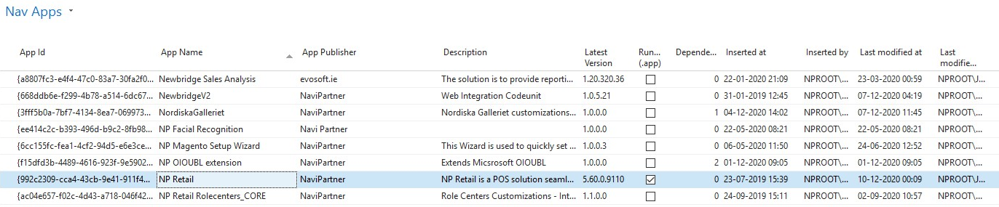
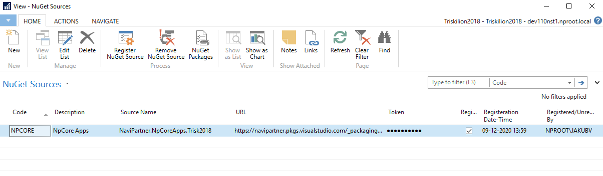
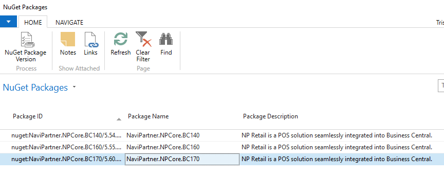
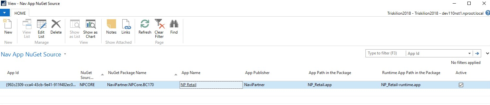

# Integration of NuGet feeds with Triskelion

[[_TOC_]]

We have finished the first version of the integration of **NuGet feeds and packages** with **Triskelion**. 
We are talking about the direction that lets us bring the packages from NuGet feeds into Triskelion, and then to publish them.

## Common workflow available today

1. Go to the **Nav Apps** page, and find the **NP Retail app**.    
 Currently, this is the only app being configured. You can see a new button activate on this entry (app). The action is called **New App Version From NuGet**.

    

2. When you click on the button, you will see the list of the packages (*TODO: currently the list includes all packages for both, **prereleases** and **releases** and we will do some separation based on the server we will be deploying to*). The package list is a fresh fetch from the NuGet feed. There is currently no caching, and maybe we will need to consider such a modification in the future (let’s see in the practical life 😉).

    

3.	When you select the **package version** you want to be registered in Triskelion, confirm your selection, and wait a few moments (*it might take some time to download, extract, move files + the rest of the process that has been there already since the first days*).     
   After this, your application becomes available in Triskelion, and you can publish it to whatever tenant you need.

    

--- 

## Integration setup

The purpose of this section is to outline a brief idea of how the configurations work (not something that the common users will do, of course).

1. We can already register multiple sources (**feeds**). This will let us set up the integration for different products or groups of products, or even for different customers/partners who will give us access to their feeds via an URL and a token.      
   There is currently only one repo for the NP Retail app. You can just specify the details here and register the feed by clicking **Register NuGet Source**. This action will register the source on the remote (NST) server.

    

2. Then for each supported application (*TODO: figure out the initialization if we get the feed and the token, and there isn't a single version of the app already in Triskelion, for NP Retail it was different, there are already apps/versions registered so we already know the AppId*) you just register the link between the app (**App Id**), **NuGet Source**, and **NuGet Package Name**. Everything is driven by lookups so here are the only necessary steps:

    * Select app (lookup)
    * Select NuGet Source (lookup)
    * Select Package (lookup)

        

And that’s all. The new button will be displayed for the specific app, and you will be able to use the NuGet integration.

You can also use more than one combination of the package per an app. This might be important for us to set up more than one major version support. The following combinations are available:

   * If there is just one active (*can be enabled, disabled*) configuration (*mapping*) per an App Id, then when you sync from NuGet to Triskelion, there is no additional request page or the **CONFIRM** dialog.

        

   * If you set up more than one active configuration (e. g. for **Package NaviPartner.NPCore.BC180** once we get there), you will be prompted to select which package you want to be uploaded, and once you confirm the selection, you will get the list of the versions for the specific package (e.g. BC17 or BC18 etc.).

 * Also, you have probably spotted two file names in the previous screenshot. This lets us specify where the APP file is located in the package, and what the file name is (basically, the relative path). We can specify either the full APP file or the runtime APP file, or even both if available (as we have it today). Of course, we might need to adjust this for scenarios in which we get APP files with the variable filenames e.g. **including the version in the file name** (This is to be seen and made once we find ourselves in this situation 😉). Today, the runtime app has priority, if you specify both. There's no specific action you need to take to confirm your choice. When publishing to live servers, we will always publish the runtime app only.