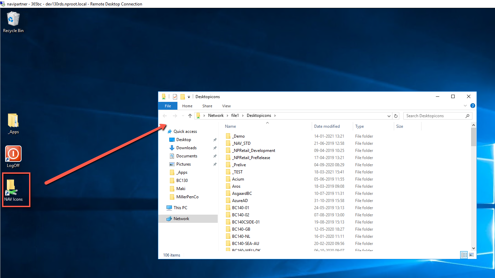
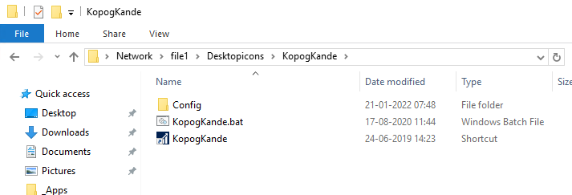
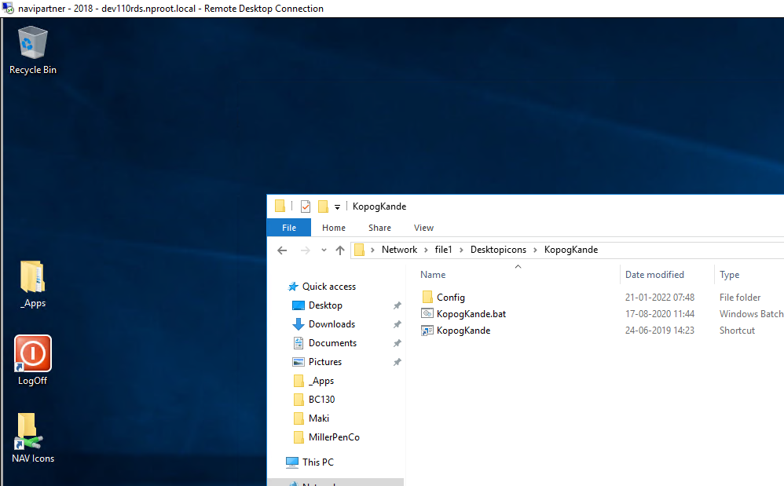
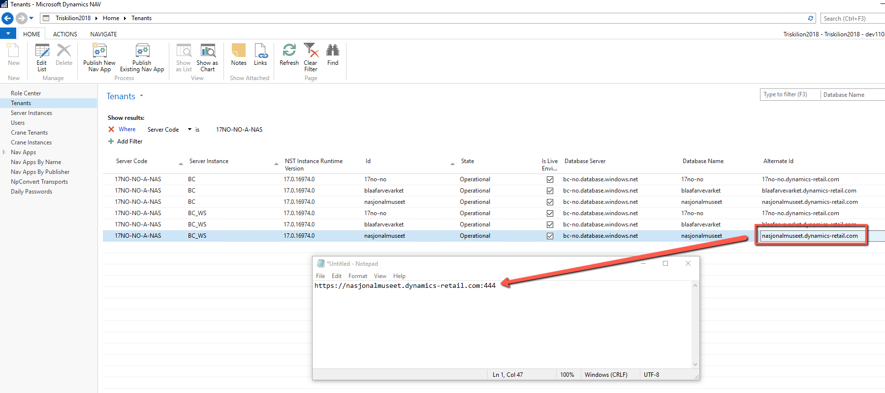
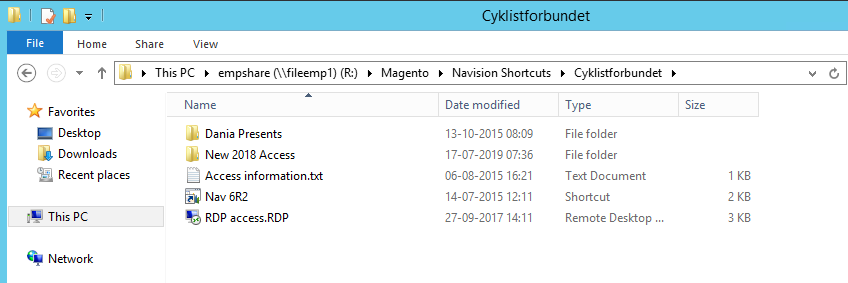
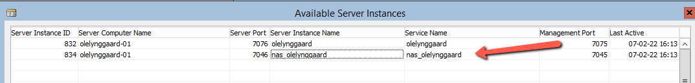

# Accessing Customers Database
Depending on which NAV/BC version customers are using and whether they're hosted by NaviPartner, Azure, or by third party, try the following places:
- npkcenter

    This domain holds all the shortcuts for customers using NAV 2017 and older versions. To access it, use remote desktop.
    For example, for version 2016, use dev2016.npkcenter.local. 
  
- nproot

    This domain holds all the shortcuts for customers using NAV 2018 and newer versions (up to BC140). To access it, use remote desktop.
    For example, for version 2018, use dev110rds.nproot.local, or for BC130, use dev130rds.nproot.local

Check with your colleagues or on teams to give you these rdp files if you need them.

You access them by using your nproot/npkcenter credentials. Note that credentials are not the same and you need to maintain them seperately. Contact hosting to give you access or if your password expired.

For all the versions up to BC140, you start by opening NAV Icons shortcut on your desktop:

This folder is maintained by hosting exclusively, and it's read-only for everyone else.

Folders are named by a customer name, so simply typing the first letter of the customer name should take you closer to the wanted folder.

For example, if you want to access KopogKande folder, you type K and it takes you to first customer with K and KopogKande is close by.

Customer folder can contain different files, but it's usually these 2 files:
 - Windows Batch File (.bat) - shortcut for development environment
 - Shortcut file - points to windows client

 

In this example you can see that shortcut file is having a correct NAV/BC image. This means that you're on the correct remote to open this client.

If this is not the case, it means you're on the wrong remote.

For example, if we search for KopogKande from dev110rds remote it will look like this:

Simply hover your mouse over the shortcut file and it will show you the correct version/remote to connect to.

In general, if you aren't on correct remote, switch it and try again.

If there's no customer folder in "NAV Icons", it means you're on a wrong domain, or it's a BC17 or higher or customer is hosted by a third party.

For versions BC17 and higher, you can create a web client on your own by finding customers database information on Triskelion:

Don't forget to add port 444 at the end of URL as that will direct you to NAS service.

For customers hosted by third parties, on npkcenter remote go to folder: R:\Magento\Navision Shortcuts

For example,

Now that you have found a shortcut (or created a web client link), to login you need to provide proper credentials.

By default, username is always NPKNAV, and password is currently generated daily on Triskelion. Npkcenter has different passwords than nproot. So keep that in mind. If today's password is not working, let hosting know and try the previous day password until they get back to you.

If you're accessing windows client from development environment (for example for debugging purposes), you'll notice multiple services available. Always use NAS service.

