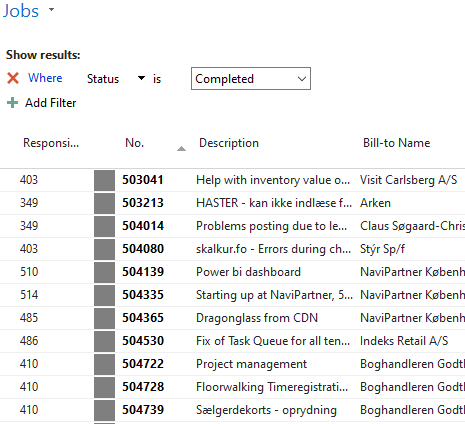

# Completion
After objects/app are deployed/installed on live environment, assign the case to customer to verify on live. After verification, they will either change the status of the case to Completed or return the case to you with same status. If they do, you need to ask them to mark the case as Completed. This way customer is in control of their cases.

If you use color codes column, Completed cases are colored gray:

Once you get the case in Completed status **DO NOT** set it to Closed status. Send it to Mark instead. This is very important if we want to invoice the case.