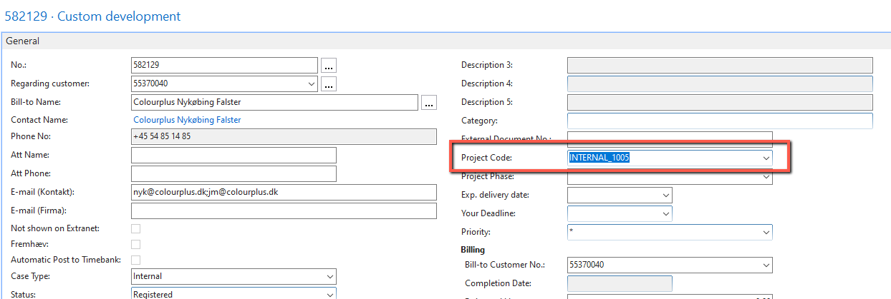
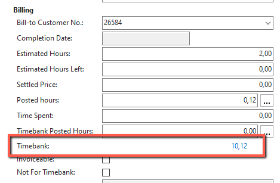

# Completion
After objects/app are deployed/installed on live environment, assign the case to customer to verify on live. After verification, they will either change the status of the case to Completed or return the case to you with same status. If they do, you need to ask them to mark the case as Completed. This way customer is in control of their cases.

If you use color codes column, Completed cases are colored gray:

Once you get the case in the **Completed** status, **DO NOT** set it to the **Closed** status immediately. You'll take a different approach depending on whether a case is a part of the project or invoiced from a timebank/per a single case.

## Project cases
These cases have the Project Code specified on the case header.

Process: send the case to project manager.

## Paid per case
These cases don't have a Project Code and the Timebank is 0.

Process: send the case to Kasper or Niels.

## Timebank
These cases have a Timebank (positive or negative):

Process: If the Timebank has enough hours to be taken for the current case (in this example the customer has 10,12h), you'll need to check if **Estimated Hours** have been exceeded. In the previous screenshot, we can see that we only spent 0,12h out of the estimated 2h. This means that you can safely pull from the Timebank. Do this by pressing the **Send to Time Bank** action, and choosing **Yes** on the popup.

If the **Estimated Hours** have been exceeded due to internal reasons (problems with the container, test environment...), update the **Time Spent** field with the number of hours you want to deduce from the **Timebank**, press the **Send to Time Bank** action, and then press **No** on the popup.

If the **Timebank** fund isn't sufficient to cover the **Estimated Hours**, send the case to Kasper or Niels. If they approve the timebank fund being exceeded, take the same approach as if the **Timebank** covers the **Estimated Hours**.

If none of the resources are available and you still don't know what to do, send the case to Mark instead.

When the case has been invoiced, you can safely change the **Status** to **Closed**.