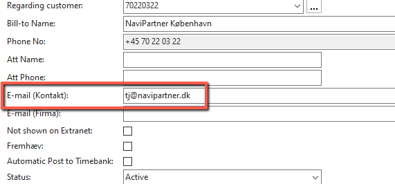
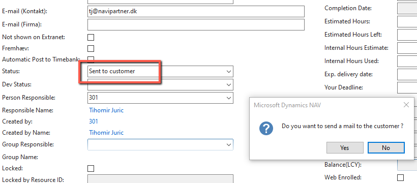
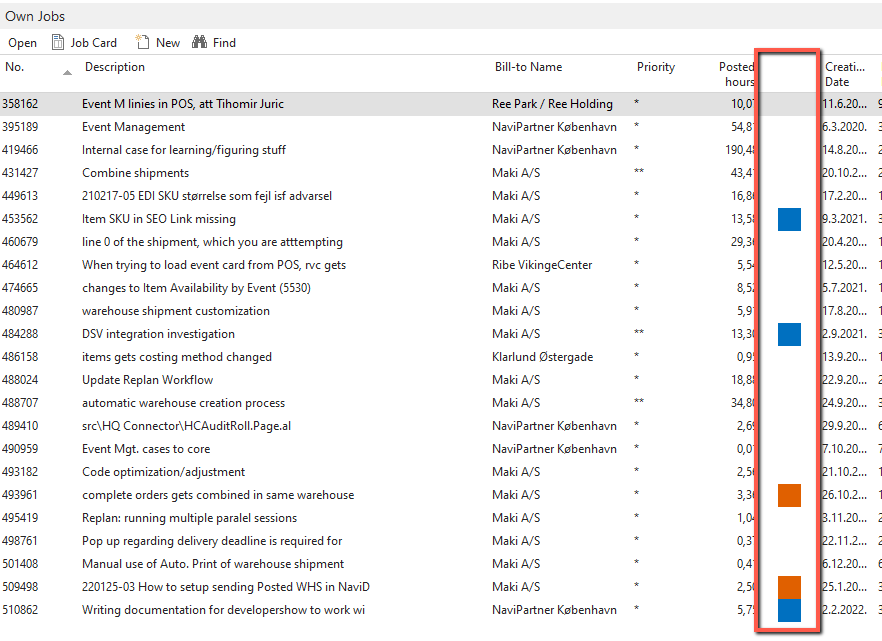

# Customer Communication
To get a better understanding of what the customer needs, you might need to take the dialogue directly to them. 
We prefer this to be done via case system, for several reasons:
- If you’re not available, Mark can assign the case to someone else. If you keep communication in the e-mail, customer might not get any feedback
- It shows entire history of the case. If you keep communication in the e-mail, it’s easy to lose track as someone might not reply to latest e-mail, or will start a new e-mail thread

Customer that you’ll be talking to is usually mentioned in the E-mail (Kontakt) field on the case header:

After you’ve put your comments in the case, change the status to “Sent to customer”, and you’ll see a popup:

By clicking Yes, e-mail will be sent to E-mail (Kontakt) with latest comments. In similar way, when the customer updates the case, they will change the status back to what it was previously.

A quick tip, on the list of the cases assigned to you, you’ll know when the customer has put a comment, by an orange color code on Own Jobs list:

