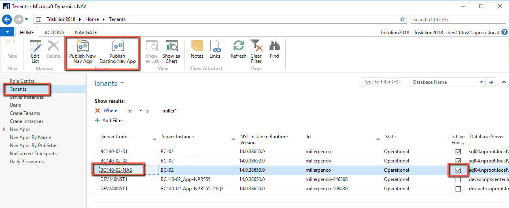
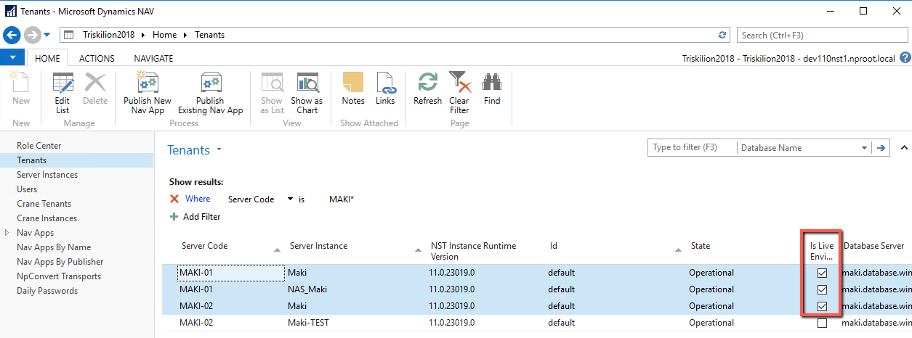
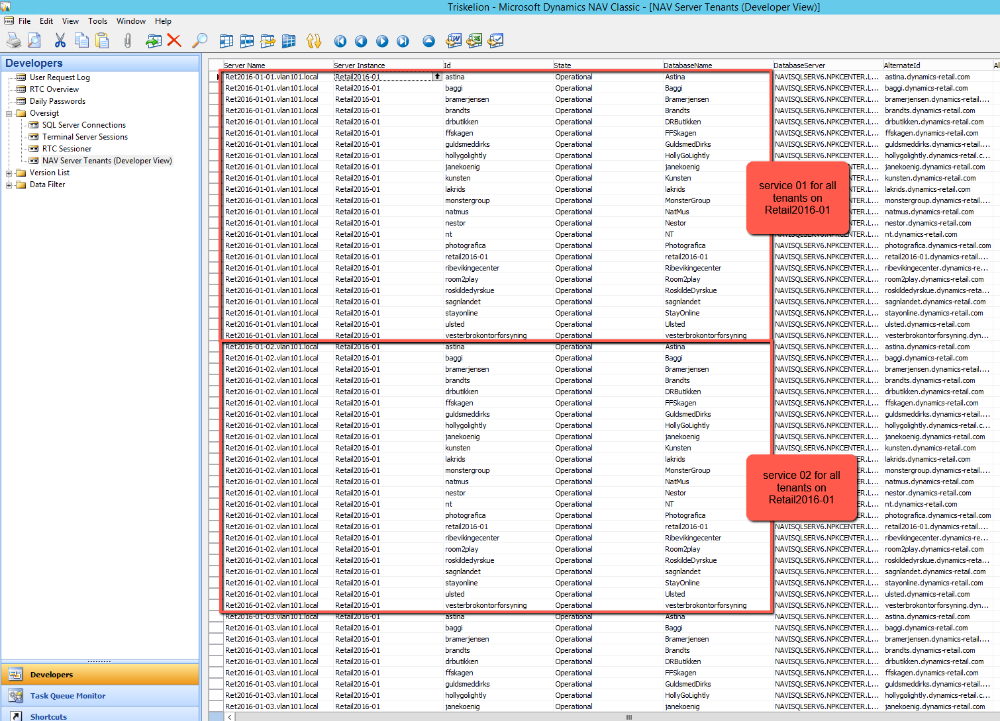

# Deployment
Regardless of how deployment is performed (fob, txt or app), always ask the customer for date and time you can deploy to live (unless you already know from prior deployments). This gives them time to notify their users about incoming change and reduces the number of users that could see an error that service is unresponsive, table definition has been changed or similar. 

It’s important to do deployment at time when no users are working in the system, or if not possible, when a small number of them is active. We usually don’t deploy on Fridays since some customers tend to have more traffic on weekends, so we don’t want to create problems if deployed code has issues. Also, not all colleagues work on weekends, so you may find it harder to get help if you need it.

## AL
Always deploy customer apps through Triskilion. Find a NAS service and initiate publishing steps from it.



When presented with a page to select time for publishing, please set agreed day/time as per customer approval.

## C/AL

First, find all the changes by setting a version filter in test environment as ```*#<case no>*``` where ```<case no>``` is case number.

Note all the objects on the case. This will be useful later if we ever need to backtrack which objects were deployed with this case.

Mark all the objects, remove the version filter and only show marked objects.

Now, if you’ve coded a new customer feature or a bugfix for customer specific process replace all ```#<case no>``` references with next NPK version by incrementing last digit by 1.

For example, if last NPK version is NPK1.01, new version will be NPK1.02

This means in Documentation trigger will look like this:
```
NPK1.02/<your initials>/<yyyymmdd> CASE <case no> <short description>
```
In code, it will look like this:
```
//-NPK1.02 [<case no>]
Your code in here
//+NPK1.02 [<case no>]
```
Properly update version list. You don't add a new NPK version if it already has it. You simply edit existing version.

If you’ve created a new object (or added a change to existing object that doesn’t have NPK version), always start from NPK1.00. If you’ve applied a hotfix for a bug in NPR, leave the hashtag version tag as it is. As mentioned, NPR version tag is not to be modified. 

These rules serve the main purpose for future upgrade so it’s easier for developer upgrading to easily recognize and classify code changes.

Don’t forget to sync the service on test environment again if you had to re-version tables.

After updating version, export all objects in txt and compare with live. Always perform txt comparison no matter how clean and tidy version list is even if you’ve updated objects with live objects before you started coding.

You’re free to decide how you want to deploy to live (fob, txt or manually added code) since this heavily depends on object state. Always compile objects (even if deployed as fob). 

If you need to perform service sync, you need to sync all services:



Simply select all live services and use the action as explained earlier. If it’s not clear which services are live (for example on Triskelion 2016 we don’t have this flag), please ask on Teams or check with a colleague. In case you’re deploying table changes to multitenant environment, sync all the tenants not just the one you got the case for. And, for all the services:

