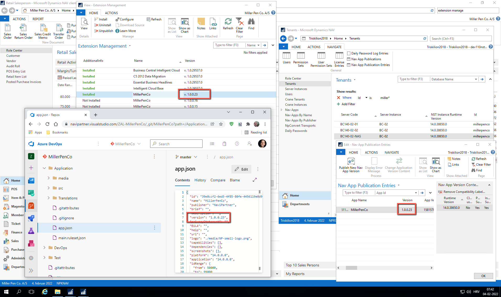
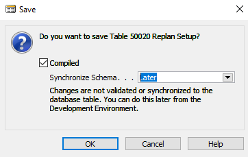
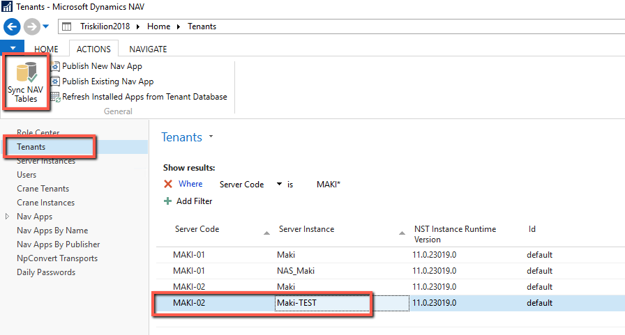
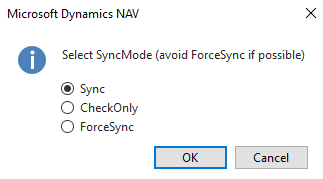
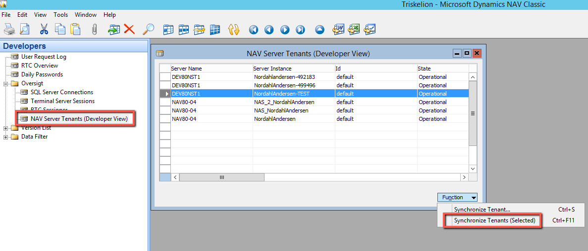
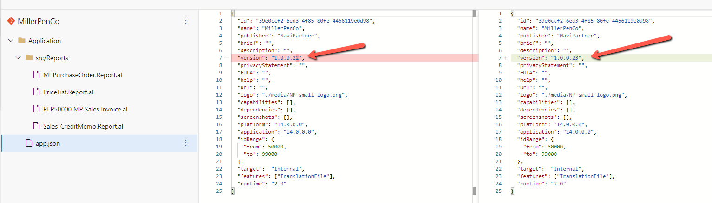
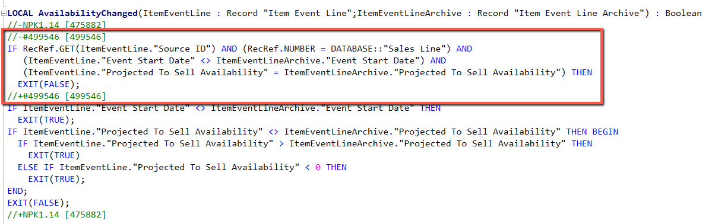
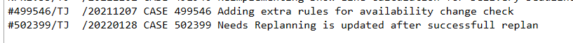
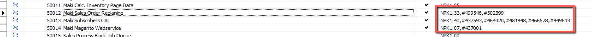

# Development and testing

When coding, do your best to make the code:
- Readable - help the next developer understand what the code does
- Upgradeable - when a customer gets upgraded, your code needs to be easy to upgrade
- Manageable - write the code so it’s easy to add changes to it (publishers)

Always write code in English, this includes any comments and variables.
Keep an eye on developer’s team channel and yammer for any tips & tricks or coding suggestions

## Coding
### AL

Before you start making changes to a customer app, please make sure repo has the same app version as is installed on live.
Compare repo with Version mentioned in Extension Management on live environment and with Triskilion, Nav App Publications:



This gives us enough confidence that repo has the latest source code.

### C/AL

If you received a fresh restore from hosting, which will have latest objects from live environment, you’re good to start coding. If you’re working on a restore from another case or on a permanent test environment, please compare and merge changes from live first. This can greatly improve quality of deployment later.

If doing changes on tables, depending on the environment, you may need to perform service sync. You’ll know as you’ll get an error in development environment when trying to save and compile table. If you do, in development environment choose option Later when saving object:



Sync is performed in Triskilion2018 by selecting the service for test environment and clicking on Sync NAV Tables action:



Popup will appear:



Choose Sync, or other options. Try to avoid using ForceSync unless you need to.

On Triskelion 2016:



## Versioning
### AL
If you're working on customers app the only version you should care about is app version. Version is usually in format 1.0.0.xx where xx is the number we increase by 1.

For example:



If you're doing changes to core please read core documentation for [versioning logic and flows](../Versioning-logic-and-flows.md)

### C/AL
There are several types of versions tags you may come across:
- Standard Microsoft version

    This includes W1 and any localization, for example NAVW111.00.00.20348,NAVDK11.00.00.20348. You should not manually alter these versions unless you’re specifically installing a cumulative update  
- NaviPartner Retail version NPR

    For example, NPR9.00.00.5.23. Note that last version deployed in this format was 5.55. You should not alter this version tag
- NaviPartner Kunde version NPK

    For example, NPK1.12. You’re allowed to modify it
- Other module versions

    For example, TSD1.00, TM90.1.35, VRT1.20, and many more. There are many different modules installed on customers NAV/BC version. If you want to know more about them, please ask. You should not alter these versions (unless you’re the owner of these modules and you know what you’re doing)  
- Hashtag (#) version

    For example, #123456. This represents either a development in progress or a hotfix for NPR. This is a version you’ll mostly use for customer cases, combined with NPK. More details below. 

You always start coding with hashtag version on development/test environment.

Code needs to be encased in this block:
```
//-#<case no> [<case no>]
Your code in here
//+#<case no> [<case no>]
```

For example,



Documentation trigger should look like this:
```
#<case no>/<your initials>/<yyyymmdd> CASE <case no> <short description>
```
Where ```<yyyymmd>``` is the date when the code is added

For example,



On the object list, version list should be updated with:
```
#<case no>
```

For example,



## Testing
Always test your code keeping in mind to:
- code works given the process requirements
- code works in border scenarios
- code isn't working when not supposed to

Once your test is successful you need to send the case to customer to perform test on their own.


