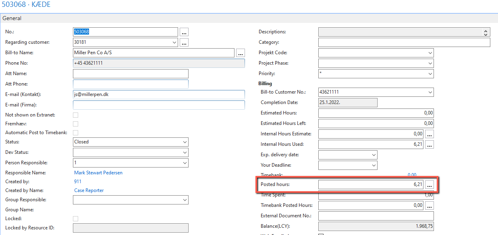
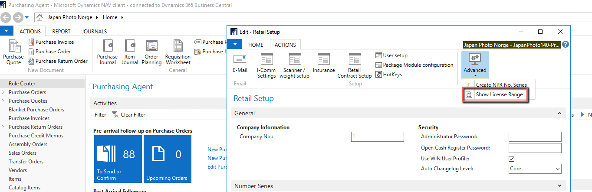
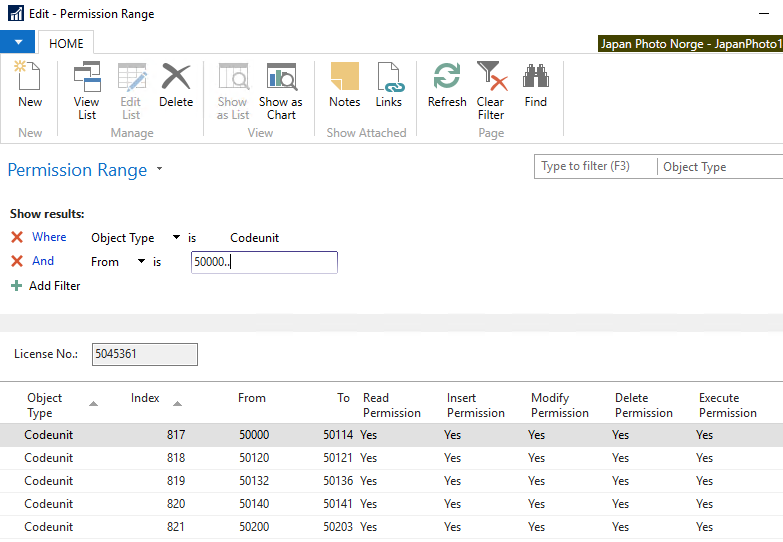
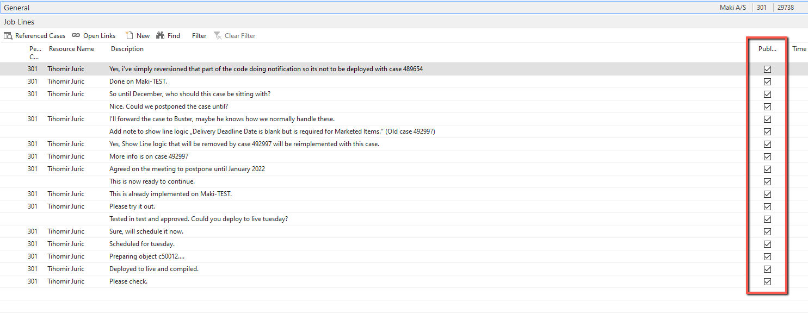

# Estimate
Although sometimes it's difficult to give proper estimate, and it's a process we should constantly improve, you can use following guidelines

## Scope entire development request

Note down everything that needs to be developed, tested, setup and estimate each step. 

For example, you need to add a field to a table, add it on the page and include it in a posting routine. 

Estimate could look like, 15min for table, 15min for page, 30min for posting routine. 
Add additional 15min for setup, 30min for testing and 15min for any versioning/deployment if required (for example for C/AL clients). 
Total 2h.

## Include time spent on analysis

Sometimes you'll get a case on which someone has already spent time, or you've been spending time to analyze the request. Make sure this is also added to the estimate. You can check total hours used on the case in field Posted hours:

This field keeps track of all the hours posted through a resource journal. If you're not sure if this should be added to the estimate, you can estimate time for your part of the request (development, testing, deployment...) and send it to a consultant or Mark with a note to add additional time if needed.

## Check license

Sometimes, change to be implemented requires new objects to be created. This could mean that client will need to expand their license which might be an extra cost for them. It’s up to a developer to properly scope and list everything upfront, so this can be resolved at proper time.

Up to version BC14, license can be checked by going to Retail Setup -> Show License Range:

Properly filter the list to get a needed range:

If there’s no available object in the range, you’ll either need a different development approach or license will need to be extended. Extending the license does not necessarily mean additional cost for the client as they may have purchased the objects and we only need to assign those objects to the license. 

For any questions about licensing, please assign the case to group 99.

## Informing the customer

When adding the estimate to the case, at first always keep the comment as not visible to the client. 
You do that by removing a check mark in the Publish column:

After you feel estimate is good enough, and when everyone has added their times (if you sent it to someone else for confirmation) you can make the comment visible to client.

You can only put total time estimated. Some clients may ask, how come the estimate is that big, in that case you can break it down as per scoping step.
