# Test Environment
Development should always be performed in the test environment. For apps, this is perhaps normal to assume and doesn’t need to be mentioned but for C/AL it’s critical.

## AL

Normally, you start by creating a container. This is done through case system by using “Request and View Container” action:

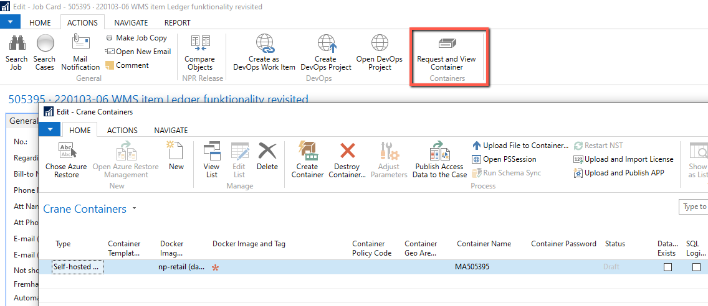

Please check [Crane documentation](../Crane-Containers/Crane-Features.md) for more details.

If test environment is created by hosting, or if a customer has permanent test environment, scroll down under [C/AL](#cal) section to see how to find it.

To obtain development port for these test environments, you need to remote to appropriate service.

You start by finding restore in Triskilion and then start a remote inside your current remote, for example:

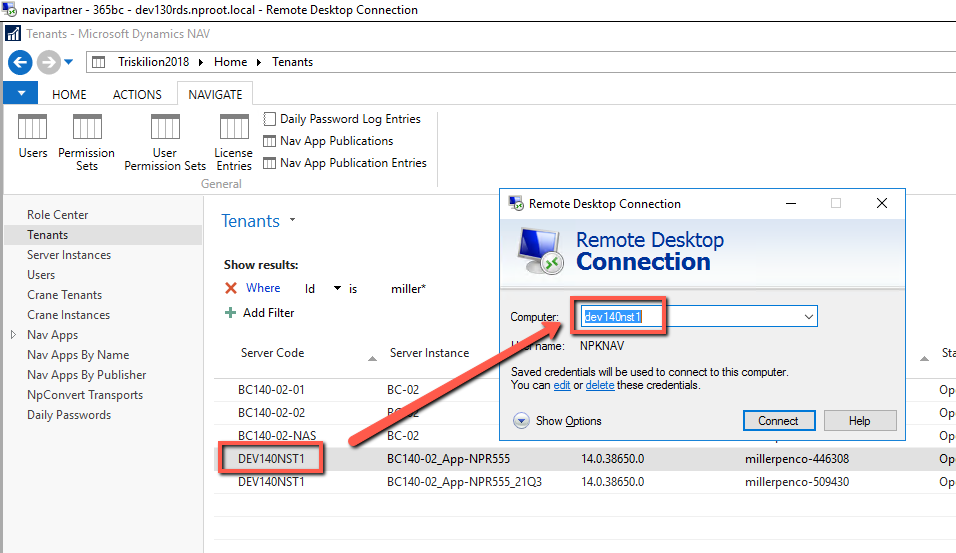

Don't use default NPKNAV username, but your own credentials, in this example for nproot.

Once there, search for Business Central Administration (or if on lower version administration shortcut for that version):

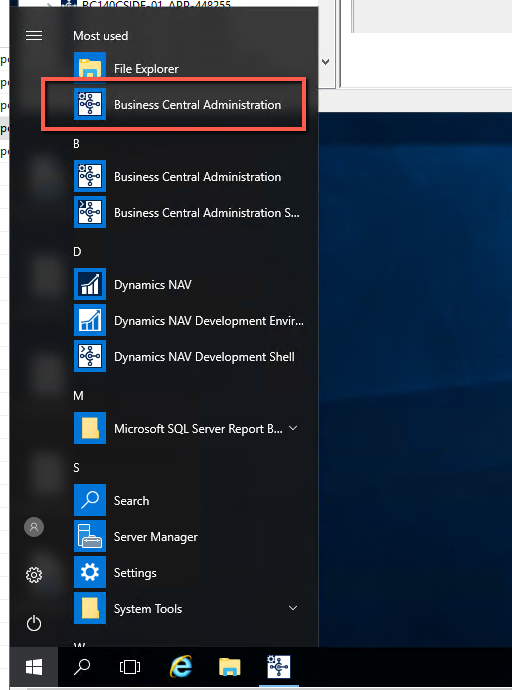

Find the correct service and this is where you see development port:

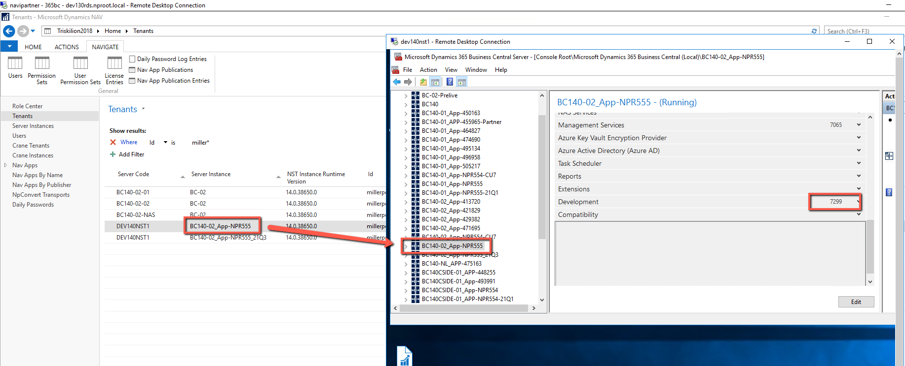

## C/AL

Some clients have permanent test environments, which they’re accustomed to use for any change we need them to test. If you don’t know where to develop, start off by searching for it in Triskelion.

For example, JapanPhoto is one client with permanent test environment:

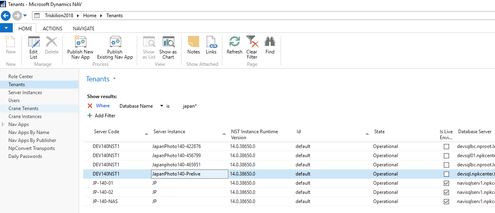

If you’re not sure if that is correct environment for coding, ask around, or send it to Mark and he’ll point you in the right direction.

If there’s no permanent test environment, you can proceed with creating one in a container or ask hosting for a restore. In most scenarios, if coding is to be done as C/AL it’ll be developed on a restore. You'll notice alot of mention of word restore on cases and teams, this refers to a test environment created by hosting.

If customer database is large, hosting might point you to an already restored database. You can get a list in the case system:

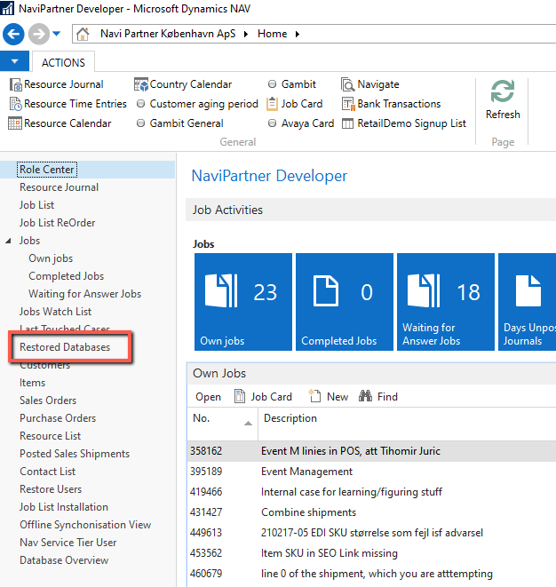

Names for these databases are usually following a pattern where a suffix is added to the end of the live database name, showing for which case it is created for:

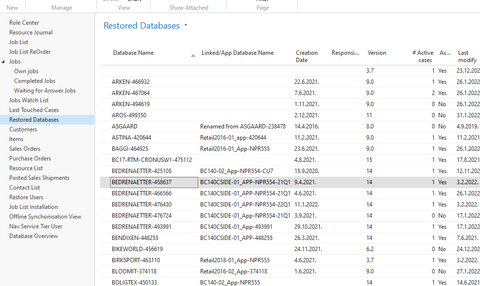

For example, BEDRENAETTER-458637 means that restore for BedreNaetter was created as per request on case 458637. Note that this list is not always showing all the databases available in Triskelion. If this is a problem, contact hosting, as they run a script that updates it.

Be aware that restored databases are deleted after certain conditions are met. It’s important you’re aware of this as you might lose your code. This will happen if there are 0 active cases that are using it, and enough time has passed since last usage. As long as you keep active cases at 1, it should not be removed.

By default, whenever you get a restore created from your case, it will have 1 in # Active cases column. If you’re using a restore for another case, you can reserve it by using Reserve Restore Database from your case:

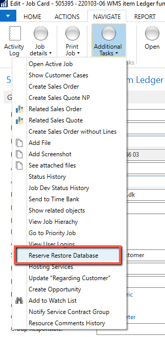

You’ll be presented with a list of restored databases, and when you select one and press OK, # Active cases will be increased by 1.

You can view any restored database and see which cases are using it, and if there are any comments on it:

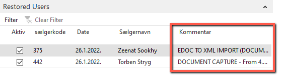

Sometimes developers have a restored database created for specific purposes and they might put a comment on saying: Please don’t touch this restore. If you’re not sure if you can use it, please contact a resource that requested a restore to see if you can use it for your case.

Note that a case is considered active while status of a case is not Closed or Completed, or to be more precise not (Closed or Completed).

### Accessing test environment

You usually start from shortcuts for live environments (unless a customer has permanent test environment in which case you access it directly with its own shortcut).

Check documentation how to access [Live environment](./AccessingCustomersDatabase.md)

Development environment shortcut is the Windows Batch File.

If customer is on the multitenant database, there will be no Windows Batch File in their folder:

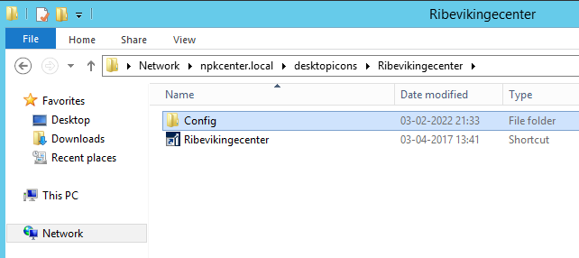

To find out on which database this tenant is, you can either check on Triskelion or you can view config file:

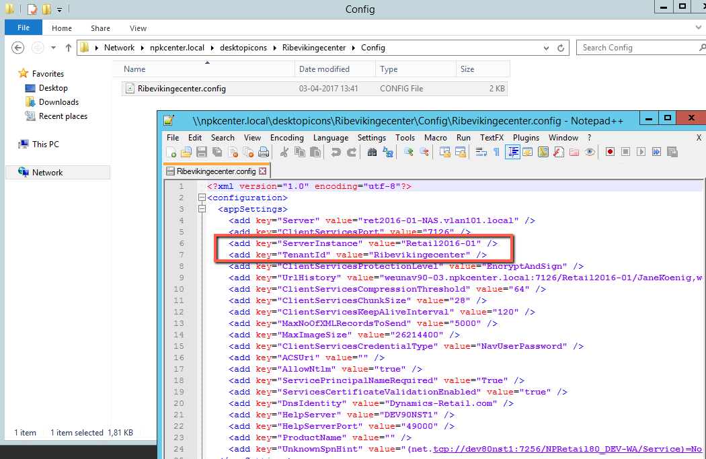

In this example, it means you need to locate Retail2016-01 folder and start from development environment located there.

As you open development environment you may need to provide credentials.

There should be a file in the folder called Database Password.txt

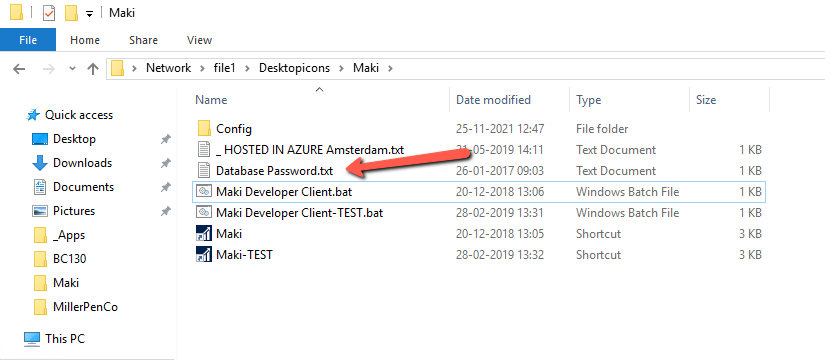

If there's isn't such file, but you still need to provide credentials, try the one from the screenshot.

Also, it may happen that development license has expired.

You can change the license on your own by selecting it from: 

R:\Navision\License\Developer

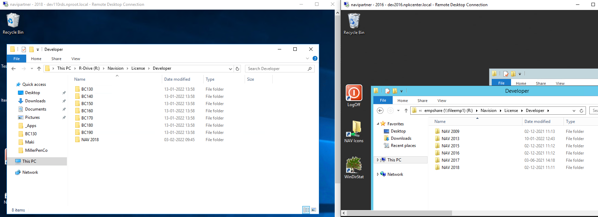

Change the license from Tools -> License Information -> Change.

Now that you managed to access live development environment, you need to open test environment from it.

Find the exact server/database/tenant information on Triskilion and set the information in the Open Database window (File -> Database -> Open):

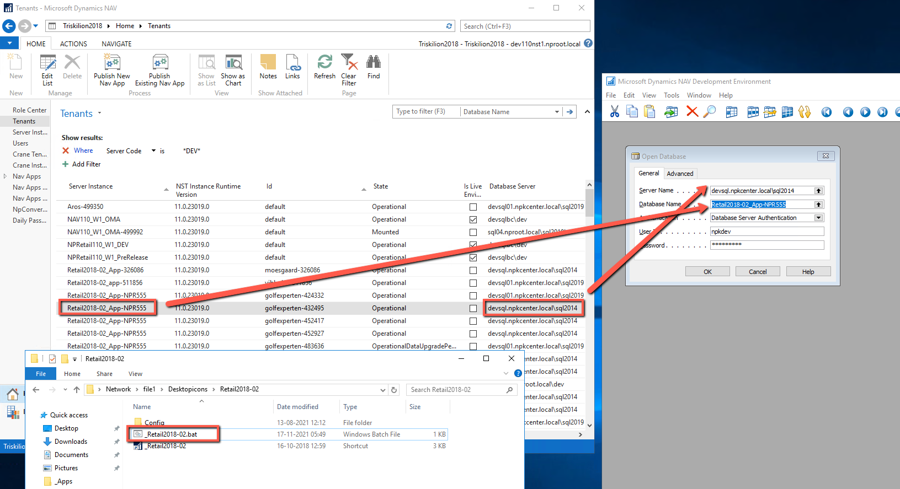

Set the service (File -> Database -> Information):

If there's no available services on the list, it may be that service is stoppped. 

You can try to start it yourself (check the documentation of how to open service remote [here](#al)) or ask hosting for help.

Set the tenant (if on multitenant) from Tools -> Options:

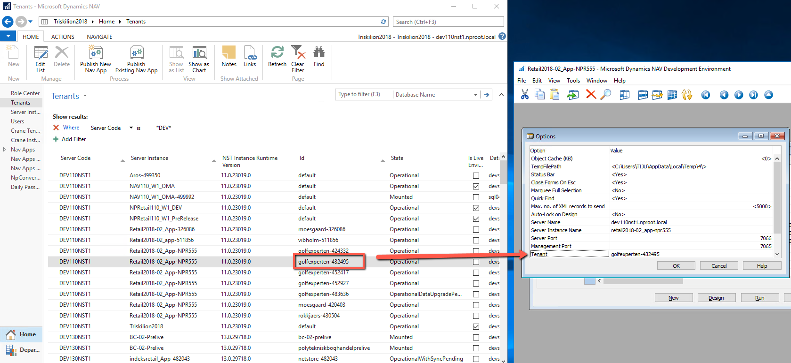

When done, run an object (for example page 1 Company Information) and on windows client credentials, provide username/password as per daily password.

Please note, on versions BC140 and older, you may need to additionaly ask hosting to enable web services and web client url.