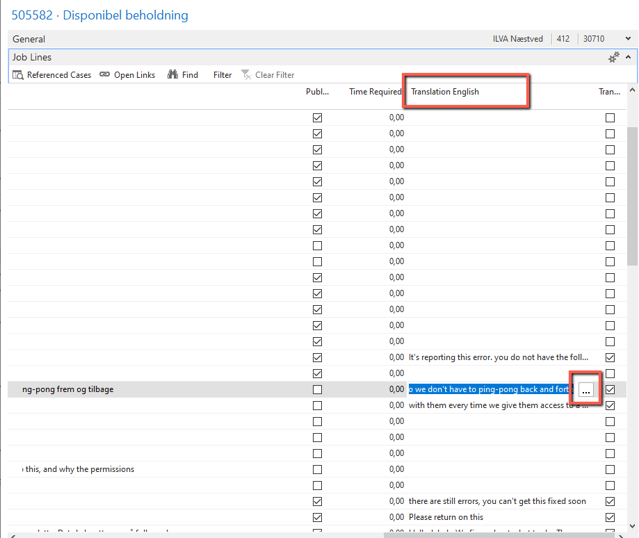
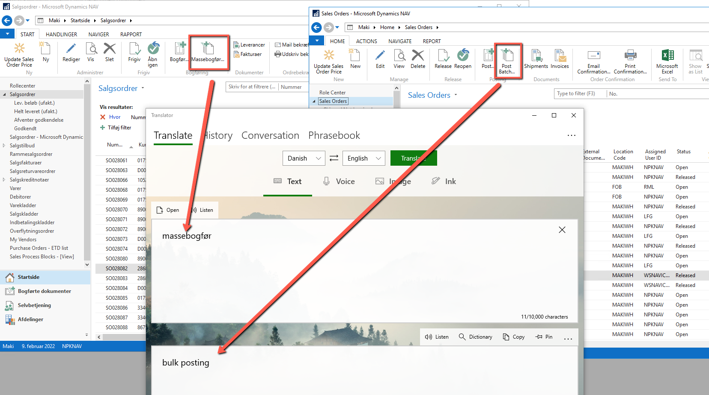

# Understanding the request
Regardless if you received the case directly from a customer or have been assigned internally, you need to understand exactly what the case is about.

If the case is not well documented, or you don't understand what it is about, please return the case to consultant you got it from, or directly ask the customer for more details. You can even suggest a teams session with a customer.

If customer requests a new feature, try to have as much notes of how you intend to implement it. Try and write it in a way so customer can understand it. When done, send it back to customer to approve the scope and details about it.

If case is about a bug, you need to be able to reproduce it. It doesn't matter if someone else reproduced it already, you need to do that as well since you'll be the first person to test it after you fix the code. If you can't reproduce it, ask consultant, or Mark, for help. 

Sometimes, case will be in Danish. You can use case built-in tool for translations:

This tool uses a service to translate, so if you use it too many times in short time, you may get denied by the service. If this happens wait a bit and try again (or use other translation services: google translate, translate app by Microsoft,....). You can also send a case to a consultant/mark/customer and ask for translation.

When referring to NAV/BC actions, pages, columns,.... use exact name as can be seen in the system. Using correct name will reduce potential missunderstanding and will provide correct guidelines. This is especially important when translating from Danish to English. Please do not translate as per what the word nativelly translates to, but what the English name is in the system.

For example, translation app will show wrong translation, so please don't use it in case when referring to it:

When adding a screenshot, try to show as much as possible on it, not just the action/error/process you're referring to, but if possible, entire windows/web client screen. This will provide additional information, for example, environment/company used.
