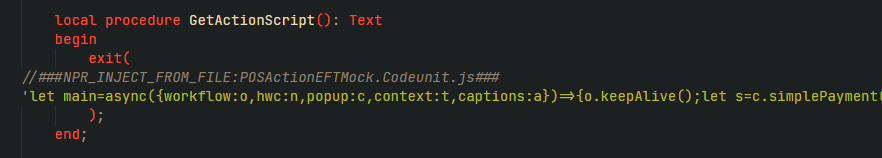

# POS Actions v3
This article goes through the changes for POS actions (a.k.a. workflows) v3 compared to the past two iterations:

## Workflow javascript in dedicated .js files
We have added support for automatically minifying and injecting the contents of any .js file into an AL string.  
The purpose of this is to provide developers with the ability to write js with syntax highlighting.
It works like this:
1. Make sure the recommended workspace VSCode extension "Run on Save" is installed (pucelle.run-on-save).
This allows us to run our script every time a POS action .al or .js file is saved.
2. Make sure both your .al and .js files are inside the same folder and both have names starting with: POSAction
3. In your .al codeunit, type a comment token declaring the name of the .js file like this:
    

    //###NPR_INJECT_FROM_FILE:POSActionREPLACEME.js###
4. Now save your file and confirm that the contents are automatically maintained - the script output is printed in the terminal.

## Develop workflow javascript directly in the browser
Instead of going back and forth between codeunit javascript, recompiling, republishing, F5ing the POS, logging into POS, testing your workflow, and then repeating all the steps if a change has to be made, you can now develop the workflow javascript directly inside the POS.  
This is done by opening your browser console, and using either of the following methods:

```javascript
Developer.LoadWorkflow("ACTION_CODE", main);  

Developer.LoadWorkflowFromString("ACTION_CODE", "WorkflowFunctionInAMinifiedString");
```

The first function is typically the easiest to use. Let's say you are developing or adjusting the workflow "TEST_WORKFLOW", and you already have a POS Menu Button 
pointing to it in your container test data.
Then you can log into the POS, find the button, open your browser console and first copy the contents of the POSActionTestWorkflow.Codeunit.js file into your browser console and load the function to replace your TEST_WORKFLOW:
```javascript
let main = async ({parameters, popup}) => {
    popuppopup.message(parameters.TextVariable);
}

Developer.LoadWorkflow("TEST_WORKFLOW", main);
```
This allows you to rapidly adjust the front end javascript, click the POS menu button to see the results and stay in this tight loop until ready to go back to VSCode.  

Note: The "LoadWorkflowFromString" method is intended for those rare extra complicated workflows that declare multiple functions and need all of them loaded for a single workflow.

Visual example:


## No more manual versioning
In action v3, any changes to parameters, javascript code and other workflow settings are automatically detected, triggering an update of the action and any POS menu button pointing to it when the POS is loaded for the first time thereafter. This means you no longer have to manually keep a version number in sync for each action.

## Less boilerplate
Action v3 are using an interface and enum approach instead of event subscribers. And extra attention has been paid to the parameters and noise within each action codeunit. Examples:
- The RunWorkflow function has parameters that better suit most action codeunits like POSSale, POSSaleLine, POSPaymentLine.
- The old JSON mgt. codeunit has been replaced with a version that has more intuitive Getters. The typical usage of these should result in a hard error if a parameter or context value is missing and this no longer requires an extra verbose overload.
Instead of JSON.GetStringOrFail('stringName', POSAction()); you can now just type JSON.GetString('stringName'). There are overloads that return a boolean along with the value as an out parameter if you need to handle a miss instead of hard erroring immediately, but most actions do not need this, so we have optimized for the common path.

- POS Session has been made single-instance. It was already pseudo-single instance via a manually bound codeunit for the entire duration of the POS session, so the only difference here is you no longer have to pass it around as a parameter or do the calls to:
```
POSSession.GetSession(POSSession, true)
```
or
```
if POSSession.IsActiveSession(FrontEnd) then
    FrontEnd.GetSession(POSSession);
```
Now you can just use it as a local var if needed from inside the POS.
- POSSession is less needed overall: RequestRefresh data is no longer a requirement to invoke from action codeunits. This is handled implicitly now.
This plus the fact that you already get the sale wrapper codeunits as parameters should hopefully reduce the need to call POSSession methods often.

## Action parameters now force captions
In V1 and V2 we needed to write manual event subscribers with big case sentences matching against all parameter names, in order to provide runtime translations in the BC user language for parameter name, parameter description, and parameter options.  
All of this is now in-lined: You simply cannot declare a parameter without specifying the captions.  
The same applies to the action description.  

However, note that none of the new captions parameters are stored in the DB - the new API takes care of buffering the captions in memory only.

## New workflow javascript pattern
In V2 you could just start typing your javascript inside the string. Now we force a function declaration with the name of main.
This gives you a more natural looking .js file, as it contains a root level function declaration.  
At the same time it allows you to declare only those parameters you need for your function. 

In the following example, a workflow needs access to 4 out of the possible parameters: workflow, context, scope and popup.
```javascript
let main = async ({workflow, context, scope, popup}) => {
}
```
This feature is called object destructuring in javascript, see https://developer.mozilla.org/en-US/docs/Web/JavaScript/Reference/Operators/Destructuring_assignment#object_destructuring for more info.

All of the possible options are:
- workflow
- context
- scope
- popup
- parameters
- hwc
- runtime
- captions

This allows workflows to be more explicit about which specific parts they require from the dragonglass framework.  
Note: If it helps with organizing a nicer .js file, you are free to assign multiple functions. However the framework will look for, and run, any function called "main" so this should be your primary function.


Note: Apart from the new requirements listed above, all the remaining details of writing frontend workflow javascript is the same as v2, meaning that the existing dragonglass documentation still: https://navipartner.visualstudio.com/Dragonglass/_wiki/wikis/Dragonglass.wiki/32/Front-End-(JavaScript)


## Testability
This is less of a new invention, and more of a structural decision:

Since all Action v3 additions should be inside a folder, we require you to split up your business logic from your integration logic.  
With "integration logic", we mean the action interface implementation, JSON parsing, injected javascript etc.  
With "business logic", we mean the actual AL execution of the action, such as data processing, webservice requests etc.

**NOTE: All functions declared on the business logic codeunit should receive as strongly typed as possible parameters. Meaning no JSON, no POSSession.**
**all of these should be unpacked in the integration logic codeunit, before it invokes the business logic codeunit.**

You are of course free to add however many codeunits you wish for code clarity but by forcing at least a split into minimum 2 codeunits, we force you to
consider that test codeunits need to be able to easily call the "business logic" codeunit without being bogged down by any details in the "integration logic" codeunit.  

In total, this means that any POS Action V3 should be inside a folder of at least 3 files (and more if needed):

1. POSActionNAME/POSActionNAMEIntegration.Codeunit.al (This one implements the action interface, handles steps and JSON ping/pong and invokes the business codeunit.)  

2. POSActionNAME/POSActionNAMEBusiness.Codeunit.al (This one implements any business logic - and is ready to be invoked from a test codeunit)

3. POSActionNAME/POSActionNAME.js (This one implements the frontend javascript workflow. Is minified and injected into the integration codeunit)

**NOTE: The "integration" and "business" are not hard rules for the naming. We have to work around the 30 char limit somehow :(**

## Enum
Since we are using enum+interface implementations for POS action v3, this means that we need to extend the enum:  
enum 6014470 "NPR POS Workflow" implements "NPR IPOS Workflow"

directly for any new NPCore actions and via enumextension for any PTE or partner apps adding new actions.  
Note: Remember to lock the caption so users see the internal ACTION_CODEs instead of a translated prettier version.


