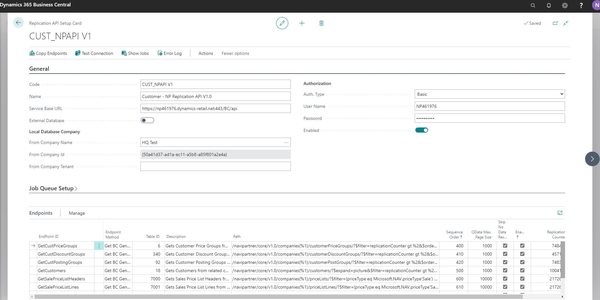
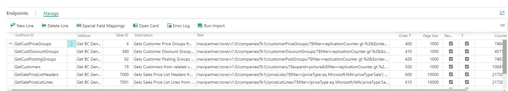
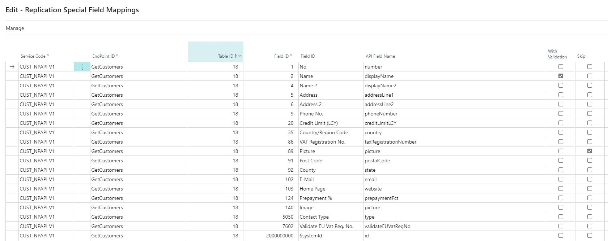

# Replication Module Configuration

This topic describes the process of configuring Replication Setup. As soon as you completed all necessary setup, data will be syncronized automatically in current company from the company setup as **From Company**

## Steps

- Open page **Replication API Setup List**. You will notice that multiple predefined Setups are created automatically grouped by master data (ex: Customer related data, Vendor related data etc.)
- Open the first **CUST_NPAPI V1** Setup.
- By default the setup is disabled. You need to enter necessary information before you can enable it.
- If Replication is made from an external database: change the predefined **Service Base URL** to the external Service Base URL and enable **External Database**
- Press Assist Edit of field **From Company Name** and select the company from which you want to import data. In case **External Company** is disabled, you can select a company from the current database, otherwise the system makes a web api request to the external database to retrieve companies and you can select a company from that database.
- The **From Company Id** is automatically filled in by the system. This field is used by the system when it makes API requests to retrieve data from the selected company.
- Enter the **From Company Tenant** if you work in a multitenant environment. Otherwise, this field can remain empty.
- Select the **Authorization Type**: Basic or OAuth 2.0.
- Enter Credentials.
- Press Action **Test Connection** to see if the connection can be established.
- If connection was successful, press "Enable".
	>[!Note]   
	> System asks: "Are you sure you want to enable service? This action will start importing from Source Company all data created or modified with a Replication Counter greater than the one setup for each Endpoint."
- After confirmation, the Replication Setup is enabled and newly or modified data in the **From Company** will be imported into the current company.
	>[!Note]  	
	> When Enabling a Replication Setup, the system creates in backgroud a Naviconnect Import Type and a Job Queue Entry so the import is done automatically based on setup on these records.

 

## Other Features

### Endpoints

The Import is done based on the **Enpoints** subpage setup.

Here, you can choose to:
1. Disable specific endpoints (which will stop importing data for those tables).
2. Change the order of the tables import.
3. Update the Replication Counter field.
4. Add new endpoint configuration.

### Special Field Mappings

Generally the fields for each table (endpoint) are mapped automatically: in the API page used as webservice most fields are named as the table field in camel case. Example: **Customer Posting Group** --> customerPostingGroup.

But there are some special cases when the field names are different. You can use **Special Fields Mappings** page to map these.
Example:
  

