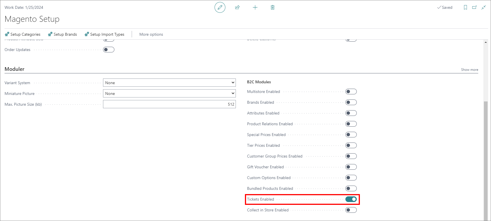
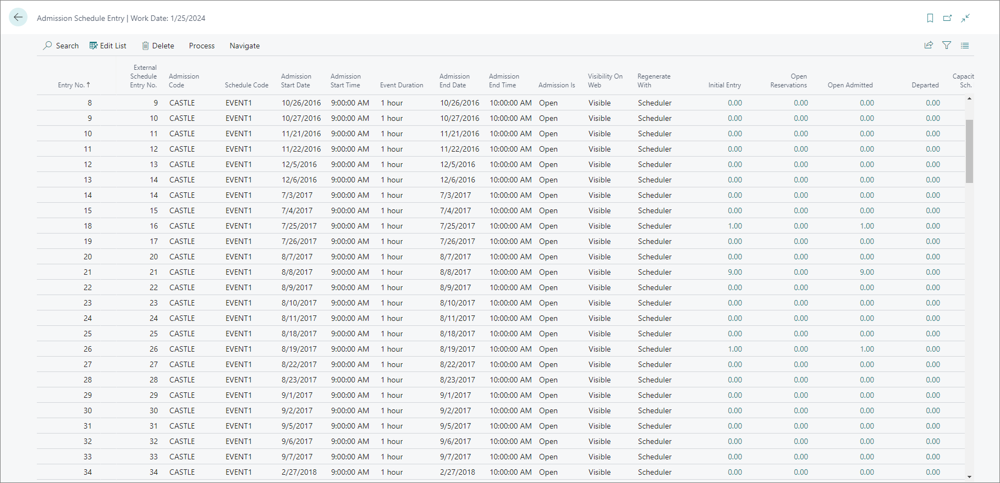
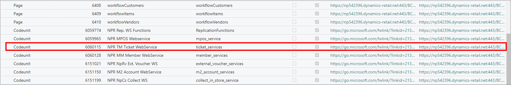
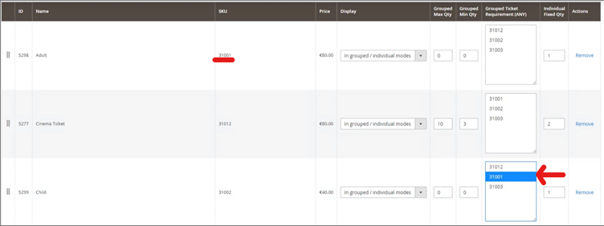
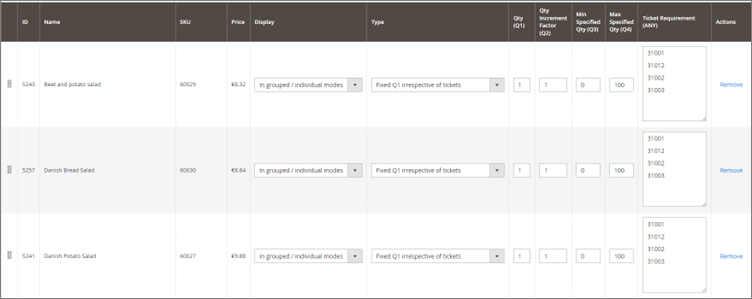

# Set up ticketing (Business Central and Magento)

The following procedure and best practices refer to the ticketing setup in Business Central and Magento. To perform the setup, follow the provided steps: 

## Prerequisites

- Have the Magento integration in place.

## Business Central setup

1. Navigate to the **Magento Setup** inside Business Central to check whether the integration is set up, and whether the ticket admission template is enabled under the **Moduler** card.

    

2. Make sure that the **UPD_TICKET_ADMISSION XML** template is present by searching for it in **XML Templates**.
3. Open the template, and select the **Edit Field Mapping** option.     
   In this way, you can check which data is being sent out to Web. Usually the sent data is contained in the **Admission Schedule Entry** administrative section.

    

4. In the **UPD_ITEM XML** template, you should check whether the *ticket_setup_v2* is being sent out when **Edit Field Mapping** is selected.
5. Check **Web Services** as well, since the setup and sync won't work without them. 

    

6. Navigate to the data log in Business Central, select the 6060119 (Admission Schedule Lines) table, and click **Add Records to Data Log**.
7. Perform the sync from the **Task List**.

    > [!Note]
    > Previously, with M1, the specific ticket in Business Central would be configured, but on M2, the only relevant thing to do is set up the picture for the item (ticket), and the name.

## Magento setup

1. Navigate to **Catalog** > **Inventory** > **Products**.    
   You will see a list of all products associated with the shop.
2. Click **Filters**, and select the dropdown menu **Type**.    
   You will see that there are **Ticket** and **Ticket Package** product types, which are cardinal for the future reference in this guide. 

   > [!Note]
   > Tickets aren't usable on their own. To make them work on the front end, you need to add a new product type **Ticket Package**.

3. From the product page, navigate to **Add Product** > **Ticket Package**.   
   The **New Product** page is displayed. 
4. Populate the **Product Name**, **SKU**, **Categories**, and other necessary fields.
5. Place where the tickets will be added as a part of this package in the **Ticket Products** card.
6. Click **Add Ticket**, and provide the tickets you wish to make a part of the ticket package. 
7. Open the **Ticket Package App Setup**.     
   The following options are available:
   - **Salable** - specifies when a purchase is allowed on this ticket package.
   - **Availability Check Before Loading App** - double-check whether all the slots are still available before the front end is loaded.
   - **Show "Make Reservation" Button** - replace the two default buttons on front end (**I am visiting on my own** and **We are visiting as a group**) with the **Make Reservation** button. 
   - **Show Sold Out Schedules** - displays the sold-out schedules.
   - **Forced Selection Mode** - forces one of the default options (either **I am visiting on my own** and **We are visiting as a group**) so that the purchasing experience is sped up. 
   - **Calendar Properties** - you can either use the default calendar view, or override it. 

## Best practices

You can apply different combinations of options in the **Ticket Package App Setup** page, which will result in different outcomes: 

- If the **Display** is enabled, and the **Forced Selection Mode** is disabled, then the content in the front end will be taken from the **Display**. 
- When the **Display** is set to the **Group Mode**, the values provided **Group Max Qty** and **Grouped Min Qty** will affect the quantity that is allowed for the purchase performed by a single customer.
- If you set the **Individual Fixed Qty** to a certain value, once a customer starts purchasing, the minimum purchasable quantity as an individual will be set to that value. 
- When we add more tickets to the ticket package, we can sort them by selecting the dots on the left side of the ticket, under the card **Ticket Products**. 
- The **Grouped Ticket Requirements** is for adding dependencies. For example: if you wish to purchase a child ticket only when an adult is present, on the **Child** ticket, you should select the SKU from the **Adult** in the **Child** ticket.   

    

- **Addon Products** is an important card for governing the ticket features, it allows us to add more products to our ticket package. If you wish to add more addons to be displayed only when the specific tickets are added, you can select the SKU from specific tickets on the **Addons** in the **Ticket Requirement** column. 
  
    

    > [!Note]
    > For the following options to work, the **Type** column needs to be selected.

- The **Qty (Q1)** can be used to indicate the quantity that will be added once the addon is selected. 
- **Qty Increment Factor** is the number of tickets selected that will consequently increase the defined number of addons. 
- **Min and Max Specified** defines the range that you can select for how many addons you wish to add. 

### Related links

- [Entertainment settings (reference guide)](../reference/entertainment_settings.md)
- [Ticket delivery (reference guide)](../reference/ticket_delivery.md)
- [Ticket BOM (reference guide)](../../entertainment/ticket/reference/ticket_bom.md)
- [Ticket schedules (reference guide)](../../entertainment/ticket/reference/admission_schedule.md)
- [Ticket types (reference guide)](../../entertainment/ticket/reference/ticket_types.md)