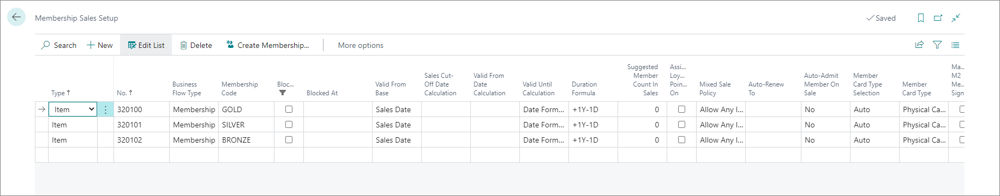
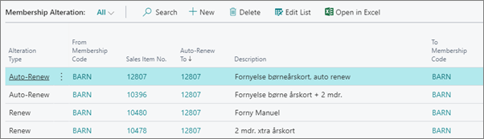

# Set up auto-renewal process

The auto-renewal process is used when a membership needs to be automatically extended. It is possible to perform auto-renewal both from Business Central, and from Magento.

There are three auto-renewal models under the Membership setup:

- Invoice - in this model, a backend user is tasked with running a job to determine which membership is set to expire in X days, and also set up for this type of auto-renewal. 
- Recurring Payment - in this model, the system looks for memberships that are in need of renewal, which is followed by an attempt to capture the required amount from a pre-registered credit card. 
- Customer Balance - this module works in a similar way to an Invoice. A backend user runs a job to find the membership that is set to expire in X days, and that is set up for this specific type of auto-renewal. 

In all three cases, an invoice is issued and posted to the customer attached to the membership. On success, the membership is renewed. Backend users are responsible for managing the posted invoices in the same way as regular ERP invoices. An unpaid invoice will not block the membership, but the outstanding amount will be displayed when the membership status needs to be confirmed. 

## Procedure

1. Click the  button, enter **Memberships**, and choose the related link.
2. Choose a **Membership** you wish to edit. 
3. Populate the **Auto-Renew** field with one of the following options:   
   - **No** - the membership will not be automatically renewed.
   - **Yes (Internal)** - the membership will be automatically renewed in Business Central using the auto-renew process.
   - **Yes (External)** - the membership will be automatically renewed in Magento. 
4. Populated the **Auto-Renew Payment Method** field.     
   The payment method code indicated the payment method that will be used by the member to pay for the invoice when the **Auto-Renew** field is set to **Yes (Internal)**.

## Next steps

After the auto-renewal process is in place, you can follow up on its status per a specific membership.

### Membership Sales Setup

When a membership is bought, membership ledger entries are created with the **Sales Item No.** used to buy the item. 

When you set the membership for automatic renewal, the **Item No.** specified in the **Auto-Renew To** field will be used for that specific sales line to create the auto-renewal invoice. 

### Membership Alteration Setup

When a membership is altered using one of the **Renew**, **Upgrade**, **Extend or Upgrade** alternation types, membership ledger entries will be created with the **Sales Item No.** used to alter the membership.

When you set the membership for automatic renewal, the **Item No.** specified in the **Auto-Renew To** field will be used for that specific alteration type line to create the auto-renewal invoice. 

### Configure auto-renewal process in Business Central

When a membership is set to automatically renew internally, the auto-renewal will occur in Business Central.

To launch the auto-renewal process:

1. Navigate to the **Member Community**, then from the ribbon select **Related**, and click **Auto Renew Process** in the dropdown.
2. Populate the available fields in the following way:
   - Set the **Community Code** to **Auto-Renew**.
   - Set the **Membership Code** to **Auto-Renew**.
   - Choose the **Valid Until Date**. All memberships having **Auto-Renew** enabled and validity that ends before or on the current date will be renewed automatically. 
   - In **Document Date** provide the date when the invoice document was created. 
   - Select the number of days **Payment Terms Code**. The due date will be calculated based on the values provided in **Document Date** and **Payment Terms Code**.
   - Select the payment method for the created invoice in the **Payment Method Code**.
   - Check **Post Invoice** if you wish it to be automatically posted.
   - Select the **Salesperson Code** of the responsible salesperson.
3. Click **Start Auto-Renew** to initiate the process.
4. Once the process is completed, you can view the details under the **Auto-Renew Lot**.