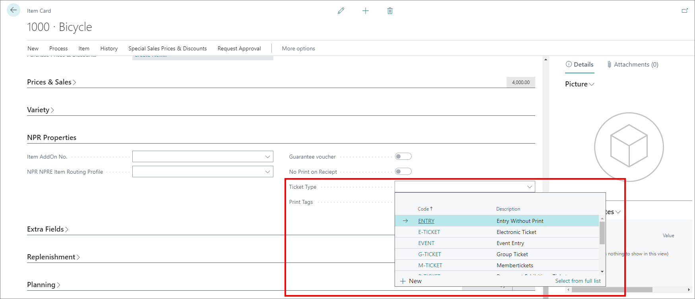

# Set up DIY printed tickets

To set up a DIY printed ticket, follow the provided steps:

1. In Business Central, search for **Items**, and open the **Item Card** of the item you wish to edit.
2. Navigate to the **NPR Properties** section, and select the **Ticket Type**.      
   Each ticket type corresponds to the value found in the **Code** column in the **Ticket Type** administrative section, and it links Business Central with the [Ticket Designer](../tutorial/TicketDesigner.md).

>[!NOTE] 
>When the customer purchases a ticket, the ticket/reservation is created in Business Central.

3. Open the Ticket Designer, and create the ticket design with the same name as the ticket type in Business Central.          
   During the creation of the ticket (during a web shop order) Magento will recognize the ticket type, and connect it to the Ticket Designer, where a design has been created.

This concludes the DIY printed ticket setup, however, if you wish for tickets created in the back office (e.g. prepaid tickets) to have a separate design from the other ticket design, follow the provided steps:

4. Create a new ticket design in the Ticket Designer, and provide it with a new name separate from the existing **Ticket Type**.
5. Add the new ticket design name to the **Ticket Layout Code**.        
   When you create new tickets in the back office, they will be provided with the design defined in the **Ticket Layout Code**, instead of the **Ticket Type** design. 

### Related links

- [Ticket Designer](../tutorial/TicketDesigner.md)
