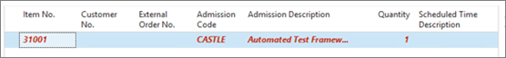

# Create prepaid tickets

Prepaid tickets are created, distributed, and paid in advance. They can be used in the following cases: 

- For internal events - if you don't necessarily wish to issue physical tickets to the guests, but still need to track the admission for statistical reasons. 
- When selling a batch of tickets to a third party - you can issue an invoice in Business Central to cater for the financial part of the transaction. 
- When handing out tickets for promotional purposes - it's quicker to use the prepaid ticket function to generate tickets if they are awarded in contests, for example. 

To issue prepaid tickets from Business Central, follow the provided steps:

1. Click the  button, enter **Ticket BOM**, and choose the related link.   
2. Place the cursor on the item number line you wish to create tickets for, and click the ribbon action **Create Tickets**, followed by **Create Prepaid Tickets**.
3. Enter the following information:
   - **Customer No.**
   - **External Order No.**
   - **Scheduled Date/Time**
   - **Quantity**

4. When all lines are correctly populated (not red), click **OK**.
5. If the tickets need to be distributed to a third party, you can export the generated tickets to Excel.

If tickets are internal or for an event you control yourself, it is possible to validate the tickets by placing them in the **Offline Ticket Validation** journal. 

Individual tickets or the entire batch of tickets can be validated for admission at this point. This will update the arrival statistics for the ticket on the **Event Date**/**Event Time** specified on the journal line.

### Related links

- [Create postpaid tickets](create_postpaid_ticket.md)
- [Issue tickets from the POS](issue_ticket_from_pos.md)