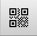
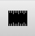
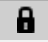
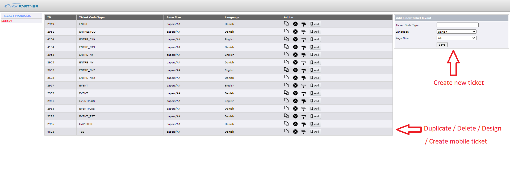
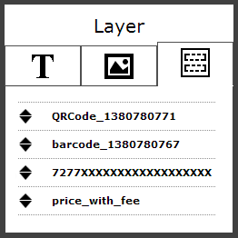

# Ticket Designer

This acticle will go though the **Ticket Designers** functionallities and how to create a new ticket.

## Shortcut Keys and Tools  
  

| Shortcut    | Tools                                          |Description                     |
| ----------- | -----------                                    |-----------                     |
| Alt + T     |                |Toggle **Custom text toolbox**  |
| Alt + F     |              |Toggle **Field** Toolbox        |
| Alt + Q     |            |Toggle **QRcode** Toolbox       |
| Alt + B     |          |Toggle **Barcode** Toolbox      |
| Alt + I     |              |Toggle **Image** windows        |
| Alt + M     |          |Toggle **Measure** Toolbox      |
| Alt + G     |    |Add / Remove **Guideline**      | 
| Alt + L     |            |Show / Hide **Layers** box      |
| Alt + Z     |                |**Zoom** in / **Zoom** out      |
| Alt + P     |          |Toggle **preview** window       |
| Alt + H     |  |Center **horizontally**         |
| Alt + V     |    |Center **vertically**           |
| Alt + C     |          |**Contain** within page         |
| Alt + O     |        |Show **Overflow** elements      |
| Alt + A     |                  |Toggle **.gif** window *(only for mobile ticket)*|

## The Admin

When having logged into the **Ticket Designer admin** you have different options. You can either:
1. Create new ticket
2. Duplicate / Delete / Design / create mobile ticket 

## Duplicating a Ticket
Duplicating an existing ticket might be the easiest way to get started. Most of the time you might want to keep the existing layout but alter a couple of things, maybe some text, or an image, then duplicating is definitely the way to go, and this also means that you do not have to set a completely new design manually every time.

1. Click on **dublicate** . You will then be prompted to define the ticket parameters: 

- **Ticket code type**: The code for a ticket type is the code that the ticketing system will use to match the design from the actual ticket being sold.
- **Language**: For which language will this ticket be used - Danish or English
>[!NOTE]
>More languages can be added upon request.
2. Press **save** 

>[!NOTE]
> If you create a new ticket design form scratch you will also have to set the actual print size of the final ticket; This can be either A4 or A5. This also defines the canvas on the ticket designer. 

## Deleting a ticket

If you want to delete a created ticket press   
Once you clicked on delete, you will be prompted if you want to proceed:

## How to design tickets

Press  to start designing a ticket.  

>[!NOTE]
> If you have dublicated a ticket you will be presented by a complete kopi of the dublicated ticket that you can edit as you please.
If you have created en entirely new ticket you will be presented by a blank page.  

In the ticket designer you can easily add elements and move them around your page (canva) by clicking and dragging. Together with a lot of intuitive tools you can position your items to pixel point accuracy.  

>[!NOTE]
>You can always right click on existing elements and choose to **edit** or **delete** tele element.  
>  

### Design Toolbar
The design toolbar contains all the design options. 
  
Please refer to the shortcut keys section in the beginning of the article for a full list of shortcut keys to use within the ticket designer.

### **Text**
The text tool will allow you to customise the text Font Size, Font (Type), and the Font colour.  

### **Field**
The Field tool will allow you to add fields that will be dynamically replaced with the actual content when the ticket is generated (E.g. Customer name, Ticket price, visit date, etc.)   
This tool also allows you to define the Font Size, Font (Type), and Font colour of the fields that are displayed on the ticket.

### **QrCode**
Using the QRCode tool you can add QR Codes on your ticket. You can chose from 4 different sizes for the QRCode; *Small, Medium, Large, X-Large*.

### **Bar Code**
Using the Bar Code tool you can add and customise Bar Codes on your ticket. You can chose from 2 different sizes; *Small, Medium*.

### **Image**
The Image tool allows you to upload images from your computer to the ticket. It also allows you to re-use a picture that you have uploaded in the past for any previously designed ticket.

**Upload image**: 
When uploading an image you will first click on choose file to browse your computer and look for the image you want to upload. Once you select the image, click on add to start uploading. Once the image is uploaded it will be automatically displayed on the page. Allowed image formats are JPG, GIF and PNG, Transparent PNG.

**Select a previously uploaded image**: If you want to re-use an image you uploaded in the past (on any ticket) you can click on the browse ticket tab and click through the list of images. Note that there will be a small preview displayed down the list to help you make an exact choice.

### **Measure**
For instance if you want to know which size of image you want to add on a specific region on the ticket, a quick way to do that is using the Measure tool. The Measure tool is a point to point tool which will give you the **Width(W)** and **Height (H)** of a specific region. First select the Measure tool then click on a starting point, move your mouse to the end point and click again. *Note that the Measure tool is not a click and drag tool*.  
Note that you can always hide the measuring layer by click the Measure tool icon from the tool bar again. When hiding the measure tool the selected region is not lost.

### **Guidelines**
Guidelines are here to give you the X and Y coordinates so you can position your elements with high accuracy on page. Together with the positioning tool in the footer you can quickly move the elements exactly to the required coordinates with pixel point accuracy.
>[!NOTE]
>- For the horizontally and vertically lines there are two lines to drag in each direction to use for assistance.

### **Layers**
Using the layer tool you can move elements on top or send them to the back very easily. Note that you can only move elements within their element group. For example you can only sort texts within text element group, etc. Images will always be displayed under Text and Text will always be displayed under Fields.  
In the tool you can drag to move the layers up and down:  

### **Preview**
The preview window will show you how the ticket will look after compiling. You can keep the window open and work on the ticket designer. Each time you make a change on the page the preview will reload.

## Reload and Publish
### Reload:   
Assume you started editing an existing ticket and then you realised that you are doing it all wrong. You can always reload the ticket which will bring the ticket back to it status when last published.

### Publish:   
A ticket will never go in production mode unless you Publish it. Once you are done designing a ticket and are sure that what you see in the Preview is what you want, then the ticket is ready to be published.
>[!IMPORTANT]
>A ticket will never go in Production mode unless you Publish it.

>[!IMPORTANT]
>A ticket can always be changed, even if it is put up for sale. The changes provided to the ticket will also take action on the already issued tickets. The customers will have to update the ticket page and the changes will occur.

## Mobile Ticket
For creating a mobile ticket the procedure is just like creating a printed ticket that will be generated for a .pdf-file. The only difference for the designer is that there is a tool for adding a gif-file for your ticket. 
>[!NOTE]
>This ticket will be opened in a browser.