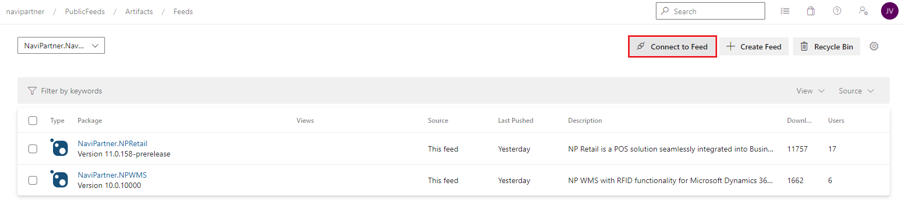
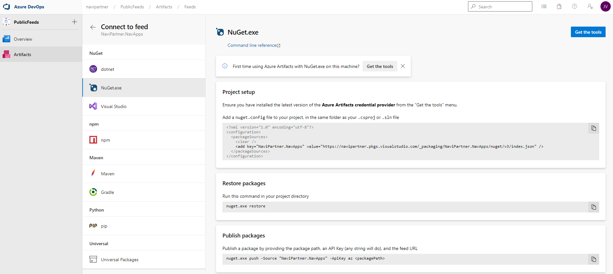

# Access to the feeds via nuget.exe or PowerShell Package Management

This is an advanced possibility allowing automation of the interaction with packages. There are many articles on the Internet providing details. **Azure DevOps Artifact Feed** page offers connection strings for multiple package management tools

From the feed page you can click on `Connect to Feed` button:

You will get details and connections strings relevant for the selected package management:

