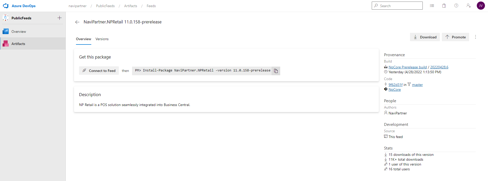
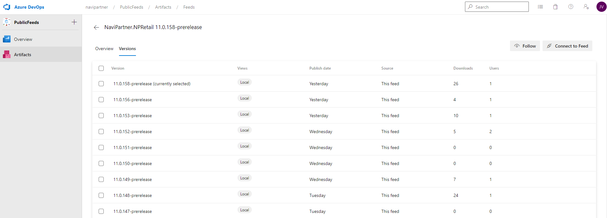
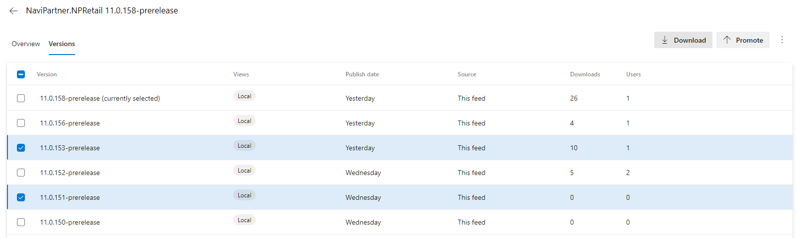

# How to access NaviPartner Artifact Feeds

First of all, it is necessary to request access to [NaviPartner Azure DevOps system](https://navipartner.visualstudio.com/). To get the access you need to ask **NaviPartner** using the common communication channel.

Once the account is ready, visit [Public Feeds project](https://navipartner.visualstudio.com/PublicFeeds/_artifacts/feed/NaviPartner.NavApps). The previous link is also accessible from [the main NaviPartner`s DevOps site](https://navipartner.visualstudio.com/).

The image above demonstrates `NaviPartner.NavApps` feed. This one includes our core apps (currently two). You have to decide which one you need to use and click on this one. Each item in the list is called, in NuGet words, a `package`)

Once you do that you will see the latest (pre)release for the specific app (or package, in NuGet words).

From this place, you can easily download the package by clicking on `Download` button.

In the case you need a specific version, you can find it using `Versions` tab (right next to `Overview` tab). This will provide a list of all available versions. Just be careful, as on the top there will be very likely prereleases of the upcoming version and official releases will be listed below.

You can click on any of the provided versions and you will see the card (overview) for the selected versions instead of the `latest` one. Or, you can select multiple and download directly selected versions.

## Next steps
 - [What to do with the packages on your local machine](./WorkingWithNuGetPackageOnLocalMachine.md)
 - [Access to the feeds via nuget.exe or PowerShell Package Management](./AccessNaviPartnerArtifactFeedsAdvanced.md)