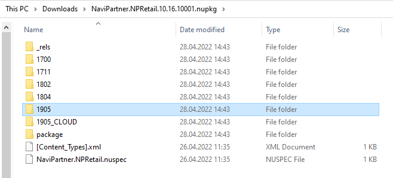

# What to do with the packages on your local machine

Once you have downloaded package(s), you have to get apps included in the package(s). NuGet packages are nothing but structured **zip** archives. So you can easily extract their content and discover apps included inside. Once you have apps, you can manually take and use them anywhere you need them (deploy to your environments or put into **AL project** folders, etc.)

