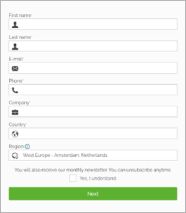
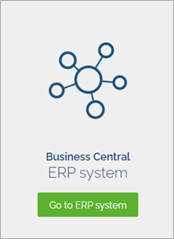
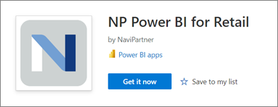
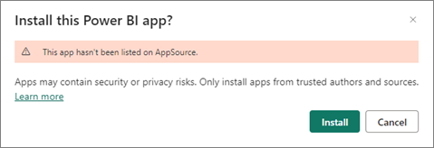
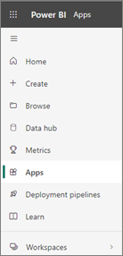
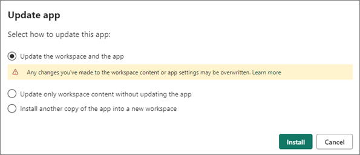
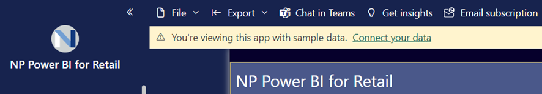

# Install NP Power BI for Retail

Take control over your operations by using the Power BI app for retail business. To install the application, follow the provided steps:

## Prerequisites

Prior to the installation of the Power BI app, request a free BC account from the [NaviPartner website](https://www.navipartner.com/get-trial/).   

1. Populate and submit the registration form.    
              
2. On the following screen, select the theme, and then the **ERP system** link.      
           
       Once the registration is completed, you will receive the necessary credentials. They will be expressed in the following format:

    **database: BCEU4044501010IM8G02043**       
    **username: K07747JI**    
    **password: 9653453**

3. Use the credentials in the final step of the installation to connect to your Power BI Retail report with your test database.

## Procedure

1. Log into your Power BI account. 
2. Go to the [Microsoft app store](https://apps.microsoft.com/store/apps) and find our product **NP Power BI for Retail**. Click **Free trial** to run the installation wizard.    
   
   
   
3. Once the installation wizard is displayed, click **Install**.     
                 
   When the application is installed, it will be added to your list in the **Apps** section.      
   
4. If you've already installed the application, you can update it to the new version by selecting the first option in the update app pop-up window, or install a new copy by selecting the third option. After selecting the third option, you need to add a new name of the installation app, and confirm it.    
   
5. Once the app is installed, click on the application name to open its content.     
   You can review the contents with the test data or connect to your test database from Business Central. 
6. To connect to your data from the Business Central, you need to click **Connect your data** in the alert ribbon.      
    
7. In the **Connect to NP Power BI for Retail** pop-up window populate the three fields as indicated in the provided screenshots.   
       

> [!Note]
> Ensure that you don't have any blank characters in the beginning and the end of the text you provide.

8. Choose the **OAuth2** authentication method, and the **Organizational** privacy level settings.
9.  Click **Sign in and connect** to synchronize your Power BI app with the data from Business Central.     
    This step may take some time, and after it's completed you will be able to see your own data in the report.    
    The data will be automatically refreshed once per day by default, but this can be changed in the dataset settings, based on your preferences. 

### Related links

- [NP Power BI for Retail](../intro.md)