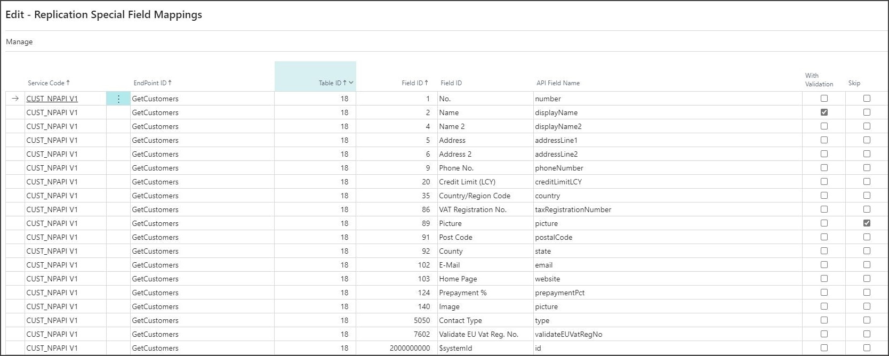

# Configure Replication Module

This topic describes the process of configuring the Replication Setup. As soon as you complete the necessary setup, data will be synchronized automatically in the current company from the company stated in the **From Company** field.

1. Open the **Replication API Setup List** page.  
   Multiple predefined setups are created automatically and grouped according to the master data, for example customer-related data, vendor-related data, and so on.
2. Open the first **CUST_NPAPI V1** setup.
3. Enter the necessary information in order to enable the setup (the setup is disabled by default).
 > [!IMPORTANT]
 > If the replication is made from an external database, state the correct external URL in the **Service Base URL** field and enable the **External Database** toggle switch.           
 
4. Press the ellipsis button next to the **From Company Name** field and select the company from which you want to import data.   
   If the **External Company** is disabled, you can select a company from the current database, otherwise the system makes a web API request to the external database to retrieve companies and you can select a company from that database.
5. The **From Company Id** is automatically populated. This field is used by the system when it makes API requests to retrieve data from the selected company.
6. Enter the **From Company Tenant** if you work in a multitenant environment.
7. Select the authorization type and the necessary credentials, then enable the authorization if needed.
8. Press **Test Connection** to see if the connection can be established.
9. Press **Enable** if the connection was successful.     
    After confirmation, the Replication Setup is enabled and all data in the **From Company** will be imported into the current company.
> [!Note]  	
> When enabling the Replication Setup, a Naviconnect Import Type and a Job Queue Entry are created in the background, so the import is done automatically based on setup of these records.

## Next steps

After you're done configuring the **General** Replication Setup options, you can also configure the **Endpoints** and **Special Field Mappings**.

### Configuring Endpoints

The import is done based on the **Endpoints** subpage setup. If necessary, you can configure it.

It is possible to:
- disable specific endpoints (which will stop importing data for those tables)
- change the order in which tables are imported
- update the **Replication Counter** field
- add new endpoint configuration

### Configuring Special Field Mappings

In general, the fields for each table (endpoint) are mapped automatically. In the API page used as a webservice, most fields are named like the table fields in the CamelCase.    

**Example:**   
**Customer Posting Group** --> **customerPostingGroup**

However, there are special cases when the field names are different. You can use the **Special Fields Mappings** page to map these. This page is accessed by clicking the **Manage** button, followed by the **Special Field Mappings** button in the **Endpoints** panel. 

**Example:**

