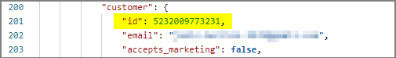

# Getting orders from Shopify

New orders and order updates are downloaded from Shopify automatically. Two periodic processes are responsible for that ([refer to **Job Queue Entries**](./autogeneratedsetups.md#job-queue-entries) for reference). 

1. The connection with the Shopify servers is established, and query for new, cancelled and closed orders is performed. The results are saved in the **Import List**.

> [!Note]
> The process doesn't request all orders from Shopify, only those created/updated in Shopify after the last request has been run, or after the date/time specified in the **Get Orders Starting From** field on the **Shopify Integration Setup** page.

2. New entries (retrieved during the first process) in the **Import List** are processed, and consequently sales orders are updated (the new ones are created, the cancelled ones are deleted, and the closed ones are posted).

It's recommended to periodically check the **Job Queue Log Entries** and the **Import List** to make sure any potential errors are addressed.

All created sales orders in the system are assigned a **Shopify Order ID**. For the purpose of reporting the order progress (shipping items to the customer) back to Shopify, each **Sales Order Line** also gets assigned its own **Shopify Order Line ID**.

## Customer search routine

Customers are selected by using the **Customer search routine**. During the order import, the following customer lookup algorithm is applied:

1. The customer is looked up by their **Shopify ID**.                   
   
   >[!Note]
   > Each time a customer is created during the Shopify order import process, the Shopify ID of the customer is saved in the **Shopify Customer ID** field on the **Customer Card** page.
2. (If the customer isn't found in the first step) The system tries to find another customer either by email, phone, or both (depending on the provided value in the **Customer Mapping** field on the **E-commerce Store Card**).   
   If the system finds the customer, the Shopify ID will be assigned to them, so that the next time they can be found more quickly.         

> [!Important]
> The system will not use a customer if its Shopify ID is different than the one received in the order, even if the email/phone number are the same.                

3. (If the customer still isn't found) The system creates a new customer if the **Allow Create Customers** option is enabled in the **E-commerce Store Card**.           
   In this case, the system uses the customer template specifies in the **Customer Config. Template Code** field on the **E-commerce Store Card**. The template is needed to fill-in fields and values which aren't sent to Shopify, but are required in Business Central.    
4. If **Allow Create Customers** is disabled, the system uses a predefined customer (assigned to the store through customer mappings, or directly specified in the **Customer No.** field on the **E-commerce Store Card**.        
   For more information, refer to the article on [E-commerce stores](../howto/salesordersetup.md#set-up-e-commerce-stores).

## Production vs. Sandbox

When downloading new orders from Shopify, the following orders are processed:

| Environment            | Condition for an order to be imported                 |
|------------------------|-------------------------------------------------------|
| Production             | JSON key “financial_status” = “authorized”            | 
| Sandbox                | JSON key “financial_status” in “authorized” or “paid” | 

> [!Tip]
> This is useful when testing the functionality.

### Next steps
- [Send data back to Shopify](./senddataback.md)

### Related links
- [Sales Order Integration area setup](../howto/salesordersetup.md)
- [Automatically generated setups](./autogeneratedsetups.md)
- [Set up Shopify integration](../howto/setupshopifyintegration.md)