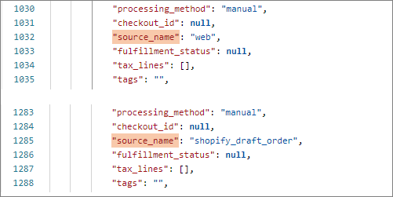
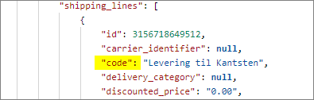
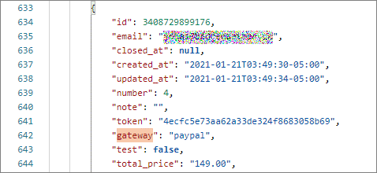

# Sales Order integration area setup

This topic contains instructions for all setups related to the **Sales Order Integration** area.

## Set up E-commerce stores

A distinct e-commerce store needs to be created in Business Central for each value sent from Shopify as a JSON key "Source Name" of the Shopify order JSON file.

To define an e-commerce store:

1. Click the  button, enter **E-commerce Stores** and select the related link.      
   The page containing all the existing e-commerce stores in the system is displayed.
2. Click **New** and specify all values that correspond to your business needs in the provided fields.       
   The **Code** and **Salesperson/Purchaser Code** fields are mandatory.

## Set up Shipment Method Mapping

The shipment method mapping needs to be set up for each value sent from Shopify as the "code" property in the Shopify order JSON file's "shipping_lines" array.

To define a shipping method mapping:

1. Click the  button, enter **Shipment Method Mapping** and select the related link.        
   The page containing all the existing shipment method mappings in the system is displayed.  
2. Click **New** and specify all values that correspond to your business needs in the provided fields.       
   The **External Shipment Method Code** and **Shipment Fee No.** fields are mandatory.

## Set up Payment Method Mapping

The payment method mapping needs to be set up in Business Central for each value sent from Shopify as the "gateway" property in the Shopify order JSON file.

To define a payment method mapping:

1. Click the  button, enter **Payment Method Mapping** and select the related link.        
   The page containing all the existing payment method mappings in the system is displayed.
2. Click **New** and specify all values that correspond to your business needs in the provided fields.    
   The **External Payment Method Code** and **External Payment Type** fields are mandatory.

## Set up Location mapping

Location mapping is used for identifying the code of the Business Central location the items are shipped from, as well as the shipping agent and its service code. During the order import process, the system searches for the location code and/or shipping agent, which depend on the customer's country and postal code.

The location mapping setup is taken into account only if the system can't identify the **Location Code** and/or **Shipping Agent Code** during the evaluation of the **Shipment Method Mapping**.

### Related links
- [Set up inventory update sending (Location links)](./inventoryupdates.md)