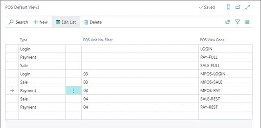

# Set up mobile POS view

Mobile view setup is defined exactly in the same way as in the non-mobile scenarios. There are default views for the login, sale, and payment functions. This is the default arrangement that Transcendence applies if there are no custom views defined.

To define a new mobile view, follow the provided steps:

## Prerequisites in Business Central

1. Create three new POS views - **MPOS LOGIN**, **MPOS-SALE**, and **MPOS-PAY**.     
   
     

   Leave the **JSON** field empty to make the default one automatically selected.
2. Navigate to the **POS Default Views** administrative section.
3. Assign a POS unit to the created POS views.      
   
   

4. Create the following entries in the **POS Menu** section:
   - **MOBILE-DRAWER**
   - **MOBILE-ITEMS**
   - **MOBILE-PAYMENT**
   - **SWIPE-ACTIONS**
5. Create a new MPOS QR code in **MPOS QR Code List**.
6. Click **Set Defaults**, and then **Create QR Code**.    
   The necessary QR code is now generated.

## Procedure on the mobile device

1. Download the **NP Retail POS** application from the app store and install it.
2. Open the **NP Retail POS** app.
3. Press **D365 BUSINESS CENTRAL - ONPREM** and scan the QR code generated in the last step of the Business Central portion of setup.     
   This step is only necessary if the app is opened for the first time. 
4. Navigate to the homepage and press **POS**.

### Related links

- [POS Display Profile](../../pos_profiles/reference/POS_Display_profile.md)
- [POS Unit Receipt Profile](../../pos_profiles/reference/POS_unit_Receipt_profile.md)
- [POS Audit Profile](../../pos_profiles/reference/POS_audit_profile.md)
- [POS End-of-Day Profile](../../pos_profiles/reference/POS_End_of_Day_Profile.md)
- [Set up the POS Global Sales Profile](../../pos_profiles/howto/POS_Global.md)
- [Set up POS Posting Profile](../../pos_profiles/howto/POS_Pos_Prof.md)
- [Set up POS Pricing Profile](../../pos_profiles/howto/POS_Pricing_profile.md)
- [Balance the POS (Z-report)](../../posunit/howto/balance_the_pos.md)
- [Establish connection between receipt printer and iPad/iPhone](mpos_bluetooth_guide.md)