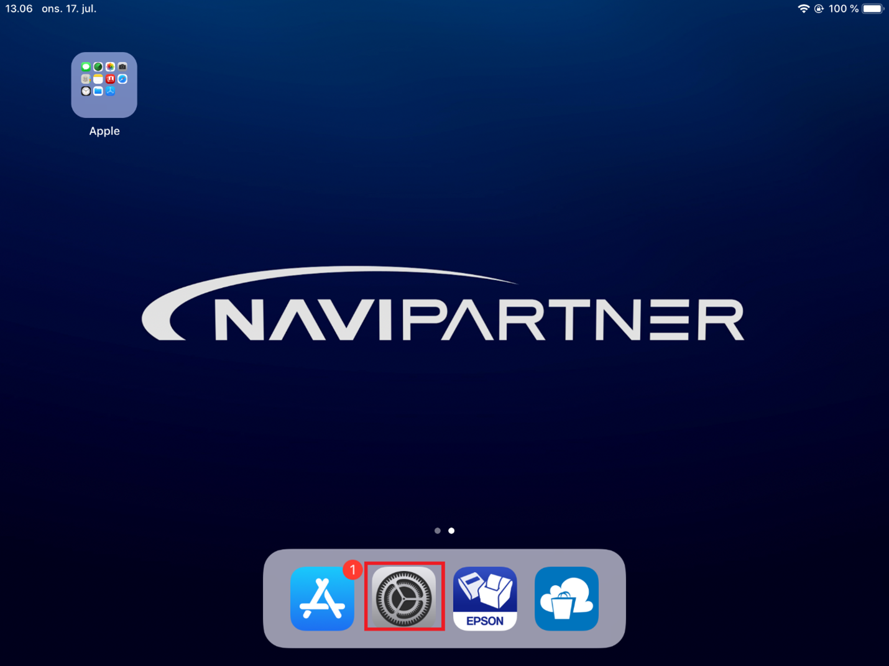
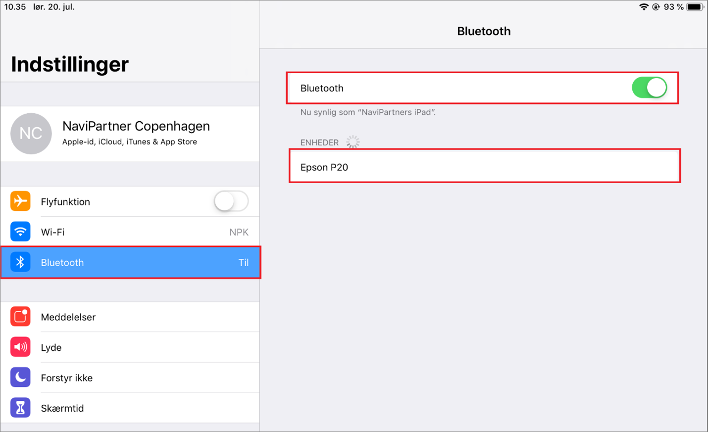

# Establish a connection between a receipt printer and an iPad/iPhone

To establish a connection between a receipt printer and an iPad/iPhone, follow the provided steps:

1. Navigate to the **Settings**.   

    

2. Select **Bluetooth Menu** in the menu (iPhone) of in the sidebar (iPad).   
3. Make sure that **Bluetooth** is on.
4. Select **Epson P20** (Epson receipt printer) from the **List of Devices**.   
   
   

The connection between a receipt printer and an iPad/iPhone is now established.