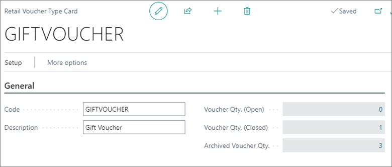
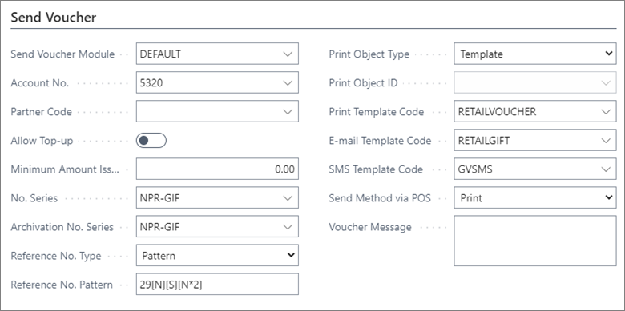
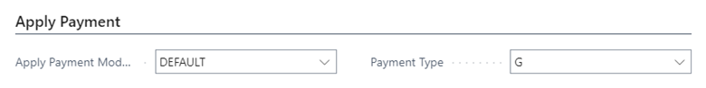

# Voucher types

Retail vouchers can be used as a payment type in their own right, so the owner of the voucher can use them to purchase various goods and services.

Retailers offer different types of vouchers. The most common ones are gift vouchers and credit vouchers. There are four sections in the **Retail Voucher Type Card**:
- **General**      
  In the **General** section you can define the **Code** and **Description** of a voucher. This section also contains a number of open, closed, and archived vouchers.

- **Send Voucher**

  In the **Send Voucher** section you can define the **Reference No.** - the account number under which the sale of the voucher will be posted. This section also contains the method used for sending the retail voucher. Vouchers can be sent to a printer via email or SMS. The template and the code unit for sending needs to be set up in relation to all methods.

- **Validate Voucher**

  If a voucher has a validity period, it needs to be defined in the **Validate Voucher** section. When a voucher is used for payment, the system will check its validity period.

- **Apply Payment**

  Rules for redeeming vouchers are created in the section **Apply Payment**. In this section there are two modules for validating vouchers. 

  - **Default** - It implies that the voucher will be redeemed in total. If the sales amount is lower than the voucher amount, you can define that a credit voucher will be created as a refund in **Setup** > **Setup Apply Payment**.
  - **Partial** - It implies that the voucher amount will be used partially, and that the leftover amount can be used another time.

### Related links

- [Create a new voucher](../howto/Create_a_new_voucher.md)
- [Coupons](../explanation/../../coupons/intro.md)