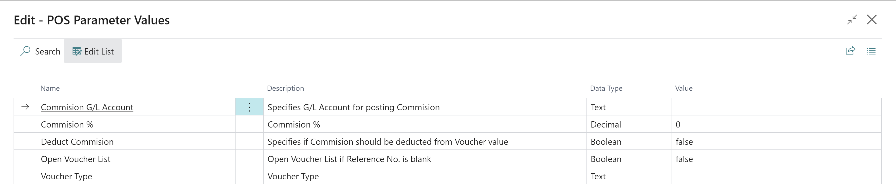
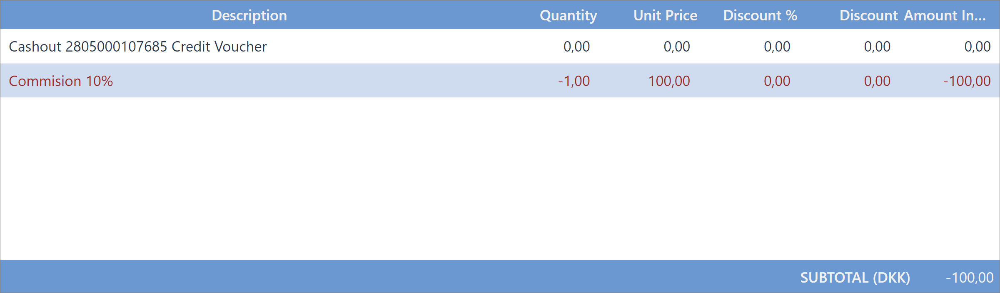
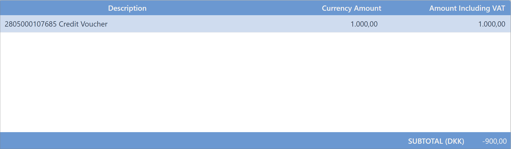
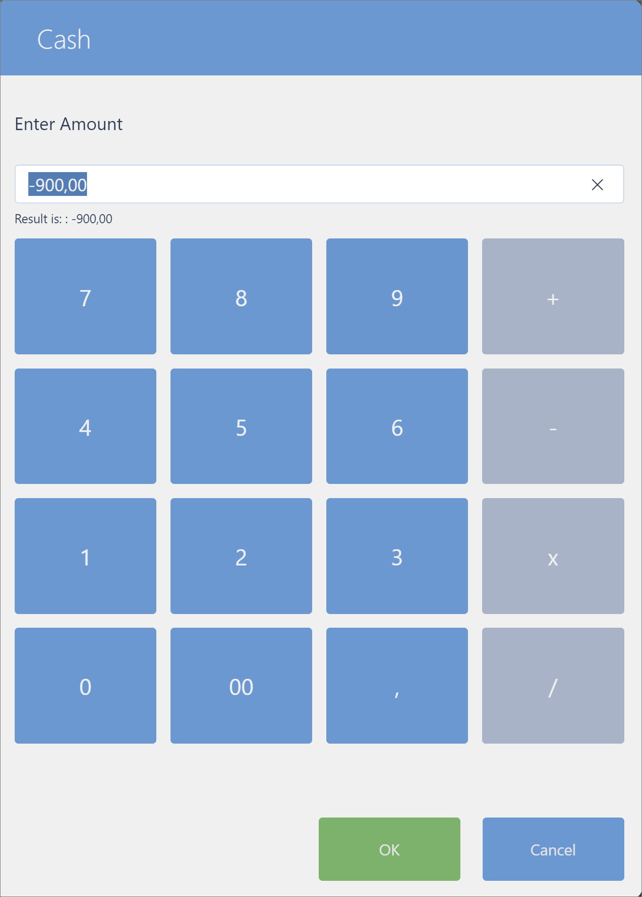

# Cash out a voucher

After the voucher is [sold](../howto/Create_a_new_voucher.md), a customer can return the voucher to the salesperson, and in return he can receive the cash back. Money can be returned in full or reduced by the commission fee amount.

The voucher cash-out is performed with the **POS Action - CASHOUT_VOUCHER**.

1. The action should be added to the POS Menu. The parameters set on this button determine if the commission fee will be charged and how it'll be posted.

    

   - **Commission G/L Account** - If the parameter **Deduct Commission** is set to **true**, this parameter needs to specify the G/L Account on which the commission will be posted.
   - **Commission %** - If the parameter **Deduct Commission** is set to **true**, this parameter needs to specify the commission percentage that will be applied on the voucher's value.
   - **Deduct Commission** - Specifies if the commission should be calculated and deducted from the voucher value. If it's set to **false**, then the commission won't be charged and the full voucher value will be suggested for the cash-out.
   - **Open Voucher List** - If it's set to **true** and the **Reference No.** is left blank during the voucher cash-out, the **Voucher List** will be opened.
   - **Voucher Type** - Choose which voucher type will be used as a filter. If it isn't set, the **Voucher Type List** will be opened during the voucher cash-out.

> [!Note]
> If **Deduct Commission** is set to **true** and the **Commission Account** or **Commission Percentage** are omitted, the run-time error will occur.

2. After the button has been created, select that button and the window for the **Voucher Scanning** will pop up.

 

3. If the voucher is valid, it will result in creating the POS sale line** for the commission.

 

The POS payment line for the voucher cash-out will also be created. 

 

4. Navigate to the payment and end the sale.      
   The suggested amount will be the difference between the value of the Voucher and the commission.

 

   After the sale is finalized, the voucher will be archived.

## Related links:

- [Voucher types](../explanation/Voucher_types.md)
- [Coupons](../../coupons/intro.md)