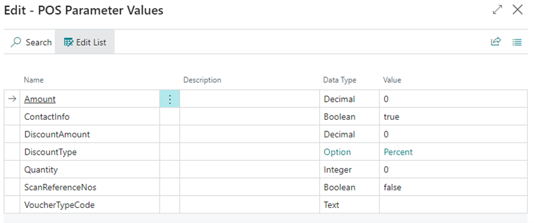
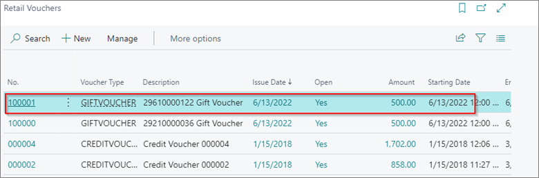

# Create a new voucher

After the [voucher type](../explanation/Voucher_types.md) is created, the voucher needs to be sold.

> [!Important]
> Buttons for issuing vouchers should be created in the POS, so that the voucher can be sold. The button must have Action – ISSUE_VOUCHER. The parameters set on this button determine which voucher will be created with which amount, and how much the customer will pay for it.

- **Amount** - when button is used, if amount is entered, voucher will be created with this value.
- **ContactInfo** - If the voucher needs to contain contact information select True. In this way, at the time of creating voucher in the POS a window will appear in which contact information can be entered.
- **DiscountAmount** - Amount entered means that customer will pay voucher less then it is worth for this discount amount.
- **DiscountType** - Amount, Percent, None
- **Quantity** - when button is used, if quantity is entered, it will be created this number of vouchers.
- **ScanReferenceNos** - False.
- **VoucherTypeCode** - Choose which voucher type will be created when button is used.

> [!Note]
> If information about voucher type, quantity, amount, discount are not entered in parameters, when choosing button wiht Issue voucher action, window appears asking for this information.

After button has been created, choose button and line with voucher will be added in sales lines.

Go to payment and end sale.
After sale is ended, in **Retail vouchers** list you will see new voucher created:

## Related links:

- [Voucher types](../explanation/Voucher_types.md)